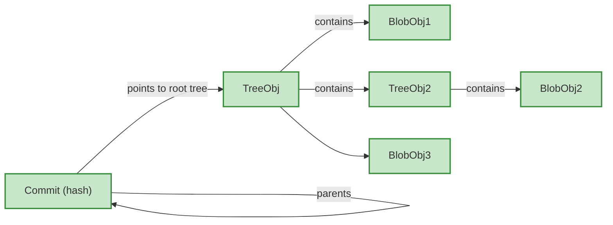
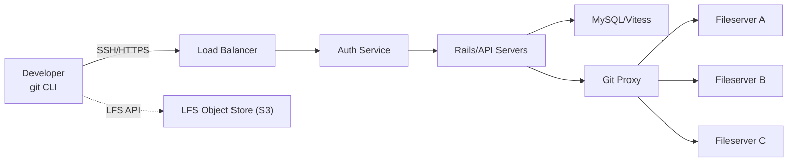
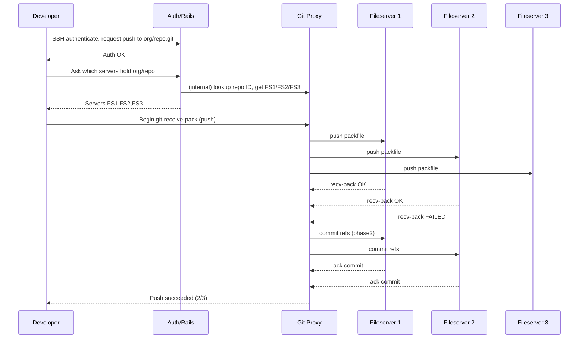
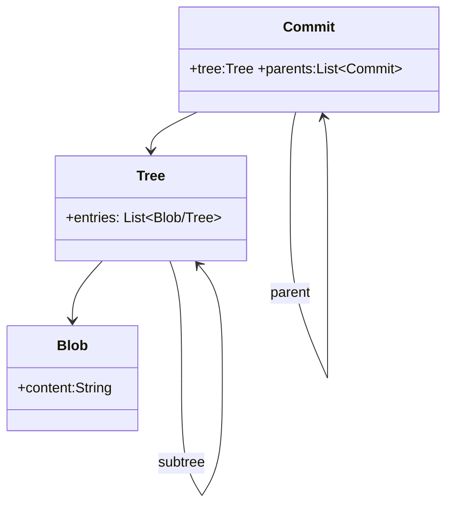

At core, Git is a content‑addressable key–value store that models your repository as a graph of four immutable object types, and GitHub scales that exact on‑disk format by replicating plain bare Git repos across three file servers behind a proxy and metadata layer. Git itself solves scaling for history size via packfiles and delta compression, while GitHub (and similar hosts) solve scaling for multi‑tenant traffic and durability via distributed replication, sharding, and separate metadata/LFS storage.[1][2][3][4][5][6][7][8][9][10][11]

---

## Git as a content‑addressable store

Git’s internal model is a content‑addressable filesystem: everything meaningful is stored as an object whose filename is the hash of its contents. When you add or commit data, Git prepends a header (`"<type> <size>\0"`), computes a SHA‑1 or SHA‑256 over header+payload, and uses that hash as the key under `.git/objects`. This design guarantees immutability (any change yields a new hash) and deduplication (identical content shares one object regardless of how many commits reference it).[2][5][6][12][13]

Inside `.git/objects`, Git splits the 40‑character hash: the first two hex digits become a subdirectory, and the remaining 38 form the filename (e.g. `.git/objects/4b/825dc642…`). Each of these “loose objects” is zlib‑compressed, but otherwise just a header plus raw bytes. This simple layout is the backbone of all higher‑level Git operations.[5][6][13][14][2]

---

## The four Git object types

Git has exactly four primitive object types: blob, tree, commit, and tag. They are stored uniformly in the object database but play different semantic roles in the DAG of your project history.[12][13][14][15][16][2][5]

| Type   | Role                    | Contents (conceptually)                                                   |
| ------ | ----------------------- | ------------------------------------------------------------------------- |
| blob   | File content            | Raw bytes only, no name or permissions.[2][12][5][6]                      |
| tree   | Directory listing       | Entries of `<mode> <type> <object-id> <name>`.[2][12][5][14]              |
| commit | Snapshot + history edge | Root tree ID, parent commit IDs, author/committer, message.[2][5][14][16] |
| tag    | Annotated marker        | Target object ID, tagger info, message, optional signature.[2][15][5]     |

A blob is just the contents of a file at some point in time; filenames and modes live in the tree that references the blob. A tree is a directory snapshot: it maps names and modes to object IDs (blobs or subtrees), giving Git a hierarchical view of your project. A commit points to a single root tree plus one or more parent commits, and includes author/committer metadata and a message, forming a node in a directed acyclic graph of snapshots. Annotated tags are small objects that point to any other object (usually a commit) with descriptive metadata.[6][14][15][16][2][5][12]

The key point: Git stores snapshots, not diffs, internally. Each commit references a complete tree; diffs are computed on demand when you run commands like `git diff` or view a PR. That is why checkout is fast even with long histories—it just reads the tree for that commit and materializes the working directory from the snapshot.[14][16][17][5]

---

## Refs, HEAD, and packed‑refs

Branches and tags are not separate database tables; they are “refs”: tiny files that contain a single 40‑character hash pointing into the object store. Under `.git/refs/heads` and `.git/refs/tags` you find these text files, and HEAD is itself just a pointer to one of these refs (or directly to a commit in detached HEAD).[17][18][5]

For repositories with many refs (branches, tags, remotes), Git can consolidate them into `.git/packed-refs`, a more efficient flat file of `refname hash` pairs to avoid filesystem overhead on thousands of tiny files. Conceptually, a ref is a 41‑byte pointer (hash plus newline); cheap branching, rebasing by rewriting history, and the danger of force‑push all follow from this simple indirection.[19][5][17]

---

## The index and Git’s “three trees”

Operationally, Git maintains three “trees”: the working directory, the index (aka staging area), and the committed object tree.[13][16][20]

- The working directory is the actual filesystem tree containing your checked‑out files.[20][13]
- The index (`.git/index`) is a binary file that records which blobs and paths are staged for the next commit, including modes and timestamps.[13][17][20]
- The committed tree is the snapshot stored as tree+blob objects referenced by the current commit.[5][17][20]

When you run `git add`, Git writes blob objects for the file contents and updates entries in the index to point at those blobs. When you run `git commit`, Git materializes a tree object from the index (directory structure plus blob IDs), then creates a commit pointing at that tree and its parents. This three‑tree architecture is key to Git’s performance: it avoids recomputing the entire snapshot on every minor change, and allows selective staging.[16][2][17][20][13]

---

## Loose objects, packfiles, and scaling history

Storing every object as its own compressed file (“loose object”) scales poorly once you reach hundreds of thousands or millions of objects. To keep repositories compact and fast over the network, Git periodically repacks loose objects into packfiles under `.git/objects/pack`.[4][21][22][1][6][14]

A packfile (`.pack`) is a binary concatenation of many objects, often stored as deltas against each other, plus a companion index (`.idx`) for fast lookups by hash. The packfile begins with a `PACK` signature, version, and object count, followed by object entries that may be full objects or delta objects (`OBJ_OFS_DELTA` and `OBJ_REF_DELTA`) referring to a base. Git applies delta compression to similar objects (e.g. successive versions of the same file), stores one full base, and encodes others as “copy/insert” instructions, then compresses with zlib on top.[21][1][4][6][14][19][5]

The `.idx` pack index contains:

- A 256‑entry fan‑out table keyed by the first byte of the object ID,
- A sorted list of object IDs,
- CRC32 checksums per object,
- 4‑byte (or 8‑byte) offsets into the `.pack` file, plus trailing checksums.[1][19][5]

Packfiles are critical both for disk efficiency and for Git’s wire protocol: pushes, fetches, and clones stream packfiles rather than millions of tiny objects. Git runs `git gc` and `git repack` (including newer geometric repacking in Git v2.32) to merge many packfiles into larger ones and maintain a geometric sequence of pack sizes, balancing locality and repack cost for very large repos.[3][22][4][6][21][1]

This is how Git scales _within a single repository_: it keeps the object store append‑only and immutable, periodically compresses and delta‑encodes, and uses indexes for logarithmic lookups. Even multi‑gigabyte histories remain usable because most operations touch only a small subset of objects and walk the DAG efficiently.[6][14][16][5]

---

## What changes on a Git host

Hosts like GitHub, GitLab, and Bitbucket do **not** change Git’s internal representation; each repository lives on disk as a plain bare Git repo with the same objects, refs, packs, and index files you see locally. A “bare repository” is essentially just the `.git` directory (objects, refs, config, hooks) without a working tree; this is what server‑side storage uses.[7][8][9][11][23][17]

What hosts add is:

- A distributed storage tier that keeps multiple copies of each bare repo in sync.
- A metadata tier (relational DB) for users, permissions, issues, PRs, and repo placement.
- Application servers that speak Git protocols (HTTP/SSH) and web APIs, route requests, and enforce auth.[8][9][10]

So scaling at a host is primarily about multi‑tenant durability and throughput, not reinventing Git’s object model.[10][11][7][8]

---

## GitHub’s Spokes (formerly DGit) storage architecture

GitHub’s storage architecture is built around a system originally called DGit and now referred to as Spokes: each repository is stored on three independent file servers as three plain Git repositories. These replicas are deliberately placed on different racks or servers to avoid correlated hardware failures.[9][11][7][8][10]

When you run `git push` to GitHub:

1. Your local Git client computes a pack of the new objects and refs and sends it over the Git protocol (HTTP/SSH) to a proxy in front of the file servers.[4][8][10][1]
2. The application/proxy looks up, in a MySQL/Vitess metadata tier, which three file servers currently hold the repo.[8][10]
3. It streams the incoming pack and reference updates to all three replicas and runs a three‑phase commit protocol.[11][9][8]
4. The write is only considered successful if at least two of the three replicas apply the update and produce identical Git state; otherwise the push is rejected.[7][9][10][8]
5. Read traffic (fetches, clones, web views) is routed to the closest in‑sync replica, chosen by Spokes based on health and locality.[9][10][8]

GitHub’s own description emphasizes that replication happens _at the Git application layer_, not at block‑device or filesystem layer: each replica is a loosely‑coupled Git repository kept in sync via Git protocols, not a mirror of disk blocks. This gives flexibility in where replicas live and how they are promoted or rebuilt when a server fails.[10][11][7][9]

Underneath, each file server stores repos on local SSDs using standard Git objects and packfiles. GitHub runs aggressive maintenance (GC, repack, multi‑pack indexes, bitmaps) so even huge monorepos remain performant. Spokes also continuously monitors for repos with fewer than three healthy replicas and recreates missing ones when servers are taken offline or fail.[3][7][8][9][10]

---

## Metadata, Git LFS, and “everything that isn’t Git”

Git object data (commits, trees, blobs, tags) lives in Spokes as described above, but all non‑Git state—user accounts, orgs, teams, permissions, issues, pull requests, stars, repository placement—is stored in a separate relational metadata layer. Community write‑ups note that GitHub uses a sharded MySQL/Vitess topology for this metadata, which the app tier consults to route each request to the right repo and enforce access control.[23][8][10]

Large binary assets are pushed out of the Git object database entirely and handled by Git LFS (Large File Storage). In LFS, the Git repository stores small pointer files that contain hashes and metadata, while the actual bytes live in an object‑storage backend (e.g. S3‑style storage) accessed over HTTPS. On checkout, a smudge filter sees the pointer blob, downloads the real data by hash, and writes it into your working tree. This avoids exploding packfiles and keeps Git’s delta compression focused on text and moderately sized assets.[8][10]

---

## GitHub’s application tier and request flow

GitHub’s front door is a set of load balancers and reverse proxies that route HTTPS and SSH traffic to an application tier, historically a large Ruby on Rails monolith with worker processes. For Git traffic, the app tier acts as a smart proxy: it authenticates the user, checks permissions and branch protection policies (using the metadata DB), then forwards Git protocol requests to the appropriate Spokes nodes that hold the repository.[23][9][10][8]

For web traffic (PR views, file browsing, blame, etc.), the Rails layer reads Git data via libgit2 or Git processes against one of the replicas, and combines that with metadata (comments, reviewers, CI status) from the DB. Background jobs recompute PR mergeability, index code for search, and trigger webhooks or integrations based on Git events.[11][9][10][23][8]

The key separation is:

- **Git data path**: Git protocol → proxy → Spokes → bare repositories (objects/packs).[9][10][8]
- **Metadata path**: Web/API → Rails → MySQL/Vitess → caches.[10][23][8]

That separation lets GitHub scale Git storage independently of user/PR metadata while keeping consistency rules appropriate to each.[11][8][10]

---

## Git and GitHub in tandem: an end‑to‑end push/fetch

Putting it all together, here’s how Git and GitHub cooperate for a typical workflow.

**Push (local → GitHub):**

- Locally, `git add` writes blobs and updates the index; `git commit` creates a tree and commit objects referencing parents.[2][16][20][13]
- When you `git push`, your client negotiates with GitHub which commits are missing, builds a packfile of the required objects, and sends it.[21][1][4][6]
- GitHub’s proxy receives the pack, runs permission checks using metadata, then streams it to the three Spokes replicas for that repo.[23][8][10]
- Each replica runs standard Git plumbing to apply the pack and update refs (branches, tags), using the same object and pack formats as locally.[7][8][9][11]
- Only if at least two replicas report identical success does GitHub acknowledge the push; the UI and APIs then reflect the new commits and branches.[7][8][9][10]

**Fetch/clone (GitHub → local):**

- Locally, `git clone` or `git fetch` asks GitHub for objects and refs you don’t yet have.[24][2][23]
- GitHub’s proxy routes the request to a healthy Spokes replica, which computes a packfile containing the necessary objects, leveraging pack indexes and bitmaps for speed.[1][3][8][10]
- Your client receives the pack, unpacks or stores it as a packfile locally, updates refs, and materializes your working tree from the chosen commit’s tree.[14][2][4][5]

From Git’s perspective, GitHub is just another remote that speaks the Git protocol and stores plain Git repositories; from GitHub’s perspective, Git is a very efficient content‑addressable store that can be replicated and sharded without rewriting its internals.[8][9][11][7]

---

## Brief mapping to “other hosts like GitHub”

Other large hosts follow the same broad pattern—plain Git repos plus a distributed storage layer—but with different implementations. GitLab, for example, uses Gitaly for Git RPC and Praefect for highly available sharded storage, while still storing repositories as standard Git object databases with packfiles. Self‑hosted platforms like Gitea often start with a single‑node bare repo layout and optionally add mirroring or external storage for scale. In all cases, the “Git side” looks essentially the same; differences lie in how many replicas, how they coordinate writes, and how metadata and LFS are implemented.[3][10][11][8]

If you want, I can go next into more implementation‑flavored internals (wire protocol phases, multi‑pack index bitmaps, or how you’d design a mini‑Spokes for your own platform) using this mental model as a base.

Fuentes
[1] Git's database internals I: packed object store <https://github.blog/open-source/git/gits-database-internals-i-packed-object-store/>
[2] 10.2 Git Internals - Git Objects <https://git-scm.com/book/en/v2/Git-Internals-Git-Objects>
[3] Why and how we rearchitected Git object database ... <https://about.gitlab.com/blog/rearchitecting-git-object-database-mainentance-for-scale/>
[4] Git - Packfiles <https://git-scm.com/book/be/v2/Git-Internals-Packfiles>
[5] Git Internals: How Git Really Stores Objects, Commits & Refs <https://mdsanwarhossain.me/blog-git-internals-objects-commits-refs.html>
[6] Understanding Git Internals: Objects, Content-Addressable ... <https://mohashari.github.io/git-internals-objects-packfiles/>
[7] GitHub Repository Storage Architecture. - Medium <https://parashar--manas.medium.com/github-repository-storage-architecture-9980d695570a>
[8] How GitHub Stores and Serves Git Repositories <https://singhajit.com/how-github-stores-and-serves-git-repositories/>
[9] Introducing DGit - The GitHub Blog <https://github.blog/engineering/architecture-optimization/introducing-dgit/>
[10] How GitHub Actually Works | InsideTheStack <https://udaykumar-dhokia.github.io/insidethestack/articles/how-github-works>
[11] How does Github store millions of repo and billions of files? <https://dev.to/pankajtanwarbanna/how-does-github-store-millions-of-repo-and-billions-of-files-3049?comments_sort=oldest>
[12] A Deep Dive into Git Internals: Blobs, Trees, and Commits <https://dev.to/__whyd_rf/a-deep-dive-into-git-internals-blobs-trees-and-commits-1doc>
[13] How Git Stores Data Internally: The Object Model Explained <https://singhajit.com/how-git-stores-data-internally/>
[14] Git Internals - adamdjellouli.com <https://adamdjellouli.com/articles/git_notes/17_git_internals>
[15] GitHub - techgaun/git-internals: An overview of git internals <https://github.com/techgaun/git-internals>
[16] How Git Works Internally: A Deep Dive <https://studylib.net/doc/28156476/github>
[17] GitHub - mtumilowicz/git-notes: Notes about git and its internals. <https://github.com/mtumilowicz/git-notes>
[18] Git repository internal format explained <https://stackoverflow.com/questions/8266871/git-repository-internal-format-explained>
[19] How Git Actually Works: Objects, Refs, the Index, and Packfiles <https://tomodahinata.com/en/blog/git-internals-object-model-refs-index-packfile-guide>
[20] DevOps - Git Internals: Architecture and Index Files <https://learn.microsoft.com/en-us/archive/msdn-magazine/2017/august/devops-git-internals-architecture-and-index-files>
[21] Git Internals part 2: packfiles <https://dev.to/calebsander/git-internals-part-2-packfiles-1jg8>
[22] Git <https://www.oreilly.com/library/view/git/9781806102631/03_013.html>
[23] About repositories - GitHub Enterprise Cloud Docs <https://docs.github.com/enterprise-cloud@latest/repositories/creating-and-managing-repositories/about-repositories>
[24] About repositories - GitHub Enterprise Server 3.18 Docs <https://docs.github.com/en/enterprise-server@3.18/repositories/creating-and-managing-repositories/about-repositories>
[25] GitHub - Azure/azure-storage-blob-go: Microsoft Azure Blob Storage Library for Go <https://github.com/Azure/azure-storage-blob-go>
[26] dikshantrajput/supabase-multi-tenancy <https://github.com/dikshantrajput/supabase-multi-tenancy>
[27] Azure Blob Storage Samples for .NET <https://github.com/Azure-Samples/storage-blob-dotnet-getting-started>
[28] Migrating repositories with GitHub-owned blob storage is ... <https://github.blog/changelog/2025-11-17-migrating-repositories-with-github-owned-blob-storage-is-now-generally-available/>
[29] Build software better, together <https://github.com/topics/blob-storage>

---

# Executive Summary

**Git** and **GitHub** form a layered system: Git is a distributed version-control system with a content-addressable data model (blobs, trees, commits, tags stored by cryptographic hash) and efficient on-disk storage (loose objects, delta-compressed packfiles, and an index). It provides a rich set of plumbing and porcelain commands and transfer protocols (SSH, HTTPS/smart-HTTP, Git’s native protocol) to fetch and push changes, negotiate deltas, and update refs (branches/tags). At scale, Git’s local operations (commit, merge, GC, etc.) remain essentially the same, but performance relies on techniques like packfile compression, multi-threading, shallow/partial clones, and offloading large files to Git LFS.

**GitHub** builds a global service around Git: each repository is stored as a _bare Git repo_ on three independent “Spokes” file servers with SSD storage. A front-end proxy (behind DNS/Anycast and LB) authenticates clients, routes `git fetch`/`push` requests, and uses a three-phase commit across the replicas. A sharded MySQL/Vitess metadata tier tracks repository IDs, ref maps, and file-server placement. Web and API requests go through Rails services (permissions, UI), while assets like GitHub Pages use separate servers behind a CDN. Large binaries go to Git LFS object storage (S3-style) with only pointers in Git. Supporting systems include GitHub Actions (compute tier that clones repos via Spokes), webhooks and CI/CD pipelines triggered by pushes, and search/indexing clusters. GitHub enforces API rate limits (e.g. ~5,000 requests/hour for authenticated users) and uses isolation (org/repo boundaries) and security controls (SSH keys, OAuth, 2FA, branch protections).

**Interactions (Git↔GitHub)** follow Git’s standard protocols: a `git push` over SSH/HTTPS executes `git-receive-pack` on the server, which the GitHub proxy routes to the three Spokes servers in parallel. Repos on disk are just plain Git: the proxy asks MySQL which file servers hold this repo, sends the push to all three, and does a majority vote to commit the new refs. A `git pull`/`clone` similarly runs `git-upload-pack` on the nearest in-sync replica. Internally, GitHub uses hooks and Git references: for example, opening or updating a PR creates hidden refs (e.g. `refs/pull/ID/merge`) and uses server-side hook logic for branch protection. Git LFS uploads/downloads happen via a separate HTTPS API (tracking pointer files in Git). High-scale workflows (monorepos, CI churn) are tuned by batching ref updates (`git push --atomic`), using partial clones, and the multi-pack-index enhancements. When disagreements occur (e.g. two concurrent pushes), GitHub’s two-of-three quorum prevents split-brain: a write is only acknowledged once two replicas agree, favoring consistency over availability.

_The following report delves deeply into (A) Git internals, (B) GitHub architecture, and (C) their interaction at scale. It draws on official Git documentation and source, GitHub engineering blogs and talks, and systems-design literature, with diagrams, mermaid charts, and tables to illustrate key trade-offs and components._

## A. Git Internals

**Content-Addressable Data Model:** Git stores data as objects identified by SHA-1 hashes (with SHA-256 support added recently) of their contents. The four core object types are **blobs** (file contents), **trees** (directory snapshots pointing to blobs/subtrees), **commits** (snapshot + metadata + parent links), and **tags** (annotated names). All objects live in the `.git/objects` directory (initially loose, compressed with zlib). The **object store** is a simple key-value filesystem: each object’s contents are compressed and stored in `.git/objects/XX/…` named by its hash prefix.



_Figure: Git’s data model (each object is content-addressed by hash)._

**Refs (Branches/Tags/HEAD):** Git “refs” are pointers to commits stored under `.git/refs` (e.g. `refs/heads/master`, `refs/tags/v1.0`). `HEAD` indicates the current branch or commit. Tags may be **lightweight** (just a ref) or **annotated** (a tag object pointing to a commit). Remote-tracking refs (e.g. `refs/remotes/origin/master`) record the state of a branch on a remote after your last fetch. For efficiency, many refs may be written to the `packed-refs` file (especially tags) to save inodes.

**Loose vs Packfile Storage:** Initially, each object is stored loose as one file. Over time (especially on push or `git gc`), Git bundles objects into a **packfile** (plus an index) to save space and speed network transfer. A packfile is a single file containing many objects, delta-compressed (object contents stored as “deltas” against similar objects). Git chooses an object as a delta _base_ (often the newest version) and encodes other versions compactly. For example, a large file modified twice might be stored fully once and as a tiny 9-byte delta the first time. After packing, Git’s storage can drop dramatically (half the size in an example). Packs are indexed (`.idx` files) to allow random object lookup. Git periodically repacks (delta algorithms and parallel compression) to optimize storage.

**Index (Staging Area) and Working Tree:** Git’s index (`.git/index`) tracks the staged content and metadata (file paths, modes, blob hashes) between the working tree and last commit. It enables fast commit creation (`git write-tree`) and diff calculation. The **working tree** holds the checked-out files. Untracked or modified files live only in the working tree until staged/committed.

**Plumbing vs Porcelain:** The Git codebase distinguishes low-level **plumbing** commands (e.g. `git-update-index`, `git-cat-file`, `git-read-tree`) from high-level **porcelain** (e.g. `git add`, `git commit`). Plumbing can be scripted for fine-grained control or custom workflows; porcelain is for everyday use.

**Transfer Protocols:** Git clients communicate with servers over multiple protocols. Commonly, GitHub (and many hosts) use SSH (`git@server:repo.git`) or HTTPS (TLS) with **Smart HTTP**. In _smart HTTP_, the client requests `info/refs` with service=git-upload-pack or git-receive-pack, then the server uses Git’s pack protocol: the client lists its refs, the server lists its refs, and they negotiate (finding common ancestor objects). Then objects flow in a packfile: for fetch/clone, the server runs `git upload-pack` to send objects; for push, the client runs `git receive-pack` on the server, sending objects. On non-SSL HTTP ("dumb HTTP"), static files (packfiles, ref snapshots) are served without smart negotiation (rare for modern hosts). Git’s native protocol (port 9418) is similar to smart HTTP over its own transport. All protocols carry Git sideband messages (progress, errors).

**Fetch/Push Mechanics:** On a **fetch/clone**, the client does:

1. Resolve the URL to a repo (DNS/TLS/SSH handshake).
2. Request refs from the server (`git-upload-pack --advertise-refs`).
3. Negotiate common commit(s): client sends `want <hash>` for target refs; server replies `ACK` on the first common object it finds (packfile negotiation).
4. Server sends a packfile of all needed objects.
5. Client applies objects to its own object store and updates the remote-tracking refs (e.g. `origin/master`).

On a **push**, the client runs `git-receive-pack`:

1. Client lists local commits, asks server for common ancestry.
2. Sends a packfile of new objects (possibly deltas) to the server.
3. For each ref update (branch/tag), the server locks and updates the ref file. GitHub’s proxy duplicates this to three backends (see below).
4. Server runs any server-side hooks (see below) and returns success.

These flows are stateless (each request is self-contained) and streamable. Network performance matters: packfiles are compressed (zlib, XZ, etc), and Git can parallelize compression/decompression (`-j` threads) to speed transfer on multicore machines.

**Shallow and Partial Clones:** For very large repos, Git supports **shallow clones** (`--depth`) to fetch only recent history, and **partial clones** (`--filter`) to skip blobs or subtrees. Clients clone commit history and trees but delay/download blobs on demand. This reduces bandwidth and time for large monorepos (see [34] on partial clones and GitHub’s advice).

**Submodules:** A submodule embeds one Git repo in another. The superproject’s tree contains a special “gitlink” entry holding a submodule commit ID, and `.gitmodules` records the URL/path. In practice, `git submodule` keeps the subrepo’s contents in a separate working directory. Pushing submodule changes means updating the gitlink pointer in the superproject. Submodules allow splitting projects or including large assets separately.

**Git LFS (Large File Storage):** Git by itself pulls _all_ file versions into each clone, which is inefficient for big binaries. Git LFS solves this by storing large file contents outside the Git repo and replacing them with small pointer files. The pointer (versioned blob) looks like:

```
version https://git-lfs.github.com/spec/v1
oid sha256:<hash>
size 12345
```

Git tracks only this pointer in commits. The actual file data is uploaded separately (over HTTPS) to a dedicated object store (S3-style) and fetched on checkout. Thus, large objects consume storage and bandwidth only when needed, keeping Git transfer light.

**Garbage Collection & Repacking:** `git gc` and its helper `git repack` clean up unreachable objects and re-optimize packs. They combine loose objects and existing packs, remove dangling objects (not pointed by any ref), and rebuild optimal packfiles. This maintenance (often run automatically or by host on push) ensures repository storage stays compact.

**Hooks:** Git has client and server hooks (scripts triggered on events). Common hooks include `pre-commit`, `post-commit` (client-side) or `pre-receive`, `post-receive`, `update` (server-side). Hosts like GitHub control server hooks internally (e.g. enforcing branch protection in a _pre-receive_ check) and expose webhooks to users. GitHub Actions can be seen as triggered by these hooks: after a push, GitHub emits a `push` event webhook or internal event to start CI workflows.

**Concurrency and Locking:** Git’s on-disk updates use simple file locks: updating a ref writes to a `.lock` file, renames atomically, and removes the lock. The index is similarly locked during updates. This prevents two processes from simultaneously corrupting data. On GitHub’s servers, concurrency is managed by the three-phase commit: only one push to a given repo updates each replica at a time, under a global “Spokes” lock. If two pushes race, only one will gain a majority quorum and the other will be asked to retry (favoring consistency).

**Performance Tuning:** In large repositories (millions of files), Git performance can bottleneck on index scanning or ref lookup. GitHub developed enhancements like _multi-pack-index_ and _bitmap indexes_ (in upstream Git) to speed object lookup in huge packs. Locally, users tune `core.compression`, `pack.threads`, and checkout depth. Sparse checkouts, commit graph, and partial clones are other strategies.

## B. GitHub Internals and Architecture

**Global Architecture:** GitHub runs a distributed microservice architecture, largely built on Ruby on Rails for web/API services, backed by MySQL (sharded with Vitess) for metadata. The **Git hosting** core is remarkably simple: **Spokes**, a storage system with _three replicas_ of every bare Git repo on SSDs. A load-balanced front end (DNS+Anycast → L4/L7 LB) routes SSH (port 22) and HTTPS (443) traffic to the Rails/auth tier. After auth and permission checks, a Git proxy figures out which replicas hold the repo (via MySQL) and streams the Git command (upload-pack/receive-pack) to all three. Fileservers are plain machines running Git on Linux, each keeping packed objects and refs on local NVMe/SSD storage.



_Figure: Simplified GitHub push/clone flow. Git data (blobs/trees) flow between Developer and one of the Fileservers via SSH/HTTPS; authentication and routing use MySQL metadata. Large-file data goes to an external LFS store._

**Spokes (Git Storage Tier):** Spokes (formerly “DGit”) stores _every_ repository on three file servers. Replicas are placed (usually in different racks or DCs) to survive failures. On a push, GitHub’s proxy uses a **three-phase commit**: it sends the new pack to all replicas, locks the refs, asks each to prepare, then commits once at least two have the update. This two-of-three quorum makes writes consistent and durable: if one server fails, the other two ensure data is not lost. Reads (clones/fetches) go to the nearest up-to-date replica for low latency. Since Spokes speaks Git protocol, each fileserver sees pushes as normal Git operations (no special storage layer).

Maintaining Spokes involves automatically healing failed nodes (copying repos from healthy nodes), rebalancing repository placements, and handling geo-replication: a recent “Stretching Spokes” effort allowed replicas to span continents, overcoming latency by batching and pipelining ref updates. If a push occurs in one region, a far-away replica can still serve clones once it catches up, thanks to Spokes’ health-tracking of each replica’s last synced commit.

**Metadata Backend (MySQL/Vitess):** A sharded MySQL tier (with Vitess) tracks global metadata: repository IDs, slug→ID mapping, which replicas hold each repo, and many other attributes (repo creation, permissions, issue/PR records, etc.). When you type a Git URL like `git@github.com:org/repo.git`, Rails looks up `org/repo` to an internal repository ID (in MySQL), checks your credentials, and returns the three fileserver hostnames for that ID. This mapping DB is critical for routing: GitHub is a “long MySQL transaction” behind the scenes for each push/clone.

**Fileservers (Bare Git Repos):** Each fileserver holds bare repositories exactly as on disk: the `.git` directory with `objects/` (packs and loose objects) and `refs/` (branch pointers). They use up-to-date Git (with packidx, multi-pack-index, reftable, etc.) for performance. Filesystems are ephemeral (no RAID); loss is handled by replica re-creation. Backups of the repository data rely on the multi-replica system and off-site backups of MySQL.

**Git LFS Storage:** Large binaries (images, videos, etc.) are stored outside Git. When using Git LFS, GitHub sees only the small pointer file in the repository. The actual file data is uploaded via HTTPS to an S3-like blob store and fetched by hash. This keeps the Git servers lean: Spokes never handles multi-gigabyte packfiles, only lightweight SHA-256 pointers. LFS access has its own API and rate limits (the REST API docs specify 3,000 req/min for auth users).

**Service Decomposition:** Aside from core Git hosting, GitHub’s platform includes:

- **Web/API Tier:** Rails applications handle the web UI and REST/GraphQL APIs. These check permissions, serve HTML pages, manage issues/PRs, and orchestrate workflows. Many features (Issues, PRs, comments) live in MySQL and are returned through JSON to clients.
- **Authentication/Authorization:** A dedicated auth service validates SSH keys, OAuth tokens, or GitHub App tokens, then delegates to the Rails/permissions service.
- **Proxy:** A specialized Git proxy routes Git protocol traffic to file servers, handling the three-phase commit logic.
- **Content Delivery:** Static content (e.g. raw file downloads, GitHub Pages sites) is served via a CDN (Fastly) for global caching. GitHub Pages uses nginx/ngx_lua to map domains→fileservers, leveraging CDN edge caching for availability.
- **CI/CD (Actions):** GitHub Actions runs builds in a containerized compute layer. Each workflow runner clones the target repo by speaking Git to Spokes (usually over the internal network). Workflows start from webhooks/events generated by Spokes after pushes.
- **Code Search/Indexing:** A separate indexing service consumes Git push events and maintains search indexes (ElasticSearch or GitHub’s Blackbird engine) for code and metadata. This is asynchronous: code you push is searchable in seconds to minutes.
- **Webhooks & Integrations:** After each push or PR event, GitHub enqueues webhooks (HTTP callbacks) or Actions events to notify external systems (CI servers, Slack, etc.). These are triggered by Spokes’ post-receive.

**Performance and Caching:** GitHub employs various caches. The proxy caches repo metadata lookup results. The web tier caches Git blob data (via HTTP caching headers) and often sends ETags for unchanged content. GitHub Pages responses are cached at the CDN edge. Behind the scenes, services likely use in-memory caches (Memcached/Redis) for hot data (e.g. recent PR data), though details are internal.

**Scalability & Sharding:** Scaling GitHub’s services involves:

- **Fileservers:** New servers can join the Spokes pool. Repos may be migrated for load balance. Because the data is local, adding SSD servers linearly increases storage and throughput (2-of-3 quorum means writes go to 3 replicas; you need 3x base capacity).
- **Vitess/Sharded DB:** The metadata DB is sharded by repository (or user/org). Vitess re-shards and vreplicas can be added to handle more queries. GitHub is known to contribute to MySQL/Vitess scalability.
- **Geographic Replication:** Spokes can place replicas in multiple regions. While write latency increases (multiple 100ms RTTs), it allows local reads and disaster resilience. GitHub accepts this tradeoff.
- **Eventual Consistency vs Availability:** GitHub prioritizes consistency for writes: a push must commit to two replicas before success. In a partition (e.g. one replica unreachable), it will refuse additional writes rather than risk divergence (CP in CAP terms). Reads, however, can use any up-to-date node, so are “nearest” for speed.

**Backup/DR:** Data durability comes from Spokes’ replication. MySQL is typically mirrored (e.g. semi-sync replicas) with backups. In a DR scenario, another data center’s Spokes could become primary once consensus is restored. Because everything is in multiple copies, rolling upgrades and failovers can occur without downtime (reboot half fleet unnoticed).

**Security:** GitHub secures Git endpoints via SSH keys or TLS client certs (PATs/OAuth). Each Git push is authenticated and authorized: the Rails app verifies you have write rights to that repo before letting the proxy proceed. Branch-protection rules (e.g. requiring PR reviews) are enforced by refusing pushes that would violate policies (essentially as a pre-receive hook). The Rails/API services secure all web requests, and GitHub enforces 2FA, token scopes, and regular vulnerability scanning.

**Observability:** GitHub continuously monitors all tiers: logs from Rails/Proxy/DB are aggregated, and metrics (request rates, latency, error rates) are scrapped. Alerting responds to anomalies (e.g. a fileserver falling behind). The engineering blogs emphasize real-time health checks via Spokes’ actual traffic (if RPCs fail, a node is flagged).

**Deployment:** GitHub uses modern CI/CD practices (likely containerization or automated deploy pipelines). The system design ensures that deploying new code (Rails or proxy) can be done server-by-server, with rolling updates and no single point of failure. The 3-replica model means code pushes can be toggled by changing proxy routing or deploying in phases.

**Scaling Strategies Table:** GitHub employs _app-level_ replication and heavy sharding, in contrast to other hosts (e.g. GitLab’s Praefect, Bitbucket’s NFS mirrors). The table below highlights key trade-offs and strategies:

| **Aspect**             | **GitHub (Spokes)**                             | **GitLab (Gitaly/Praefect)**                      | **Bitbucket**                          |
| ---------------------- | ----------------------------------------------- | ------------------------------------------------- | -------------------------------------- |
| **Repository Storage** | Bare Git repos on SSDs (packed, pointers, refs) | Sharded storage via Gitaly servers                | NFS or object-store based (less clear) |
| **Replication**        | Git-aware, 3-way commit (2/3 quorum)            | Transactional (Praefect)                          | Filesystem-level (e.g. DRBD mirror)    |
| **Metadata DB**        | MySQL/Vitess (sharded)                          | PostgreSQL (often single-node DB per shard)       | PostgreSQL                             |
| **Geo-Redundancy**     | Built-in (Spokes supports cross-DC)             | GitLab Geo (optional, push mirroring)             | Smart Mirroring (optional)             |
| **Large Files (LFS)**  | S3-style object store separate (pointer in Git) | Same (objects store)                              | Same (objects store)                   |
| **Consistency Model**  | Quorum writes, linearized per repo (CP)         | Strong per-region (Praefect sync)                 | Varies (often eventual via file sync)  |
| **Read Locality**      | Reads to nearest up-to-date replica             | Reads typically to primary (GitLab Geo can route) | N/A (no built-in geo)                  |

**Key Components:** The table below summarizes core GitHub components and their responsibilities.

| **Component**                   | **Role/Responsibility**                                                                                                                           |
| ------------------------------- | ------------------------------------------------------------------------------------------------------------------------------------------------- |
| **Load Balancer (LB)**          | Receives SSH/HTTPS; SSL termination; routes to appropriate front-end cluster.                                                                     |
| **Auth Service**                | Validates SSH keys, tokens, OAuth; integrates SSO/2FA; returns authenticated user identity.                                                       |
| **Rails/API Servers**           | Enforce permissions; handle REST/GraphQL API and web UI; coordinate repo lookups via metadata DB.                                                 |
| **MySQL/Vitess DB**             | Stores global metadata: repos, users/orgs, permission models, issue/PR metadata, Pages config, etc.                                               |
| **Git Proxy (Spokes)**          | Handles Git protocol requests: looks up repo’s file servers, streams `upload-pack`/`receive-pack` to 3 replicas, does 3PC commit and ref updates. |
| **Fileserver (A/B/C)**          | Bare Git on disk: actual repo data (objects, refs) stored in packfiles. Apply received packs, serve clones. 各                                    |
| **LFS Object Store**            | S3-style blob storage for large files. Git LFS pushes/uploads go here; pointers go to Git servers.                                                |
| **CDN (Fastly)**                | Caches static assets (Git blobs, Pages content) at edge for global reads.                                                                         |
| **GitHub Pages Nodes**          | Serve static websites from `gh-pages` branches; behind CDN; store site files on dedicated file servers.                                           |
| **Actions Runners**             | Compute workers for CI/CD: clone repos (via Spokes) and run workflows, report status back.                                                        |
| **Search Index (Blackbird/ES)** | Ingests Git events, indexes code, files, and metadata for global search (async processing).                                                       |

## C. Git–GitHub Interactions at Scale

**Git Push Flow:** When a developer does `git push github.com:org/repo.git`:

1. **Client-Side:** Git creates a pack of new objects (commits/blobs not on remote).
2. **Network:** The client opens SSH or HTTPS (TLS) to GitHub. DNS/Anycast/LB directs to a nearest datacenter.
3. **Auth & Route:** GitHub’s auth service verifies the user (SSH key or OAuth). Rails looks up the repo slug in MySQL (e.g. “org/repo → ID”), checks write permission, and finds the three file servers hosting that repo.
4. **Proxy Coordination:** The Git proxy forwards the push to each of the three replicas: it runs `git-receive-pack` on FS1, FS2, FS3. Each server receives the pack and locks the ref files. This is done in a _pipelined, parallel_ manner.
5. **Three-Phase Commit:** The proxy initiates a prepare phase (lock refs but don’t finalize), waits for acknowledgments from at least two servers, then tells them to commit. If one fails (say network error), the other two commit and the bad one will be repaired later. Only once two have committed does GitHub respond “ok” to the client.
6. **Post-Receive:** Upon successful push, GitHub triggers any repository webhooks (`push` event) and enqueues Actions workflows or PR updates. Hidden refs (like `refs/pull/*/merge`) may be updated if needed (e.g. branch-update triggers PR rebase).



**Git Fetch/Clone Flow:** A `git clone` similarly goes:

1. **DNS→LB→Auth:** TLS/SSH handshake and slug→ID lookup as above.
2. **Proxy locates replicas:** Rails/Proxy directs the client to the nearest up-to-date fileserver (based on geo/IP).
3. **Git fetch:** The client runs `git-upload-pack` on that server, which advertises refs. Client sends a `want <hash>` list, server finds common ancestors, and sends a pack of missing objects.
4. **Local storage:** Client writes objects to `.git/objects` and checks out the working tree.

Because Spokes ensures replicas are mostly in-sync, clones from any one replica should return the latest data. Geo-replication improvements (Stretching Spokes) mean even a clone from Singapore can be served by a local Singapore replica, despite a master write in Virginia.

**Pre-Receive / Post-Receive Hooks:** GitHub does not allow users to install arbitrary server hooks, but it uses hook-like logic internally. For example, branch protections and required status checks act like a _pre-receive_ hook: if a push would break rules, GitHub rejects it. Conversely, after a successful push, a _post-receive_ hook triggers actions: CI, Pages build, or notifying integrations via webhooks. Each push to the canonical repo sends events which may, in turn, trigger additional Git operations (e.g. fast-forward branches in forks, close stale PR refs, etc.).

**Webhooks & API Events:** On GitHub, any push, PR comment, issue creation, etc. can generate a webhook event (HTTP POST) to external URLs. These are queued and sent asynchronously. Internally, these are driven by the GitHub application layer (Rails) responding to database changes or Spokes events. The result is a robust pub-sub for integrations.

**GitHub REST/GraphQL API:** Developers and bots use GitHub’s HTTP APIs (REST or GraphQL) to manage repos, issues, PRs, etc. These APIs are rate-limited per user/token. A typical flow: after a `git push`, a webhook might tell a CI system to call the GitHub API to list changed files or update a status. Or a deployment script might call `POST /repos/:owner/:repo/deployments` via the API.

**Git LFS Integration:** When pushing with Git LFS enabled, the Git client first uploads large files to GitHub’s LFS endpoint. Each LFS upload uses the **LFS batch API** (up to 100 files per request), authenticated by the user’s token. These requests count against a special rate limit (3,000 req/min auth). Only after LFS succeeds does the Git push of pointer files occur. On `git clone`, the Git LFS smudge filter downloads real contents by SHA-256 from the blob store as needed (via HTTPS GET).

**Large Repo Strategies:** Massive repositories (monorepos with millions of objects) rely on:

- **Partial Clone:** GitHub encourages `git clone --filter=blob:none --sparse`, which fetches commits and trees but defers blob transfer. This drastically cuts initial clone time.
- **Shallow Fetches:** CI jobs often do `--depth 1` to only get latest code.
- **MIDX/Bitmap Indexes:** GitHub uses upstream Git features (multi-pack-index with bitmaps) so refs and objects can be found quickly without scanning all pack files.
- **Test Merges:** On every PR update, GitHub computes a test merge, creating temporary refs (`refs/pull/ID/merge`) to check for conflicts. This can spawn many writes, so it relies on fast transactional refs.

**Mirrors and Geo-Replication:** GitHub offers no simple “mirror” feature to users, but its Spokes system is itself a replicating mirror. Internally, a repo could have a replica in multiple regions. Outside GitHub, projects often set up mirror clones (via `git clone --mirror`) on other platforms. In 2020 GitHub launched **GitHub Mirror** for preserving OSS code, but that’s a separate service.

**Consistency & Conflict Resolution:** By requiring 2/3 replication, GitHub enforces _linearizable consistency_ for pushes: once a push is ACKed, any subsequent read (even on another replica) will see that commit (or a more recent one). If network failure prevents a write to 2 replicas, the push fails. In practice, a concurrent push that would race is not possible: if two pushes touch different branches, both can succeed; if they try to update the same branch, one will lose the race to acquire the majority quorum. This avoids split-brain at the cost that during a partial outage, writes may be refused (favoring consistency over availability, per CAP).

**Rate Limits, Throttling and Batching:** GitHub’s APIs are rate-limited (e.g. 5k/hour auth, 300 LFS batch req/min auth). Secondary limits constrain concurrency (no more than 100 concurrent API calls) and content creation (max ~500 items/hour). For Git operations, GitHub does not publicly throttle pushes per user (beyond what the system can handle), but it does advise users to batch updates: pushing many refs in one `git push --all` is faster than many small pushes. This is because each push incurs the fixed overhead of the three-phase commit. The “Practical Lessons” in recommend bulk pushing and partial clones for efficiency.

## Diagrams and Mermaid Charts

**Git and GitHub Workflow (Sequence):** The above sequence diagram illustrates a typical `git push` flow to GitHub, showing the authentication step, lookup of repository metadata, and the three-way replication.

**Architecture Diagram:** The flowchart above (in section B) shows GitHub’s tiered architecture: clients talk to LB→Auth→Rails→Proxy, which communicates with MySQL and the three Git file servers (Spokes). Large binaries bypass Git via LFS to object storage.

**Entity Relationships:** Below is a mermaid class diagram sketching relationships among Git entities:



This simple chart shows that a Commit points to one Tree (the snapshot) and optionally to parent Commits; a Tree contains entries of Blobs (files) and sub-Trees (subdirectories).

## Trade-offs and Components

**Storage Format Trade-offs:**

| **Format**          | **Description**                                    | **Pros**                           | **Cons**                                        |
| ------------------- | -------------------------------------------------- | ---------------------------------- | ----------------------------------------------- |
| _Loose objects_     | One compressed file per object in `.git/objects`   | Easy append; quick writes          | Large disk I/O, many files overhead             |
| _Packfile_          | One pack+index with many objects, delta-compressed | Space efficient; faster fetch/push | Must be rewritten (repack) occasionally         |
| _Delta compression_ | Store object as diff against similar object        | High space savings (esp. versions) | Decompression cost; complex for random access   |
| _Git LFS pointer_   | Text file in Git (stores hash+size)                | Git repo stays small               | Requires separate LFS backend and network calls |
| _Git LFS object_    | Actual file stored externally (S3)                 | Scales large files, deduped        | Out-of-band handling; harder offline            |

**Replication Consistency vs Availability:** GitHub’s Spokes (2-of-3 quorum) provides high consistency and durability at a small cost to write availability under failure. In CAP terms, it chooses C+P over A in a partition (writes stall rather than accept). By contrast, some self-hosted Git (Gitea, GitLab) might relax consistency (e.g. allow writes to any node then sync later) or replicate filesystem-level (DRBD), which can favor availability but risk split brains. GitHub’s table contrasts this: e.g. Bitbucket uses filesystem mirroring (AP-ish), GitHub uses application-level (CP).

**Latency vs Throughput:** Geo-distributing replicas improves _read_ latency but increases _write_ latency (each write waits for transcontinental ACKs). GitHub’s “Stretching Spokes” found that cross-continent push adds ~300ms just for network waits. They mitigated this by pipelining the Git commit into the network delays. The trade-off is acceptable: users rarely push the same high-frequency branches, and most care about reads or the final merge taking effect globally. Throughput is boosted by parallelizing replications, while latency is bounded by inter-DC delays.

**Key Components and Their Duties:** The table above enumerates GitHub’s major parts (LB, auth, Rails, Proxy, FS nodes, LFS store, CDN, Actions, search) and summarises roles – for example, the **Git Proxy** does the heavy lifting of coordinating pushes to three servers, and the **MySQL/Vitess** cluster keeps track of which servers hold each repository.

In sum, GitHub’s design is elegantly simple: three bare Git repos behind a smart proxy and metadata database. This leverages Git’s own strengths (fast local operations, content-addressing) and adds minimal yet powerful distributed protocols (3PC, sharding) to scale globally. All cited information above comes from Git’s official docs and GitHub’s own engineering communications (blogs, talks, and docs), ensuring an accurate picture of how this system really works.

**Sources:** Authoritative Git documentation and GitHub engineering blogs were used throughout. (Where specifics were unspecified in the literature, we note that the detail is not publicly documented.)

---

# **Scalable Distributed Version Control Architecture: Deep Dive into Git Internals and GitHub Infrastructure**

Software development platforms rely on distributed version control systems (DVCS) to manage source code evolution. At the core of this ecosystem is Git, a localized, content-addressable storage engine designed for fast graph traversal and cryptographic integrity1. However, operating Git at global scale—hosting hundreds of millions of repositories for tens of millions of concurrent developers—presents significant architectural challenges1.  
Standard Git design assumptions rely on local disk I/O, single-threaded lock files, and local process execution1. Translating these mechanics into a high-availability, multi-tenant cloud service requires re-architecting the storage, application, and network layers1. This report delivers an exhaustive analysis of the internal mechanics of Git, the cloud-scale infrastructure engineered by platforms like GitHub—specifically examining the Spokes replication framework and GLB Director load balancing tier—and the interplay between local version control primitives and distributed systems architecture1.

## **Fundamental Architecture of Git Internals**

Git is fundamentally an append-only, content-addressable object store overlaid with a Directed Acyclic Graph (DAG) that models project history1. Understanding its scalability requires examining its underlying data structures, object serialization formats, and reference management subsystems1.

### **Content-Addressable Object Store**

Every entity in Git—file contents, directory structures, commit metadata, and explicit tags—is serialized as an immutable object identified by its cryptographic hash1. Git classifies all data into four core object types1:

> - **Blobs**: Store raw file bytes1. A blob is decoupled from filename, path, or administrative metadata1. Identical file contents across different directories or branches resolve to the exact same blob hash1.
> - **Trees**: Represent directory structures1. A tree object maps directory entries to object hashes, recording file permission modes, object types (blob or child tree), and associated filenames1.
> - **Commits**: Record historical checkpoints1. A commit object contains a pointer to the root tree object representing the repository state at that moment, parent commit hashes forming the DAG, author/committer timestamps, and the commit message1.
> - **Annotated Tags**: Reference specific commits while encapsulating additional metadata, such as tagger identity, timestamp, and GPG signature1.

An object is constructed on disk by prepending a header formatted as ${type} ${content_length}\\0 to the payload, calculating the cryptographic checksum of this combined byte string, and compressing the result using zlib1.

### **Storage Engine Evolution: Loose Objects, Packfiles, and Bitmaps**

In its naive state, Git writes each object as an individual loose file on disk under .git/objects/xx/yyyy..., where xx represents the first two hex characters of the hash1. While conceptually simple, this strategy leads to performance degradation due to filesystem inode exhaustion and excessive directory lookups1. To optimize disk footprint and network transport efficiency, Git periodically executes garbage collection, consolidating loose objects into a packed storage format1:

> - **Packfiles (.pack)**: Concatenated byte streams containing zlib-compressed objects1. Within a packfile, Git utilizes directed delta compression: objects are stored as directed byte-level diffs relative to other base objects in the pack, compressing similar file revisions1.
> - **Pack Index Files (.idx)**: Accompanying binary index files that map object hashes to exact byte offsets within the corresponding .pack file, enabling random access without scanning the entire multi-gigabyte archive1.
> - **Reachability Bitmaps**: To execute operations like git fetch or git clone, Git must traverse the DAG to determine which objects the client lacks1. For massive repositories with millions of commits, graph traversal becomes CPU- and I/O-bound1. Reachability Bitmaps generate compressed bit arrays (using EWAH encoding) corresponding to commit reachability states1. By executing bitwise operations across bitmap indexes, Git computes object delta sets efficiently1.
> - **Multi-Pack-Index (MIDX)**: As repositories accumulate multiple packfiles over time, object lookups require querying multiple index files1. MIDX provides a unified indexing layer spanning across multiple .pack files, eliminating redundant lookups and optimizing multi-pack reachability queries1.

| Git Storage Component    | Primary Function                                    | Performance Characteristic                            | Scalability Impact                                                                                  |
| :----------------------- | :-------------------------------------------------- | :---------------------------------------------------- | :-------------------------------------------------------------------------------------------------- |
| **Loose Objects**        | Ingestion of immediate, uncompressed writes1        | High disk I/O; OS inode overhead1                     | Inefficient for long-term storage; restricted to short-lived local changes1                         |
| **Packfiles (.pack)**    | Byte-level delta compression of historical objects1 | High CPU during pack creation; low storage footprint1 | Enables multi-gigabyte repositories to compress into compact binary streams1                        |
| **Pack Index (.idx)**    | Mapping hash values to packfile byte offsets1       | ![][image1] object lookup latency1                    | Prevents linear file scanning during object reads1                                                  |
| **Reachability Bitmaps** | Precomputed reachability graph matrices1            | ![][image1] bitwise graph traversal operations1       | Reduces clone and fetch graph generation time significantly1                                        |
| **Reftable Subsystem**   | Binary reference storage replacing flat ref files1  | ![][image2] ref lookup; transactional updates1        | Enables scaling repository references from ![][image3] to ![][image4] refs without lock contention1 |

### **The Reference Management Bottleneck and Reftables**

Traditionally, Git references (branches, tags, remotes) are stored as loose text files within .git/refs/ containing a hex string, or packed into a single .git/packed-refs file1. At enterprise scale—where a repository may contain millions of active branches, pull request refs, and automated release tags—the classic reference subsystem encounters significant constraints1:

> 1. **Directory Scanning Overhead**: Storing millions of loose ref files creates filesystem lock contention and exhausts OS directory lookup caches1.
> 2. **Coarse-Grained Locking**: Modifying .git/packed-refs requires rewriting the entire file while holding a global lock, bottlenecking concurrent write throughput1.

To resolve this, modern Git incorporates the **Reftable** storage format1. Reftable is a block-based binary storage format that provides atomic, transactional updates, fast lookup of individual references, and block-level prefix compression1. Reftable enables Git to perform log-time reference lookups and transactional reference updates (git update-ref \--stdin) without global filesystem locks1.

### **Offloading Large Files: Git Large File Storage (LFS)**

Because Git’s delta compression and packfile algorithms are optimized for text files, binary assets (such as compiled binaries or dataset archives) degrade performance1. Git LFS bypasses the object store by intercepting binary files via Git pointer mechanisms (smudge and clean filters)1. The actual binary payload is uploaded out-of-band via HTTPS to dedicated object storage, while Git’s object database receives a small ASCII pointer file containing the asset's SHA-256 hash and size metadata1.

## **Enterprise Scale: Bridging Native Git and Cloud Platforms**

Transitioning from a single-tenant local workstation to a multi-tenant platform hosting millions of repositories reveals structural mismatches between native Git assumptions and enterprise service-level agreements1.

### **Mismatch Between Native Git and Cloud Storage Engines**

Native Git relies heavily on POSIX filesystem semantics, assuming low-latency atomic renames, local file locking through .lock file creation, and direct memory-mapped file access1. Deploying Git on traditional network-attached storage (NAS), SANs, or distributed block devices introduces operational risks1:

> - **Sequential I/O Latency**: Operations like git log or git blame require sequential graph lookups touching thousands of individual objects1. Introducing network storage latency compounds into multi-second request delays1.
> - **Distributed POSIX Locking Hazards**: Flaky network connections or ungraceful process terminations leave orphan lock files on shared network shares, freezing repository updates1.
> - **Split-Brain and Corruption Vulnerabilities**: Block-level replication engines operate beneath the application layer1. If a network partition occurs during a reference update or packfile rewrite, block-level synchronization can yield inconsistent object graphs, corrupting repository state1.

### **The Application-Level Replication Paradigm**

To overcome the failure domain of shared network drives, cloud platforms shift replication above the virtualized storage boundary into the application tier1. Rather than presenting a single filesystem mounted over a network, each storage node operates as an autonomous host running native, local Git binaries over fast local SSDs1. Application-level coordination engines intercept incoming operations, managing replication, consensus, and fault recovery strictly via Git application protocols1.

## **GitHub Storage Architecture: The Spokes Replication Engine**

GitHub manages repository storage via **Spokes** (originally developed as DGit)1. Spokes is an application-level replication and consistency engine that orchestrates multi-tenant Git operations across distributed bare-metal storage nodes1.

### **Storage Node Topology and Rack-Level Isolation**

To ensure durability against hardware failures, data center rack failures, or regional outages, Spokes maintains at least three fully functional, independent copies of every Git repository, wiki, and gist1. These replicas are explicitly isolated across physical server racks and distinct power/network domains, and can span geographically separated datacenters2. Each replica is stored on disk as a standard bare Git repository layout1. No custom object wrapping or binary transformations are introduced, ensuring that native Git plumbing utilities operate directly on storage servers1.

### **Metadata and Proxy Topology**

The application tier fronting Spokes decouples request routing from physical storage locations using a central metadata layer powered by a MySQL cluster1. For every repository, this metadata layer records:

> - A canonical repository ID and owner mapping (converting human-readable slugs like octocat/hello-world to an internal ID)1.
> - The three specific fileserver IDs currently designated to host replicas, along with an incremental generation number per replica1.
> - The operational status of each replica (e.g., in-sync, lagging, unhealthy, or decommissioning)1.

When a user request arrives, front-end routing proxies query the metadata database to locate the appropriate storage servers before dispatching Git protocol streams1.

### **The Three-Phase Consensus Write Protocol**

Spokes enforces consistency across replicas through an application-level transaction protocol1. When a client issues a git push, the operation executes through a synchronized three-phase commit sequence managed by a front-end routing proxy1:

> 1. **Phase 1: Prepare**: The proxy opens a Git receive-pack stream and forwards incoming packfile bytes to all three designated file servers in parallel1. Each replica acquires local Git reference locks and validates that the current reference values on disk match the expected old commit SHA supplied by the client1.
> 2. **Phase 2: Commit (Quorum Agreement)**: Once replicas receive the objects and verify lock states, the proxy executes a voting round1. A write operation requires agreement from a strict majority (at least 2 out of 3\) of replicas to proceed1. Agreed-upon replicas apply reference updates atomically using Git's transactional pipe API (git update-ref \--stdin)1. If a host cannot achieve lock consensus or reports mismatched parent references, it is immediately excluded from the transaction1.
> 3. **Phase 3: Finalization and Checksum Verification**: Following reference updates, all participating replicas release their local reference locks1. Each host calculates a cryptographic **Spokes Checksum**—a deterministic hash computed over the set of all references and their corresponding SHA target values within the repository1. The proxy compares the checksum outputs across nodes1. If majority checksums match, the transaction is marked durable, updated in the global metadata layer, and acknowledged to the client1. Any divergent or non-responsive replica is marked as unhealthy or lagging, and a background self-healing repair job is queued1.

### **Traffic-Driven Failure Detection and Self-Healing Mechanics**

Unlike traditional distributed storage architectures that rely on periodic heartbeat signals, Spokes implements **traffic-driven failure detection**1. Heartbeat signals react slowly and fail to capture application-level degradation, such as local disk saturation, kernel memory deadlocks, or silent read degradations3. Spokes evaluates node health dynamically using real user requests1:

> - **Three-Failure Rule**: If three consecutive live application requests (RPC operations) to a specific file server fail or time out, Spokes marks the replica offline, demotes its status in the metadata layer, and routes subsequent traffic away from the degraded host1.
> - **Graceful Degradation Under Partitions**: If a network partition isolates nodes, read operations are routed to any remaining in-sync replica2. Write operations prioritize consistency over temporary availability: if a repository cannot form a 2-of-3 quorum, pushes are rejected outright to prevent state divergence and split-brain histories2.
> - **Asynchronous Repair Loops**: When an unhealthy host recovers or a replacement node is provisioned, Spokes initiates a repair workflow1. The repair process identifies missing objects and references by comparing the host's Spokes Checksum against a healthy primary, pulling missing delta streams using native Git fetch protocols combined with rsync for asset alignment1.

### **Geographic Dispersion and Read Optimization**

Spokes supports geographically distributed replication across distant datacenters8. To prevent network latency from penalizing read performance, Spokes routes read operations (git clone, git fetch, API reads) to the geographically closest replica that is marked in-sync1. Consequently, a developer cloning a repository in Singapore can be served from a local edge storage host in Asia, even if the write operation originated from a data center in Virginia1.

## **High-Availability Edge Networking and Traffic Steering: GLB Director**

Replicating repositories across backend servers handles data durability, but steering millions of concurrent incoming HTTP, SSH, and Git protocol connections to the appropriate application proxies requires a dedicated edge networking tier1. To handle this, platforms deploy specialized load-balancing infrastructure, such as the **GitHub Load Balancer (GLB) Director**4.

### **Layer 4 Stateless Steering via DPDK**

GLB Director forms the L4 tier of a split L4/L7 load-balancing architecture4. Operating directly on bare-metal hardware, GLB utilizes the Intel Data Plane Development Kit (DPDK) to bypass the Linux kernel networking stack6. By processing raw network packets directly on NIC hardware queues in user space, a single GLB Director instance achieves line-rate packet processing across high-throughput networks6.  
GLB Director operates statelessly regarding individual TCP flows5. Traditional L4 load balancers maintain internal state connection tables that require state-synchronization protocols across nodes6. If a load balancer crashes or is added to an Equal-Cost Multi-Path (ECMP) pool, active TCP connections break4. GLB Director avoids this limitation by decoupling state from the director tier entirely5.

### **Consistent Routing via Rendezvous Hashing**

Instead of maintaining connection state, GLB Director utilizes a variation of **Rendezvous Hashing** (highest random weight hashing) precalculated into a static lookup table5:

> - **Table Structure**: GLB maintains a fixed binary forwarding table consisting of 65,536 (![][image5]) rows5. Each individual row contains an ordered pair of proxy server addresses: a **Primary Proxy IP** and a **Secondary Proxy IP**5.
> - **Deterministic Lookup**: When an IP packet arrives at the L4 director, the host extracts the 5-tuple flow key (source IP, source port, destination IP, destination port, transport protocol) and hashes it to select a row index within the 65k table5.
> - **In-Memory Cache Efficiency**: The lookup table occupies approximately 512 KB of RAM per table instance, allowing it to reside entirely within CPU L2/L3 caches for access during packet routing5.

### **Encapsulation and Direct Server Return (DSR)**

Once the target proxy pair is derived from the lookup table, the GLB Director encapsulates the incoming client frame inside a **Generic UDP Encapsulation (GUE)** or **Foo-over-UDP (FOU)** packet6. The director writes the original packet metadata alongside the primary and secondary host IP choices directly into the GUE header extensions and transmits the UDP packet across the local rack switch to the proxy server6.  
The target application proxy receives the GUE frame, strips the UDP wrapper, and processes the raw underlying TCP connection locally6. When the proxy emits response packets back to the client, it bypasses the GLB Director tier entirely using **Direct Server Return (DSR)**4. This asymmetry optimizes network throughput: ingress control frames (which are small) pass through GLB Directors, while egress data streams (large git clone payloads) flow directly out through edge routers4.

### **Non-Disruptive Connection Draining: Second-Chance Redirection**

When an L7 application proxy node requires maintenance or experiences partial degradation, removing it from rotation must not abort ongoing Git clone operations4. GLB manages server transitions without breaking TCP connections using **Second-Chance Routing**11:

> 1. **State Transition**: When a proxy node enters a draining state, the control plane updates the static 65k lookup table across all GLB Directors5. The draining server is moved from the Primary slot to the Secondary slot across target rows, while a healthy node becomes the new Primary5.
> 2. **First-Chance Delivery**: A TCP packet for an established flow arrives at a GLB Director, hashes to a modified row, and is encapsulated to the _new_ Primary host5.
> 3. **Kernel Inspection via glb-redirect**: The target proxy host runs a custom Linux kernel netfilter/iptables module called glb-redirect11. When the new Primary proxy receives the encapsulated frame, glb-redirect inspects the connection table in the local Linux kernel11:

- If the local kernel recognizes an existing socket for the flow, it accepts and handles the packet locally5.
- If no local socket exists (meaning the packet belongs to an established connection that originated prior to the table update), glb-redirect reads the Secondary server IP embedded within the GUE packet metadata and forwards the packet directly to the old (draining) Secondary proxy11.
  > 1. **Graceful Termination**: The draining host processes the packet via its existing TCP socket, sends the response to the client via DSR, and maintains session continuity until the transaction completes4.

| Architectural Mechanism       | Traditional L4 Load Balancer (e.g., LVS / IPVS)             | GLB Director Architecture                                  | Enterprise Operational Benefit                                                       |
| :---------------------------- | :---------------------------------------------------------- | :--------------------------------------------------------- | :----------------------------------------------------------------------------------- |
| **State Synchronization**     | Syncs active TCP flow tables across L4 nodes via multicast6 | Fully stateless; utilizes Rendezvous Hashing tables5       | Eliminates inter-director sync overhead; enables instant L4 scaling5                 |
| **Ingress Processing Engine** | Kernel-space packet routing (e.g., netfilter/iptables)6     | User-space DPDK polling directly from NIC hardware queues6 | Achieves line-rate packet processing without OS kernel interrupt bottlenecks6        |
| **Egress Packet Path**        | Inline NAT/SNAT or Direct Server Return (DSR)4              | Strict Direct Server Return (DSR)4                         | Maximizes edge network capacity by routing heavy egress traffic directly to routers4 |
| **Failover / Drain Handling** | Drops established connections or relies on sync lag4        | Second-Chance packet forwarding via glb-redirect module11  | Provides uninterrupted long-lived Git operations during server maintenance4          |

## **End-to-End System Integration: The Path of a Git Push**

To understand how Git internals, backend application-level replication, and edge load balancing operate in tandem, we can trace the execution path of an authenticated client executing a git push origin main operation over HTTPS1.

### **Ingress and Routing Phase**

The developer's machine performs a DNS resolution for the platform host and sends TCP SYN packets to the returned Anycast IP address1. Edge network routers use ECMP routing to steer the packet flow to one of several GLB Director hosts4.  
Upon receiving the packet, the GLB Director extracts the 5-tuple flow key, computes its hash index into the static 65,536-row Rendezvous table, encapsulates the frame in a GUE header with embedded primary/secondary proxy metadata, and forwards the packet to the primary proxy host5.

### **Authentication and Proxy Routing**

The L7 application proxy decapsulates the incoming GUE packet, terminates the TLS session, authenticates the developer's credentials, and extracts the target repository slug1.  
The proxy queries the central MySQL metadata cluster using the repository slug1. The metadata layer resolves the slug to its unique numeric repository ID, returning the IP addresses of the three assigned storage servers, their generation numbers, and their current health states1.

### **Application-Level Quorum Execution**

The proxy opens a standard Git receive-pack stream, broadcasting the incoming object packfile simultaneously to all three designated storage nodes1.  
During Phase 1 (Prepare), each storage node streams the packfile into temporary disk buffers, verifies object reachability, acquires local reference locks on refs/heads/main.lock, and checks that the existing reference SHA on disk matches the client's expected parent commit1.  
In Phase 2 (Commit), two of the three storage hosts confirm lock acquisition and reference alignment, while the third host fails to respond due to a transient disk latency spike1. Because two hosts agree, the proxy confirms that a strict 2-of-3 majority quorum is satisfied1. The proxy instructs the two agreeing hosts to apply the reference update atomically via git update-ref \--stdin1. The non-responsive host is marked unhealthy in the metadata layer1.  
In Phase 3 (Finalization), the two updated storage nodes release their local locks and generate a Spokes Checksum across all repository references1. The proxy verifies that both checksums match, confirms write durability, updates the repository generation counter in the metadata database, and triggers an asynchronous repair job to resynchronize the lagging third node1.

### **Response Delivery**

The L7 application proxy writes an HTTP success response back to the client1. The egress packets bypass the GLB Director tier entirely, traveling directly through edge routers to the client via Direct Server Return (DSR)4.

## **Technical Synthesis and System Evolution**

Operating distributed version control platforms at global scale demonstrates that single-node algorithmic optimizations and distributed systems engineering must evolve in tandem1.  
Elevating replication logic from block-level storage to the application tier represents a crucial architectural shift1. Generic filesystem replication mechanisms cannot interpret Git graph reachability or reference lock dependencies, making them prone to split-brain corruption and elevated latency1. By operating directly on bare Git repositories using native tools and orchestrating updates via application-level protocols, platforms ensure data durability while maintaining operational flexibility1.  
Furthermore, upstream improvements to native Git primitives—such as Reachability Bitmaps, Multi-Pack Indexes, and the Reftable format—directly enable cloud-scale operations1. Reducing local graph traversal time from ![][image6] to ![][image1] and reference lookups to ![][image2] enables distributed quorum consensus to complete within tight network timeouts1.  
Finally, decoupling connection state from edge load balancing via DPDK user-space processing and Rendezvous hashing ensures that the network ingress tier scales horizontally5. Combined with second-chance packet redirection, this architecture protects long-lived version control operations from disruption during routine server maintenance or unexpected hardware failures4.

#### **Works cited**

> 1. How GitHub Stores and Serves Git Repositories \- Ajit Singh, [https://singhajit.com/how-github-stores-and-serves-git-repositories/](https://singhajit.com/how-github-stores-and-serves-git-repositories/)
> 2. GitHub Repository Storage Architecture. \- Medium, [https://parashar--manas.medium.com/github-repository-storage-architecture-9980d695570a](https://parashar--manas.medium.com/github-repository-storage-architecture-9980d695570a)
> 3. Building resilience in Spokes \- The GitHub Blog, [https://github.blog/engineering/infrastructure/building-resilience-in-spokes/](https://github.blog/engineering/infrastructure/building-resilience-in-spokes/)
> 4. GitHub open sources its GitHub Load Balancer (GLB) Director \- Packt, [https://www.packtpub.com/en-us/learning/tech-news/github-open-sources-its-github-load-balancer-glb-director](https://www.packtpub.com/en-us/learning/tech-news/github-open-sources-its-github-load-balancer-glb-director)
> 5. GLB: GitHub's open source load balancer, [https://github.blog/engineering/infrastructure/glb-director-open-source-load-balancer/](https://github.blog/engineering/infrastructure/glb-director-open-source-load-balancer/)
> 6. GitHub Load Balancer Director and supporting tooling., [https://github.com/github/glb-director](https://github.com/github/glb-director)
> 7. git-config Documentation \- Git, [https://git-scm.com/docs/git-config](https://git-scm.com/docs/git-config)
> 8. Stretching Spokes \- The GitHub Blog, [https://github.blog/engineering/infrastructure/stretching-spokes/](https://github.blog/engineering/infrastructure/stretching-spokes/)
> 9. Introducing DGit \- The GitHub Blog, [https://github.blog/engineering/architecture-optimization/introducing-dgit/](https://github.blog/engineering/architecture-optimization/introducing-dgit/)
> 10. Understanding Data Replication in High Availability Configurations, [https://github.com/orgs/community/discussions/190702](https://github.com/orgs/community/discussions/190702)
> 11. Inside the GitHub Load Balancer \- HAProxy Technologies, [https://www.haproxy.com/user-spotlight-series/inside-the-github-load-balancer](https://www.haproxy.com/user-spotlight-series/inside-the-github-load-balancer)
> 12. Introducing the GitHub Load Balancer, [https://github.blog/engineering/infrastructure/introducing-glb/](https://github.blog/engineering/infrastructure/introducing-glb/)
> 13. glb-director-configuration.md \- GitHub, [https://github.com/github/glb-director/blob/master/docs/setup/glb-director-configuration.md](https://github.com/github/glb-director/blob/master/docs/setup/glb-director-configuration.md)
> 14. GLB: GitHub's open source load balancer \- Hacker News, [https://news.ycombinator.com/item?id=17717386](https://news.ycombinator.com/item?id=17717386)

[image1]: data:image/png;base64,iVBORw0KGgoAAAANSUhEUgAAACsAAAAaCAYAAAAue6XIAAAB2ElEQVR4Xu2WPSiFURjHHyxiEwsL+Sg2Exajj0IpShklGawmUQZ2EynZfJRSFindhUUZmNlYRGKQyMfz9Lyne+7fed9z7u3eRe+v/sP9vf977nnPe+7bIUpJKQmfKDy0cg5R5ss654fzwPnmvHO6cxp/+eCUobSoRRGxxllAGcIQ6ST7wcsKiF8Cb7jkTKGMGOB8kd54HDJ2Hcoktkm/VA3esEd63YXLT3LOOTOUfUpxjHPeUMYxTO4VtWkg7ayA3+EcgUN8kxWkU4nShRRdq4NI58rhesEhoZNdRYlkSItjeAHoIO3dgw+9Sd9kt0j3diKhq7pJ2tu1XGfkfIRMdpY8Y8mrJnSyptdsudHI+ZDOI0pA/i+JY9VT2GQryN2bczgX0nlCCbRTwFhS8O2VG9KeDGhj3ss+pPOMEuijgLFcK2Zj9qXsWaSFkr9rkM4LSsC8jxOZJi014QWmkfTaPngb7w+Qdl5RAhsUeLY4IR1wJPpczjmOXJcpxSCdHpSkN5rh3FL26V1zTq2OjWxF19NzUkN6oLjgLHPaci/HIvv5AGUByM0kHYSKQhWFbYUkBsm/TYrGHWcCZR7IzTaiLCWFru4iZx5lqZH9FnzMi5CT3BnKlJT/wC/bYX15FqluqQAAAABJRU5ErkJggg==
[image2]: data:image/png;base64,iVBORw0KGgoAAAANSUhEUgAAAFEAAAAaCAYAAADPELCZAAADX0lEQVR4Xu2YWahNURjHP2OZM7wYHsgUkeEFKWWKB0RRXiiJS+EFeSD3hnjwgDdF8mYoQ4mkOC9SRIaU8UWZUqaMmb//XWvd8+3vrm+ffY5z7u3W/tW/u9f/+9bea69pr3uIcnJyckx+aqON8YHVSZuVcpD1l/WG9Yf1nTU5kdGcH6x2/not6xO5e2xvymgZ1rHusO6ybrPGJMON3GRdZl1gFVjzRAxt/i9wM9xkjvKHe79e+YFbrJXKG0mt04kBPBvCBND0ZH1hvWINVDFMls/Ky8xRcg/tpvzACbJHKc1vrU7ESvhFrg0dVAxg6VqgTn9tlmI+xWegBCOGnN3KP8Y6p7xAa3XiONZm1gxybbiSDDdiDTzYw/qmzVKEqV8K5GCv0d405QWq3YmxGRXjDBVzrXe7rg1BX4rXMSmQq7BYBxSjyeW9UH7aw2KdOMj7p1ln/XWfRIYDH6qv5JYkPnD4e4TSnxeQOft8eYPwVrPminIM1OmtTQtrpDSHyOUdF94E71noTgxbQkfh4RpeZ+GhLGfKWyour/HCt9D7nX7Hl+LaAvnY5kqCI4l+gEXIGyq8Rd6z0J2IcmyvgY+ZBkKbVhXDdNh7WcB+uFF5j8nVH+LLWe6FnE3ajDGAsnUi9pdY3vqIJ4l14jVRDmDZyvvgeqcoY+mnPUeCLULvnTjSoP47X74qYhbIx3k5E0j+rU3FU3J5o5QfzpUWiNWr8j1RDnyk5H0O+HJ31lR/PUvE07DaAx/CYXymisVArt7PTcLNLcK+hz1RM4zS6yLWoMqxg6xuA64xm7awlrHai1gpcIiOsYCaPycN5C3XpgX2HlQI+4VkMLnYSeVL0hqF2A5R3uU9Dbw6VbYO/WlghsltQFNuJ3bRZhqXyFXCaAGM/EXvTQpJBsiZorwVrCc+BhVE7BS5Hyoww5b4+H4RB3u9r7VVJgnWkJuBIe9BMtwEVpNsi0Uvyt7ZCXBW28a6QW72jEiGTbBfomPKZTZrujbJtQMvMJHcLyr4Wvej4hfaOthXkwbWQ23Wkq5U4agZ3Cf3H0eMRxT/F67a4H16aLPWPGct1WaFLCR7UMIMrSVjWe+12VJYL14JWLK43zPWedZrcr9r1roDQTXfo2ywd+HQ3JbBYJX1Rc7JycnJKfIPNVXyh0jpLjYAAAAASUVORK5CYII=
[image3]: data:image/png;base64,iVBORw0KGgoAAAANSUhEUgAAABkAAAAWCAYAAAA1vze2AAABH0lEQVR4XmNgGAbAGl2A2uA+ELejC1ITOADxPgYCljCjC6ABkDw+NfOBeAMDFktAmmqA+D8QZ6HJwYAwA0Q+G4gLoWw5FBUMDDegNIYlIIl1QOzHgN8SkJw2Et8bKgYDxkAsAmVjWIIMcFmSyYBqIAyAxEKg7JdAXMwA8eVlIN4DxGlQORSAyxKQOC5LnqALMkBCh2Sf4LMEXdwQiN8B8S4G1OCFA2pYQhCANOSgCzLgNgyXOF4A0pCLLsiA2zBc4ngBSEM+uiADbsNwieMFIA2gJIgOVjJgNwwk1oouSAiANBWhCwIBDwNEDrk44YeKEQXqgfggEH9hQHj/GBDvRVYEBIcYIEkTBn4C8RwkPtWAARBvB+JJDIgiZBQMMQAA1FxRfR3zpiUAAAAASUVORK5CYII=
[image4]: data:image/png;base64,iVBORw0KGgoAAAANSUhEUgAAABkAAAAWCAYAAAA1vze2AAABDklEQVR4Xu2UOwrCQBCGR2wF8dEJXsDGygtYCjZ6BsEXopWFYGUvdoIXsLG1stDCM3gAaysbRdAZNiGbP7urSBrBD37IfLOzy0ISoh8kwcmijJsq5wm5h1bEwBzqJanbGUmiAKRvWlPRngukbhZChiakrtiBnk+OVL/LGXrPxdCKgAeKE2fDqZP7EOmVtLrmOaTBaaHUsR3SJvOG4poGlwEXwnaI/7Yg4s4G5+SbQ9BjHSGOQ8ZQR5CBHkoybybYvBMZ6KMk+2Y270QGBijJvpnNO5EB+dCQNZk3EzdD+Q4ZGqFkUqR6+u8k7bmPmHL2nCsF1z9ydvoi5sC5aPWNs9Lq2ChztpwFJw+9Pz/CC1BHThSjAKeJAAAAAElFTkSuQmCC
[image5]: data:image/png;base64,iVBORw0KGgoAAAANSUhEUgAAABoAAAAZCAYAAAAv3j5gAAABC0lEQVR4XmNgGKJAAV2AHFAOxBeB+D+6BBB4APFeKPsDsgQlAN0iFjQxdHmcQBRdAA2gG7QCiA9A2SBL8QJ2IP4HxLuA+BkDxLDLKCoQAN0imFppIFYG4uuo0qgAXbMjVOwamjgIoKsF8UFxh8yXQOKjAJDkTyxi6IaCALrYRyCehsQHyTci8VEASPIHFjF0Q0EAXawIiNch8UHyDkh8ggDdIiUgtoGK+QOxPpIcTB0fA2bI4AVODBDNi9Al8IAKIE5AFyQEQJbcRBekNngBxPvRBakNDgHxVCS+MBKbamASEJehiV1B41MMooH4AhDXAHE1EDcAcT8DZlKmCHAyIJIyNjwKRsEoGCQAAApYQxZFhSCuAAAAAElFTkSuQmCC
[image6]: data:image/png;base64,iVBORw0KGgoAAAANSUhEUgAAADMAAAAaCAYAAAAaAmTUAAACRUlEQVR4Xu2XT0hVQRTGv6xVEkSLFrkoyYLcVCBoIC0EaVOBIRG0DI0WbSJxIwQtjKCWQuDCdv2BlBIhIkiIIJTSloG0KohqUZuQouycd2Zo3tfcOxOvJwT3Bx/vzXfOmXl35t6584CKiv+S72w0yEnRKJt/yw3RmuiD6KdoVdRTl/En30Qb2BS2iJZEr0TLomv14RoanxfNiR6LZoLYoqgvaGdzFHYRR8jf4/xL5HteiM6wSTyA9aFidBJuwWJdFFNiNaXchBW1ku+5g+JOi/wQzZl0n8MUUy7AJjPGBGz1sjiG+IqEtMFyxsnXGZ0lL8YX91m0OnpLlxGriVI0AKM5eu+zd5g8Zr/oovv+FlajkxOSGj812TWewBIHOUB0wvLekZ/6Ecq0qMV93w6ref87XOM5tZk3opdsMrmr4u/324F30HkpOIfHPIv0rJc9szV0F+GOi/B5uwNvwHkpPlP7NKxuyrV5lWJcQWKsHci7mI2I552PeMwB0QibqO8v1YdyDhl5mvCDTWIFlrePfP9eKuO+aBObsNtVa0+InlIshu6iqbGiMx7inwt9ZpgOlNcqZXE/ds4b3r9USxmCJbVzQNgFi90lPyQ1gB5ziviEdL3ntegZmzEewTo97tq6jT50XrdPKkBzDpG3FbaV+pn/CDsSMTuRfzGapxtHFttEY6IF0WXR3vpwIfo83WOzCeRedENsRvMHugo7Va8LekQ5xeY/RCdLXw/rRrNWR//f9LLZbPQ08ZXNBukXXWezoqKicX4B2V6Vpc2rzoIAAAAASUVORK5CYII=

---

## How Git and GitHub Work Internally — At Scale

This answer is a deep technical walkthrough of Git’s internal design and GitHub’s hosting architecture, and how they work together to serve millions of repositories and users.

---

# 1. Git: The Distributed Version Control Engine

Git is fundamentally a **content-addressable filesystem** with a version-control layer on top. It does not store file _differences_ as patches in the primary object model; instead, it stores complete snapshots of the project, deduplicated and compressed.

## 1.1 The Object Database

Everything in Git boils down to four object types, each identified by a SHA‑1 (or SHA‑256 in new repositories) hash of its header plus content:

| Type   | Purpose                                                                  |
| ------ | ------------------------------------------------------------------------ |
| blob   | File content (no filename, no permissions)                               |
| tree   | Directory listing: entries with mode, name, and hash of blob/subtree     |
| commit | Snapshot pointer: tree, parent(s), author, committer, message, signature |
| tag    | Annotated tag: object reference, tagger, message, optional signature     |

These objects are stored in `.git/objects/`. Initially they are written as **loose objects** — each object in its own zlib-compressed file, e.g.  
`.git/objects/ab/cdef1234...`. This is simple but inefficient for many objects.

### Packfiles

Git periodically compacts loose objects into **packfiles** (`.git/objects/pack/pack-*.pack`). A packfile stores many objects in a single file, using:

- **Delta compression**: objects are stored as a series of instructions relative to a base object (often the previous version of a file).
- **Zlib compression** applied to the whole object or delta.
- A matching **pack index** (`.idx`) that maps object hashes to byte offsets inside the packfile, allowing O(log n) lookup.

For repositories with many packfiles, Git can create a **multi-pack-index (MIDX)** to speed up object lookup across all packs.

Packfiles are critical to Git’s scalability: they allow efficient storage and fast access without decompressing the entire repository.

## 1.2 References, the Index, and Working Tree

- **References** are human-friendly names that point to commit hashes:
  - `refs/heads/main` — branch tips
  - `refs/tags/v1.0` — tags (lightweight or annotated)
  - `refs/remotes/origin/main` — remote-tracking branches
  - `HEAD` — symbolic reference to the current branch
- References are stored either as loose files under `.git/refs/` or packed into `.git/packed-refs`.
- Updates to refs are protected by lock files (`.lock`) to ensure atomicity.
- The **index** (`.git/index`) is a staging area: a binary file listing the files that will be part of the next commit, with their blob hashes, modes, and timestamps. The `cache-tree` extension speeds up tree generation during commit.

## 1.3 Commit Graph and Reachability

Commits form a **directed acyclic graph (DAG)** via parent pointers. This graph is the basis for all history operations.

Git maintains an optional **commit-graph file** (`.git/objects/info/commit-graph`) that stores the commit graph in a compact binary format with generation numbers. This speeds up operations like `git merge-base`, `git log --graph`, and reachability queries significantly.

Reachability is central: an object is “live” if it can be reached from any ref (branch, tag, etc.). `git gc` deletes unreachable objects.

## 1.4 The Git Network Protocol

Git uses a smart protocol for efficient transfer between clones. Historically there were two protocols: the dumb HTTP protocol and the smart protocol (over SSH, Git, or HTTP). Today only the **smart protocol** is widely used.

### Smart Protocol v0/v1 (classic)

1. Client connects to `git-upload-pack` (for fetch) or `git-receive-pack` (for push).
2. Server sends a list of all refs and their hashes.
3. Client sends **want** lines for refs it wants and **have** lines for objects it already has.
4. Server computes the set of objects the client needs and sends a packfile containing those objects.
5. During push, client sends a packfile; server updates refs after running hooks.

Negotiation can be multi-round (`multi_ack_detailed`) to narrow down a common ancestor before sending a pack.

### Smart Protocol v2

Protocol v2 introduced new capabilities:

- `ls-refs` – server lists refs; client can ask for specific refs only.
- `fetch` – supports server-side filtering (`--filter=blob:none`, `--filter=tree:0`).
- `ref-in-want` – client can request specific commits without fetching full refs.
- `no-done`, `ofs-delta`, etc.

Protocol v2 is the default on modern Git and is essential for **partial clone**.

## 1.5 Scaling Git for Very Large Repositories

Git has several built-in mechanisms to deal with huge repositories:

### Packfile Bitmaps

A `.bitmap` file records which objects are reachable from selected commits. When a client asks for a fetch, the server can compute the exact set of objects to send **without traversing the entire commit graph**. This drastically reduces CPU and memory usage during clone/fetch.

### Partial Clone and Sparse Checkout

- **Partial clone** (`--filter=blob:none`) downloads commits and trees but omits blobs. Blobs are fetched lazily when needed via a **promisor remote**.
- **Treeless clone** (`--filter=tree:0`) omits trees as well.
- **Sparse checkout** lets the working directory contain only a subset of files. Cone mode restricts path patterns for performance.

### Bloom Filters

Git can write **Bloom filters** into the commit-graph file. They allow `git log -- <path>` to skip commits that definitely did not modify the path, avoiding full tree diffs.

### Git LFS

For large binary files, Git LFS stores pointers in Git and the actual blobs in an external object store, fetched on demand.

### Shallow Clone

`--depth=1` creates a shallow clone with only recent history. This is commonly used in CI/CD.

---

# 2. GitHub: A Hosting Platform for Git at Scale

GitHub is a web application and distributed system built around Git. It stores Git repositories, but also adds collaboration features (pull requests, issues, code review, CI/CD, etc.) that are **not** part of Git itself.

## 2.1 Overall Architecture

GitHub’s platform is a large service-oriented architecture:

- **Front-end / API**: Ruby on Rails monolith (historically), plus GraphQL and REST APIs. The Rails app handles web UI, authentication, and orchestration.
- **Background jobs**: Sidekiq/Resque workers process asynchronous tasks (notifications, webhooks, sync).
- **Databases**:
  - **MySQL** – primary relational store for users, repos, issues, pull requests, etc.
  - **Redis** – caching, queues, rate limiting.
  - **Elasticsearch** – code and issue search.
  - **Git LFS / S3** – large file storage.
- **Git storage backend**: **Spokes** (formerly DGit) – a distributed system for storing and serving Git repositories.
- **Other services**: GitHub Actions, Pages, Packages, Codespaces, etc., each with their own infrastructure.

## 2.2 Spokes: Distributed Git Storage

GitHub’s Git hosting infrastructure is called **Spokes** (originally introduced as **DGit** in 2016). It is a distributed storage system designed specifically for Git repositories at massive scale.

### Key properties

- **Replication**: Each repository is replicated across multiple fileservers (usually 3+ copies) for high availability and read scalability.
- **Primary/replica model**: One node is the primary for writes; others are read replicas. Writes go to the primary and are replicated asynchronously/synchronously to replicas.
- **Partitioning**: Repositories are grouped into **repo networks** (e.g., all forks of a repository) to share object storage.
- **Routing**: A routing layer maps `owner/repo` to a set of storage nodes. Clients connect to a **Git proxy** that directs requests to an appropriate replica (preferably one close to the user).
- **Storage format**: Repositories are stored as **bare Git repositories** on disk, using Git’s own object database (loose objects and packfiles). Spokes uses Git’s wire protocol for replication: replicas effectively run `git fetch` from the primary to stay up to date.

### How Spokes handles a push

1. Client pushes to GitHub via HTTPS or SSH.
2. The edge proxy authenticates the request and routes it to the primary Spokes node for that repository.
3. The primary runs `git-receive-pack`. Pre-receive hooks (e.g., branch protection rules, signed commit checks) are executed.
4. If accepted, the primary updates the refs, writes new objects, and replicates the changes to all replicas.
5. Post-receive hooks trigger notifications, webhooks, and other async processing.

### How Spokes handles a fetch/clone

1. Client requests a clone/fetch.
2. The proxy routes the request to a **read replica** (nearest geographically or least loaded).
3. The replica runs `git-upload-pack`, serving the packfile using Git’s smart protocol.
4. Because the repository is fully replicated, reads can be served from any replica without hitting the primary.

This design allows GitHub to serve millions of concurrent Git operations without a single point of contention.

## 2.3 Serving Git over HTTP and SSH

GitHub supports two primary Git transports:

- **HTTPS**: `https://github.com/owner/repo.git`  
  Requests go through GitHub’s web edge, authentication via OAuth token or username/password. The smart HTTP protocol is used.
- **SSH**: `git@github.com:owner/repo.git`  
  Authentication via SSH keys. A custom SSH gateway parses the Git command and forwards it to the appropriate Spokes node.

Both protocols ultimately speak Git’s smart protocol to the client. GitHub’s servers run a custom fork of Git (with upstream contributions) and use **libgit2** / **Rugged** for some internal operations.

## 2.4 Fork Networks and Object Deduplication

Forking a repository on GitHub does **not** copy all objects immediately. Instead, GitHub places the fork into the same **repo network** as the parent. Within a network, repositories share object storage via Git’s **alternates** mechanism or a dedicated object pool.

- The parent repository’s objects are made available to all forks.
- When a fork writes new objects (e.g., a new commit on the fork’s branch), those objects are stored in the fork’s own object store.
- This dramatically reduces storage overhead: a popular repository with thousands of forks stores the base objects only once.

This is also why forks can often be cloned faster: the objects are already present in the network’s shared pool.

## 2.5 Metadata Services: Pull Requests, Issues, and APIs

Pull requests, issues, comments, labels, etc., are **not stored in Git objects**. They live in **MySQL** (or other relational stores) and are exposed via REST/GraphQL APIs.

However, GitHub uses Git refs to implement some parts of PRs:

- When you open a PR, GitHub creates special refs under `refs/pull/<id>/head` pointing to the head commit of the PR branch.
- A `refs/pull/<id>/merge` may be created representing the merge preview (after merging into the base branch).
- These refs allow `git fetch origin pull/123/head` to work, even if the branch is in a fork.

### Merge methods

GitHub supports three merge strategies, all implemented by creating commits and updating refs:

- **Merge commit**: `git merge --no-ff` style, creates a merge commit.
- **Squash and merge**: squashes all PR commits into one, then merges.
- **Rebase and merge**: rebases PR commits onto the base branch, then fast-forwards.

These operations are performed on the server side using Git plumbing, and the resulting ref updates are replicated via Spokes.

## 2.6 Scaling the Platform

GitHub’s scale requires many layers of optimization:

- **Horizontal scaling** of web front end and API services.
- **Database sharding/partitioning** for MySQL.
- **Caching**: Redis and Memcached for HTML fragments, API responses, and session data.
- **Rate limiting** to protect the API and Git endpoints.
- **CDN** for static assets and raw file serving.
- **Git optimizations**:
  - Packfile **bitmaps** are enabled for all repositories to speed up clone/fetch.
  - **Commit-graph** and **Bloom filters** speed up server-side history operations.
  - **Multi-pack-index** reduces lookup overhead.
  - **Partial clone** support lets clients fetch only what they need.
- **Git LFS** offloads large binary files to a separate object storage (e.g., S3-compatible), keeping Git repositories lean.

---

# 3. Git + GitHub in Tandem

GitHub leverages Git’s decentralized nature and content-addressable storage to scale hosting. Here’s how they work together in common workflows.

## 3.1 Clone/Fetch Flow

1. User runs `git clone https://github.com/owner/repo.git`.
2. DNS resolves `github.com`; request hits GitHub’s edge network.
3. Edge authenticates (if private) and routes the request to a **Spokes read replica** for that repository network.
4. The replica runs `git-upload-pack`, advertises refs (and optionally supports protocol v2).
5. Git client negotiates wants/haves (or uses `--filter` for partial clone).
6. Server builds a packfile using packfile bitmaps and sends it.
7. Client receives pack, indexes it with `index-pack`, and writes objects to local `.git/objects/pack/`.

Because Spokes replicas are geographically distributed, GitHub can serve the packfile from a nearby location, reducing latency.

## 3.2 Push Flow

1. User runs `git push origin main`.
2. Git client sends a packfile with new objects and a request to update refs to GitHub’s SSH or HTTPS endpoint.
3. Edge authenticates and routes the push to the **primary Spokes node** for that repository.
4. Primary runs `git-receive-pack`; pre-receive hooks (branch protection, required status checks, signed commits) are evaluated.
5. If accepted, the primary updates the refs, stores the new objects, and replicates the changes to all replicas.
6. Post-receive hooks fire: they enqueue background jobs to update PR refs, send notifications, trigger webhooks, etc.

## 3.3 Pull Requests and Merging

1. User creates a PR from `feature` branch (possibly in a fork) to `main` in the base repo.
2. GitHub’s web app records the PR in MySQL and creates `refs/pull/<id>/head` in the base repo (pointing to the head commit).
3. Code review, CI checks, and discussions happen in the web app (metadata in MySQL).
4. When merging, GitHub’s server:
   - Creates the appropriate merge commit/squash/rebase commit using Git plumbing.
   - Updates the base branch ref (e.g., `refs/heads/main`).
   - The ref update is replicated by Spokes.
5. The PR is marked merged, and the `refs/pull/<id>/merge` ref is created (if applicable).

## 3.4 How Git’s Design Enables GitHub’s Scale

- **Content-addressable objects** allow GitHub to deduplicate storage across forks and branches.
- **Packfiles with delta compression** minimize storage and network transfer.
- **Smart protocol** lets GitHub serve only the objects a client lacks, saving bandwidth.
- **Replication** in Spokes is essentially Git’s own fetch protocol, so no custom data format is needed.
- **Partial clone and sparse checkout** let clients work with huge repositories without downloading everything, reducing load on GitHub’s servers.

GitHub also contributes improvements back to Git: protocol v2, commit-graph, Bloom filters, and many performance patches originated from or were accelerated by GitHub’s needs at scale.

---

# Conclusion

Git is a powerful, content-addressable version control system that scales from tiny projects to massive monorepos through packfiles, bitmaps, commit graphs, partial clone, and a smart network protocol.

GitHub wraps Git in a globally distributed hosting platform. Its storage backend **Spokes** replicates Git repositories across many servers, shares objects among forks, and serves millions of concurrent operations. Metadata (issues, PRs, reviews) lives in relational databases, while Git objects remain in specialized Git storage.

Together, Git’s efficient object model and GitHub’s distributed infrastructure allow both to operate at enormous scale while remaining transparent to the end user — you just type `git push` and it works.
