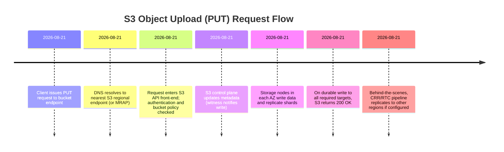

# Perplexity

Amazon S3 is a globally distributed, multi-tenant object storage system built around a sharded metadata layer and a multi–Availability Zone (AZ) erasure-coded storage layer, designed for ~11 nines durability and 4 nines availability per object per year. It achieves this by synchronously replicating (or erasure-coding) data across at least three AZs within a region, aggressively detecting and repairing failures, and layering a strongly consistent metadata tier on top of a horizontally scaled storage fleet.[1][2][3][4][5][6]

## Big picture

S3 is an object store: you put and get immutable objects identified by a key within a bucket, not a block device or POSIX filesystem. A bucket is a logical container with a globally unique name and a specific AWS Region; objects live inside buckets, each with data (bytes), metadata, and a key (for example `photos/2026/trip.jpg`).[5][7][8][1]

S3 is designed as a service, not a cluster you provision: AWS hides disks, RAID, and nodes behind HTTP APIs (REST/SDK/CLI) and takes responsibility for scaling capacity, redundancy, and durability. Standard storage classes are designed for 99.999999999% durability and 99.99% availability per object per year, while specialized classes trade off AZ count, retrieval time, or cost.[2][3][8][9][1]

## API and namespace

Clients talk to S3 via regional endpoints such as `s3.eu-west-1.amazonaws.com` or virtual-hosted–style endpoints like `my-bucket.s3.eu-west-1.amazonaws.com`, which front a large fleet of API servers in the target region. DNS and load balancers distribute requests across this fleet, which is itself partitioned into “cells” for fault isolation and safe, incremental deployment.[9][10][11][12][13][1]

Every request is authenticated and authorized using IAM, bucket policies, and ACLs before it touches data or metadata, enforcing security and multi-tenancy boundaries. The front-end service decodes the HTTP verb and path (`PUT /bucket/key`, `GET /bucket/key`, `DELETE`, `LIST`), applies rate limiting and throttling as needed, and forwards work to the internal metadata and storage layers.[11][14][1][9]

S3 uses a flat namespace internally: “folders” are a key-name convention, not a real directory tree; list operations are prefix-based scans over keys. Buckets are region-scoped but names are globally unique across AWS, which allows S3 to map hostnames to the correct region and account without collisions.[7][8][5][11]

## Metadata layer

S3 separates metadata (object names, sizes, version IDs, ownership, pointers to data) from the raw object bytes, similar to inode vs data blocks in a filesystem. The metadata tier stores records keyed by a composite of bucket and object key, typically hashed and sharded across many partitions to scale to trillions of objects.[6][10][14][11]

Because a single index server cannot handle the namespace, S3 partitions metadata into many shards, each responsible for a range of hashed keyspace; objects with certain prefixes are mapped to particular partitions, and AWS hashes prefixes to avoid hot partitions from sequential key patterns. This sharding means that different objects in the same bucket can be served by different metadata partitions, which is critical to scaling reads and writes across hundreds of millions of operations per second globally.[10][12][13][14][11]

The metadata store tracks, for each logical object version, a pointer (often a UUID) to the physical storage fragments, plus auxiliary attributes such as storage class, encryption state, and tags. It also manages per-object ordering of operations (PUT, overwrite, delete) and the strong-consistency machinery discussed later.[4][14][15][9][11]

## Storage layer

The storage layer is a fleet of storage nodes that manage physical disks; it stores object data bytes, typically in append-only logs (write-ahead logs) along with embedded indices that map from internal object IDs to file offsets. S3 splits incoming object data into chunks/shards and uses erasure coding (data shards plus parity shards) to achieve durability and reduce replication overhead.[14][6]

Within a region, standard storage classes store data redundantly across multiple devices in at least three AZs; One Zone classes store across multiple devices in a single AZ only, trading resilience for lower latency or cost. Erasure coding stripes an object over many disks and nodes, so reads can be served by many drives in parallel and the system can survive multiple disk or node failures without data loss.[8][2][5][6]

Storage nodes maintain local integrity via checksums for each fragment; S3 computes a checksum at write time and stores it alongside the object, and every subsequent read revalidates integrity. Internal “repair fleets” continuously scan for corrupted or missing fragments (using these checksums) and reconstruct them from parity shards or redundant copies, minimizing time-to-repair and thereby enabling the eleven-nines durability target.[3][2][4][5][6]

## Write path

When you upload an object (PUT), the request reaches the front-end/API layer, which authenticates the caller and enforces bucket policy. The API service then streams the object bytes to the storage layer, which persists them (often as erasure-coded fragments) across multiple storage nodes and AZs, and returns an internal ID representing this object version.[1][5][6][9][10][11]

S3 does not acknowledge the write to the client until redundancy targets are met for the configured storage class—meaning the object has been successfully stored across the necessary devices/AZs and checksums recorded. Only after successful data placement does the API layer insert or update the corresponding metadata record linking the bucket/key to the new object ID, version ID, and attributes, and then return 200 OK.[2][3][4][5][11][14]

For large uploads, multi-part upload splits the object into parts that can be uploaded in parallel, each following the above path; a final “Complete Multipart Upload” call atomically assembles parts into a single logical object version at the metadata layer. This enables high throughput over high-latency networks and allows retrying individual parts without restarting the whole upload.[12][9][1]

## Read path

On a GET, the front-end authenticates the request and looks up the object’s metadata record by bucket and key, resolving to the latest version ID and the object ID/locations. It then fetches the corresponding fragments from the storage layer; for erasure-coded data, it contacts enough shards to reconstruct the object, which can be fewer than the total number of shards if parity is available.[6][9][11][1]

Because metadata and storage are decoupled, the API layer can leverage caching for hot metadata records while still fetching bytes from any suitable storage node copy or shard, which helps with latency under high read loads. The system also uses internal retries and redirect logic to route around unhealthy storage nodes or AZs, preserving availability even during localized failures.[13][4][10][11][2]

LIST operations hit the metadata layer rather than storage, scanning the keyspace for the given bucket and prefix and returning keys plus selected metadata, with strong consistency guarantees in modern S3. Because list traffic can be heavy and skewed, sharding and caching within the metadata tier are critical to keep latency predictable and avoid hot spots.[15][10][11][13][1]

## Durability design

S3’s headline durability—99.999999999% per object-year for standard classes—is a design target derived from redundancy across AZs, aggressive repair, and continuous integrity verification. Standard, Intelligent-Tiering, Standard-IA, and several Glacier classes redundantly store each object on multiple devices across at least three AZs, meaning the system is designed to withstand the loss of an entire AZ without losing data.[3][4][5][2]

Durability is not just “replication factor N”; AWS emphasizes it as a continuous control loop: detect failed disks or nodes quickly, reconstruct lost fragments from parity, and reestablish redundancy before additional failures accumulate. Regular checksumming and scrubbing detect latent bit rot, and any mismatch triggers repair from a known-good copy.[4][5][2][3][6]

AWS documents that S3 is designed to sustain concurrent device failures and even the loss of entire facilities while preserving stored data, and that the eleven-nines figure is a modeled expectation, not a measured loss-rate promise. For customers requiring resilience to regional disasters or jurisdictional separation, cross-region replication (CRR) asynchronously replicates objects to buckets in other regions, providing additional, independent replicas beyond the baseline multi-AZ design.[9][13][2][3][4]

## Availability design

Availability is a separate axis from durability: S3 Standard aims for 99.99% yearly availability, meaning expected downtime of roughly tens of minutes per year. To achieve this, the service uses multi-AZ replication of both metadata and storage, cell-based architectures, and automated failover so that reads and writes can continue even when an AZ or cell is impaired.[10][12][13][2][3][6]

Within an AZ, S3 replicates data across multiple disks and storage nodes; if a drive fails, traffic transparently shifts to other copies while repair processes run in the background. Across AZs, front-end fleets and metadata services can route requests to healthy cells, and multi-value DNS ensures clients connect only to healthy endpoints.[12][13][2][6][10]

Operationally, AWS stresses safe continuous deployment, deep post-incident root-cause analysis, and feature-flagged rollouts, all on top of S3’s cell-based layout, to avoid global impact from localized bugs or failures. Customers can further architect for availability using features like versioning, multi-region access points, and CRR, which combine S3’s infrastructure-level guarantees with application-level redundancy.[13][3][9][12]

## Latency and distribution

S3 endpoints are regional: data in a bucket stays within that region unless you explicitly replicate or move it, and clients connect to regional S3 front-ends over AWS’s backbone or the public internet. Within a region, AZs are physically separated (tens of kilometers) but connected with low-latency links; S3 replicates data synchronously across at least three AZs while still maintaining millisecond-scale latencies due to these high-bandwidth links and local front-end fleets.[5][7][1][2][10]

S3 Express One Zone is a specialized storage class that keeps data in a single AZ and is optimized for single-digit millisecond latency for latency-sensitive workloads, trading off multi-AZ resilience. More generally, multi-part uploads and range GETs let clients parallelize large transfers, and erasure coding allows reads to complete as soon as enough shards are fetched, both of which help hide per-node latency under aggregate throughput.[8][1][6][9]

S3 itself is not a global CDN, but it integrates tightly with Amazon CloudFront and multi-region features: CloudFront caches S3 objects near users, while features like multi-region access points and CRR let you keep data closer to geographically distributed clients. For intra-AWS workloads (for example EC2 or Lambda in the same region), colocating compute in the same region or AZ and using VPC endpoints reduces latency and avoids hairpinning over the public internet.[3][5][9][13]

## Consistency model

Originally, S3 offered eventual consistency for overwrite and delete operations in some regions, but since December 2020 it provides strong read-after-write consistency for all operations in all regions, at no extra cost. That means after a successful PUT, overwrite, or DELETE, any subsequent GET or LIST immediately sees the latest state—what you write is what you read.[15]

Under the hood, AWS retrofitted strong consistency without removing the fast metadata caches by introducing per-object ordering and a “witness” component: the system enforces a total order of operations for each object and uses a read barrier so that cache entries never return stale data. If the cache cannot guarantee that it has the latest version, the read falls through to the authoritative persistence tier, ensuring that clients either get the new state or fail, but never see an older version after a successful write.[4][15]

Strong consistency also applies to LIST operations: once a new object is written or deleted, bucket listings reflect that change immediately, which simplifies applications that rely on listing for discovery or coordination. This model lets you treat S3 more like a strongly consistent key-value store for many workloads, while still remembering that latency and throughput characteristics are those of a remote object store, not an in-memory database.[11][9][15]

## Design implications

For application architects, the key takeaway is that S3 is a strongly consistent, highly durable object store with millisecond to tens-of-milliseconds latency, not a low-latency attached disk; it is ideal for large objects, logs, backups, and data lakes, but not for per-request tiny reads in a hot path without caching. S3’s durability guarantees protect against hardware and facility failures, but they do not protect against authorized deletes or overwrites; you need versioning, MFA delete, backups, and access controls to guard against logical mistakes.[2][5][8][9][3][4]

Resilience and availability emerge from combining S3’s baseline guarantees with your architecture choices: multi-AZ within a region, optional multi-region replication, CloudFront caching, and careful use of storage classes (for example avoiding One Zone for critical data). Performance and cost tuning involve key design (to avoid hot prefixes), choosing appropriate storage classes (Standard, Intelligent-Tiering, Express), using multi-part uploads and parallelism, and colocating compute with data.[5][6][9][10][11][13][2][3]

Fuentes
[1] What is Amazon S3? - Amazon Simple Storage Service <https://docs.aws.amazon.com/AmazonS3/latest/userguide/Welcome.html>
[2] DataDurability.md <https://docs.aws.amazon.com/AmazonS3/latest/userguide/DataDurability.md>
[3] ARCHIVED: AWS Storage Services Overview <https://d1.awsstatic.com/whitepapers/Storage/AWS%20Storage%20Services%20Whitepaper-v9.pdf>
[4] How Amazon S3 Achieves Strong Consistency and Durability <https://hidekazu-konishi.com/entry/how_amazon_s3_achieves_consistency_and_durability.html>
[5] What Is Amazon S3? Complete Guide to AWS Storage 2026 <https://go-cloud.io/what-is-amazon-s3-guide/>
[6] Systems Design Notes: AWS S3 - Medium <https://medium.com/@ivaramme/systems-design-notes-aws-s3-6ef82a101e15>
[7] AWS Simple Storage Service (AWS S3) <https://www.geeksforgeeks.org/devops/introduction-to-aws-simple-storage-service-aws-s3/>
[8] Amazon S3 - Wikipedia <https://en.wikipedia.org/wiki/Amazon_S3>
[9] AWS S3 Deep Dive: Architecture, Performance, and Scaling <https://startupik.com/aws-s3-deep-dive-architecture-performance-and-scaling/>
[10] Deep Dive into AWS S3 Architecture | by Alon Shrestha <https://medium.com/@alonshrestha/deep-dive-into-aws-s3-architecture-18d214dcff14>
[11] Amazon S3 - A Deep Dive - The System Design Newsletter <https://newsletter.systemdesign.one/p/aws-s3-system-design>
[12] Amazon S3 Architecture Deep Dive - AWS <https://aws.amazon.com/video/watch/d33eda30e60/>
[13] Operational Best Practices <https://aws.amazon.com/blogs/storage/architecting-for-high-availability-on-amazon-s3/>
[14] How S3 works under the hood.. <https://medium.com/@Abose56/how-s3-works-under-the-hood-76ba8a567261>
[15] Amazon S3 Strong Consistency <https://aws.amazon.com/s3/consistency/>

---

# Deepseek (simple)

Understood. Here is the same deep engineering-level explanation of AWS S3, now presented entirely in English.

---

Amazon S3 is a massively complex distributed system. Its legendary resilience, availability, and performance stem from a series of deeply ingrained engineering principles. Here is a deep dive into its internal mechanics.

### 🏛️ Core Architecture: The Control Plane / Data Plane Dichotomy

S3's architecture is built on a critical separation of duties: **strictly isolating management functions (Control Plane) from data operation functions (Data Plane).**

* **Control Plane:** Handles account and bucket-level management operations, such as creating or deleting buckets (`CreateBucket`, `DeleteBucket`), setting bucket policies (`PutBucketPolicy`), and configuring lifecycle rules. These operations are low-frequency and have strict rate limits. A critical design point is that **failures in the control plane do not affect already-running workloads**; the data plane operates independently.
* **Data Plane:** Handles the core data operations: **PUT, GET, DELETE, and HEAD** requests for objects. This plane processes hundreds of billions of requests per day and is optimized for massive scale and low latency.

### 🔗 Resilience & Durability: How the "11 9s" Are Achieved

S3’s resilience is designed to deliver **99.999999999% (11 nines) of object durability**.

1. **Availability Zone (AZ) Level Redundancy:** This is the bedrock of S3's resilience. An AWS Region consists of multiple physically isolated Availability Zones, connected by high-speed, low-latency private fiber networks. For storage classes like S3 Standard, data is automatically and redundantly stored across **a minimum of three physically distinct Availability Zones** within the same region. This guarantees data survival even if an entire AZ goes offline.
2. **Erasure Coding (Not Simple Replication):** Instead of brute-force 3x replication (which incurs a 3x storage cost), S3 uses **erasure coding** for data redundancy. Erasure coding fragments data into multiple pieces and adds parity blocks. The storage overhead is significantly lower than 3x replication, optimizing storage costs while sustaining extreme durability.
3. **Proactive Data Repair & Integrity Checks:** Background daemons continuously run to **actively detect and repair** any loss of data redundancy. Simultaneously, the system **periodically verifies data integrity using checksums**. If bit-rot or corruption is detected, S3 automatically recreates the lost data from other redundant fragments.
4. **Additional User-Configurable Protections:** S3 provides built-in mechanisms for users to increase resilience further, including **Versioning**, **Cross-Region Replication (CRR)**, and **Object Lock** (for Write-Once-Read-Many, or WORM, compliance).

### ⏱️ Availability & Latency

* **Availability:** S3 Standard is designed for **99.99% availability**. This high SLA is achieved through its multi-AZ deployment, automated failover, and the system's ability to self-heal from failures without manual intervention.
* **Latency:** S3 is architected as a low-latency system, with typical request latencies falling in the **100–200 millisecond** range. Because S3 is a network-accessed distributed system, every operation involves network round-trips, request routing, metadata lookups, and disk I/O, which naturally imposes this baseline.

### 🌐 Distribution & Scaling: Handling Massive Request Loads

To process millions of requests per second, S3 employs deeply optimized sharding and routing logic.

1. **Partitioning (Sharding):** S3 does not store all objects in a single flat namespace. Instead, it partitions data based on the **object's Key Name prefix**. Each partition is essentially a group of back-end storage nodes responsible for managing a specific subset of objects.
2. **Automatic Partition Splitting:** When a specific partition experiences high load, S3's backend **automatically splits it into two or more new partitions** to balance the traffic. This splitting is dynamic and transparent to the user—no action is required.
3. **Request Routing:** When a request arrives at S3, it first hits a **stateless Gateway Service**. This gateway queries the global **Indexing and Metadata Services** to determine which specific partition holds the target object. The request is then **transparently redirected** to the correct partition for processing.
4. **Performance Scaling via Prefixes:** Understanding partition mechanics is key to optimizing performance. Each individual prefix (e.g., `logs/2024/`) has a maximum throughput limit: **about 3,500 PUT/COPY/POST/DELETE requests per second** and **about 5,500 GET/HEAD requests per second**. You can **linearly scale performance** by spreading requests across **many distinct prefixes** (e.g., 10 prefixes can yield 35,000 writes/second). Therefore, **avoid monotonically increasing key patterns** (like timestamps) to prevent overwhelming a single "hot" partition.

### 🔄 Strong Consistency (Read-After-Write)

Prior to December 2020, S3 offered "eventual consistency." Since then, S3 has upgraded to provide **strong read-after-write consistency** for all `GET`, `PUT`, `LIST`, and metadata-update operations.

The implementation mechanics are as follows:

* **Metadata Caching & "Witnesses":** To maintain low latency, S3 caches metadata. To guarantee that cached data is never stale, the system introduces a component called a **"Witness"**.
* **Write Path:** S3 uses a **Write-Through** strategy. It updates the cache and synchronously updates the underlying metadata store. During each metadata update, the write coordinator notifies the "Witness."
* **Read Path:** When a read request occurs, the server queries the cache, but before serving the data, it asks the "Witness" if the cached version is the absolute latest. Only when the cache is confirmed to be current is the data served. If the cache is stale, the server fetches the data from the underlying metadata store, ensuring strong consistency.

### 🛠️ Performance Optimization Recommendations (Engineering Best Practices)

Based on the internal architecture above, here are actionable strategies to maximize S3 performance:

* **Optimize Key Name Design:** **Avoid sequential keys** (like timestamps or sequential IDs) to prevent hotspot partitions. Instead, prepend a **random or hashed prefix** (e.g., `hash_` + `timestamp`) to ensure requests are evenly distributed across all available partitions.
* **Leverage Parallelism:** S3 is a huge distributed system. To maximize throughput, **scale horizontally**. For a single client, use multiple parallel connections and multi-threaded requests to saturate the available bandwidth.
* **Utilize Caching Layers:** For **frequently accessed, latency-sensitive content**, place a cache layer in front of S3, such as **Amazon CloudFront** (CDN) or **Amazon ElastiCache**. This drastically reduces latency and offloads direct API calls to S3.
* **Use Multipart Upload for Large Files:** For **objects larger than 100 MB**, always use the **Multipart Upload** API. This allows you to upload parts in parallel, significantly improving throughput and providing efficient retry mechanisms if individual parts fail.
* **Use S3 Transfer Acceleration:** For **globally distributed users** uploading data, enable **S3 Transfer Acceleration**. This routes traffic through AWS's global edge network (CloudFront), optimizing the network path and reducing upload latency over long distances.

---

In summary, S3 achieves its world-class status through **strict control/data plane separation, multi-AZ redundancy, efficient erasure coding, intelligent dynamic partitioning, and a sophisticated strongly-consistent caching model**. Understanding these internal mechanics is essential for architecting high-performance, cost-effective, and resilient cloud-native applications.

---

# Deepseek (pro)

# Amazon S3: How It Works Under the Hood

Amazon S3 is not a filesystem or a single database. It is a massive distributed object storage system exposing a simple REST API (`GET`, `PUT`, `DELETE`, `LIST`, etc.), but underneath it is a layered architecture of stateless request routers, a partitioned/replicated metadata plane, and an erasure-coded data plane.

This answer focuses on the deep engineering mechanisms behind S3’s durability, availability, latency, and distribution.

---

## 1. High-Level Architecture

S3 separates the system into several planes:

```
Client
  │
  ▼
DNS / S3 Endpoint
  │
  ▼
Front-end request fleet   ← stateless HTTP/TLS, authn/authz
  │
  ├──► Metadata plane       ← partitioned, replicated index
  │
  └──► Data plane           ← erasure-coded storage nodes
```

### Request/front-end plane

* S3 endpoints resolve to many IP addresses.

* TLS is terminated at a fleet of stateless front-end servers.
* These servers authenticate requests using AWS Signature V4, IAM policies, bucket policies, ACLs, and VPC endpoint policies.
* They validate object size, content, headers, and apply bucket-level settings such as encryption, object lock, and lifecycle rules.
* They also handle request throttling and routing to the correct internal metadata and storage services.

### Metadata plane

* S3 stores object metadata separately from object bytes.

* For every object, the metadata includes:
  * bucket name
  * key
  * version ID
  * ETag/checksum
  * size
  * storage class
  * encryption metadata
  * physical location of data fragments
  * access control metadata
* This metadata is stored in a distributed, replicated, strongly consistent database.
* The namespace is partitioned across many metadata servers. Partitioning is typically based on the bucket and key, allowing high horizontal scale.
* Each metadata partition is replicated across multiple Availability Zones.

### Data plane

* Object bytes are not stored as a single file on a single disk.

* Instead, S3 uses erasure coding to split objects into multiple data and parity fragments.
* Fragments are spread across many storage nodes, racks, and Availability Zones.
* This allows S3 to tolerate the loss of multiple disks, nodes, or even entire facilities without losing data.

---

## 2. Write Path

When a client uploads an object:

1. **Authentication/authorization**
   * The front-end validates the request, identity, permissions, and bucket settings.

2. **Metadata allocation**
   * S3 reserves a new object version in the metadata plane.
   * The metadata write is not yet made visible to readers until the data is safely stored.

3. **Data streaming and erasure coding**
   * The object is streamed in chunks.
   * S3 erasure-codes the object: it takes `k` data chunks and creates `m` parity chunks, producing `n = k + m` fragments.
   * These fragments are written to different storage nodes and fault domains.
   * The exact code parameters are not public, but the design is similar to Reed-Solomon or other maximum-distance-separable codes.

4. **Durable acknowledgement**
   * S3 does not acknowledge the write until enough fragments are durably committed across independent fault domains to meet its durability target.
   * The metadata entry is then committed and made visible.
   * The client receives a `200 OK`.

5. **Background verification**
   * After the write, background processes verify fragment integrity and rebuild any missing or corrupt fragments.

For large objects, S3 supports multipart uploads. Each part is independently stored and erasure-coded, which improves throughput and allows parallel uploads.

---

## 3. Read Path

When a client reads an object:

1. **Front-end validates the request.**
2. **Metadata lookup**
   * S3 looks up the object’s metadata to find the list of fragment locations, object size, checksum, and version.
3. **Fragment retrieval**
   * S3 fetches any `k` of the `n` stored fragments in parallel.
   * It can fetch the fastest-responding fragments, which improves tail latency.
4. **Decoding**
   * The erasure-coded fragments are decoded back into the original object bytes.
5. **Streaming**
   * S3 streams the object to the client.
   * For `Range` requests, only the relevant chunks and fragments are read.

Because the metadata lookup is strongly consistent, clients never see stale object data after a successful write.

---

## 4. Strong Consistency

Since December 2020, S3 has offered strong read-after-write consistency for all operations in all AWS Regions, including overwrites, deletes, and listings.

This is a significant distributed systems achievement. Under the hood, it means:

* Metadata writes are committed using a quorum-based or consensus replication protocol.
* A successful `PUT` is only acknowledged after the metadata is durably committed and made visible to all subsequent reads.
* `GET`, `LIST`, and `HEAD` operations observe the latest committed metadata version.
* Object data itself is immutable for a given version; overwrites create a new version and atomically update the metadata pointer.

S3 previously used an eventual-consistency model for overwrites, but the metadata plane was redesigned to support strong consistency without sacrificing availability.

---

## 5. Resilience and Durability

S3 Standard is designed for **99.999999999% durability** — often called “11 nines.” That means if you store 10 million objects, you would expect to lose one object every 10,000 years on average.

### How S3 achieves this

#### Multi-AZ storage

* S3 Standard automatically stores data across at least **three Availability Zones** in a Region.

* It is designed to sustain the concurrent loss of data in **two** facilities.

#### Erasure coding

* Instead of keeping full replicas, S3 stores encoded fragments across many independent failure domains.

* Any `k` of `n` fragments can reconstruct the original object.
* This gives high durability with much lower storage overhead than 3x replication.
* For example, a 10+4 code would tolerate the loss of any 4 fragments.

#### Fragmentation across fault domains

* S3 places fragments on different:
  * disks
  * storage nodes
  * racks
  * Availability Zones

* This ensures that a single power supply, network switch, or even an entire data center failure does not destroy enough fragments to lose data.

#### Continuous anti-entropy and repair

* S3 stores checksums for every fragment.

* Background processes continuously scan stored data, verify checksums, and detect bit rot, latent disk errors, or missing fragments.
* If a fragment is lost or corrupt, S3 reconstructs it from the remaining fragments and writes a new healthy fragment.
* This automatic healing is a critical reason S3 durability is so high.

#### Shuffle sharding

* S3 uses a technique called **shuffle sharding** to limit the blast radius of failures.

* Instead of placing all customers onto a single large shared pool of workers, S3 creates many smaller virtual shards.
* Each customer is assigned to a random subset of those shards.
* If a worker or shard fails, only the customers assigned to that shard are affected, rather than the entire S3 service.
* This applies to front-end request handling, metadata services, and background workers.

#### Versioning and object lock

* Versioning protects against accidental overwrites and deletes by keeping every object version.

* Object Lock adds WORM protection, preventing deletion or modification for a fixed period.
* These features protect against application-level or user errors, which are a different class of failure than hardware faults.

---

## 6. Availability

S3 Standard is designed for **99.99% availability** over a year. Its availability comes from:

### Stateless request routers

* Front-end servers are stateless and horizontally scaled across multiple AZs.

* Any front-end can handle any S3 request.
* Load balancers and DNS route traffic away from unhealthy nodes.

### Replicated metadata

* Metadata partitions are replicated across AZs.

* If one AZ fails, other metadata replicas continue serving reads and writes.

### Multi-AZ data placement

* With erasure coding and at least three AZs, S3 can continue serving data even if an entire AZ becomes unavailable.

* Reads can be satisfied from any `k` fragments in the remaining AZs.

### Graceful degradation

* S3 is designed to degrade gracefully under load or partial failure.

* It may throttle some requests, but it does not collapse globally.
* Shuffle sharding prevents noisy-neighbor problems from affecting unrelated customers.

### SLAs

* S3 Standard has a 99.9% monthly availability SLA.

* The design target is 99.99%, but the SLA gives customers service credits if availability falls below 99.9%.

---

## 7. Latency

S3 is optimized for high throughput and low latency, but it is not a microsecond-latency system like Redis or a local SSD. Standard S3 first-byte latency is typically in the tens to low hundreds of milliseconds, depending on object size, region, and network.

### Sources of latency

* DNS resolution

* TCP/TLS handshake
* Request authentication and authorization
* Metadata lookup
* Storage fragment retrieval
* Erasure decoding
* Network transfer to the client

### How S3 reduces latency

#### Distributed front ends

* S3 front-end fleets are spread across AZs and close to clients within the Region.

* This reduces internal network hops.

#### Fast metadata lookups

* Metadata is stored in a low-latency distributed database.

* Hot metadata is often cached at the front-end layer or in memory.
* Strong consistency is achieved without making every read a slow quorum read; the system uses optimized consensus and read-leader mechanisms.

#### Parallel fragment reads

* S3 fetches erasure-coded fragments in parallel from many storage nodes.

* It can use the fastest `k` fragments, which improves tail latency.
* Large objects are streamed in chunks, so the first byte can be delivered before the entire object is fetched.

#### HTTP range requests

* Clients can request only the bytes they need.

* S3 only reads the relevant chunks and fragments.

#### Multipart upload

* Multipart upload allows large objects to be uploaded in parallel, increasing throughput and reducing total upload time.

#### S3 Transfer Acceleration

* This routes uploads through AWS CloudFront edge locations.

* Data travels from the client to the nearest edge over the public internet, then over AWS’s private backbone to the destination Region.
* This can significantly reduce latency for cross-continent uploads.

#### S3 Express One Zone

* S3 Express One Zone is a storage class designed for **single-digit millisecond** latency.

* It stores data in a single AZ on SSD-backed storage.
* It is intended for latency-sensitive applications that can tolerate losing data if the AZ is destroyed.
* It uses a different architecture: data and metadata are co-located in the same AZ, reducing cross-AZ network hops.

---

## 8. Distribution and Scale

### Regional service

By default, an S3 bucket is created in a specific AWS Region. S3 is a **regional service**, not globally replicated by default.

Inside that Region, S3 distributes data across multiple AZs. Each AZ is a separate physical location with independent power, cooling, and networking, but they are connected by high-speed private links.

### Horizontal partitioning

S3 scales by partitioning the namespace:

* Metadata is partitioned by bucket and key.
* Data fragments are distributed across many storage nodes.
* S3 automatically splits hot partitions and rebalances load.

S3 can handle very high request rates. The legacy guidance of randomizing key prefixes is less important today, but S3 still benefits from naturally distributed key names for extreme workloads.

### Global distribution patterns

Although S3 itself is regional, AWS provides several mechanisms to achieve global distribution:

#### Cross-Region Replication (CRR)

* Automatically and asynchronously replicates objects from a source bucket in one Region to a destination bucket in another.

* Replication is version-aware and can be configured with S3 Replication Time Control for a 15-minute replication SLA.
* This improves durability against a whole-Region loss and reduces read latency for users in the destination Region.

#### Multi-Region Access Points

* Provides a single global S3 endpoint.

* Routes requests to the nearest Region that has a replicated copy of the bucket.
* If one Region fails, requests can be routed to another Region.

#### CloudFront

* S3 can be used as an origin for Amazon CloudFront.

* CloudFront caches objects at hundreds of edge locations worldwide.
* This reduces latency for global users and offloads reads from S3.

#### S3 Transfer Acceleration

* As mentioned, it accelerates uploads by using edge locations and the AWS backbone.

### Consistency vs. replication

* Cross-Region Replication is asynchronous, so it is eventually consistent across Regions.

* Within a single Region, S3 is strongly consistent.
* This trade-off is deliberate: synchronous cross-Region replication would add significant write latency.

---

## 9. Key Distributed Systems Patterns Used by S3

### Separation of metadata and data

* Metadata is small, highly contended, and requires strong consistency.

* Object data is large, immutable for a version, and can be erasure-coded.
* Separating them allows each to be optimized independently.

### Erasure coding over replication

* Replication is simple but expensive.

* Erasure coding provides equivalent or better durability with much lower storage overhead.
* The cost is higher CPU and more complex read/write paths.

### Quorum/consensus for metadata

* Strong consistency requires that a write is acknowledged only after a quorum of metadata replicas have committed it.

* Reads must observe the latest committed state.
* This is similar to systems like Zookeeper, etcd, or DynamoDB’s consensus internals.

### Anti-entropy and continuous repair

* Large-scale storage systems constantly experience disk failures, bit rot, and node outages.

* S3 does not wait for a failure to become visible to users.
* Background processes continuously verify and repair data.

### Shuffle sharding

* Shuffle sharding is a powerful availability technique.

* It prevents correlated failures from affecting a large number of customers.
* AWS has published detailed descriptions of this technique in the context of S3 and Route 53.

### Stateless front ends

* All request processing is stateless.

* This allows any front-end to serve any request.
* It simplifies scaling and failure recovery.

---

## 10. Summary

Amazon S3 achieves its extreme durability, availability, and scale through a combination of:

* **Erasure coding** across many independent fault domains.
* **Multi-AZ storage** designed to survive the loss of two facilities.
* **A strongly consistent, partitioned, replicated metadata plane**.
* **Stateless, horizontally scaled request routers**.
* **Continuous background repair and anti-entropy**.
* **Shuffle sharding** to limit failure blast radius.
* **Regional placement with optional global acceleration and replication**.

The result is a system that can store exabytes of data, survive entire data center failures, provide strong consistency, and still deliver low-latency object access at massive scale.

---

# Gemini

# **Architectural Foundations of Amazon Simple Storage Service: Deep Engineering Mechanics of Scale, Resilience, Latency, and Distribution**

## **Global System Topology and Edge Request Orchestration**

Amazon Simple Storage Service (Amazon S3) operates as a massively distributed object storage platform managing trillions of objects and processing millions of requests per second globally1. At this scale, traditional monolithic storage architectures fail due to single-point bottlenecks and blast-radius constraints. S3 addresses these challenges by employing a microservices architecture composed of over 300 autonomous software services2. The system strictly segregates its operations across two functional planes: the Control Plane and the Data Plane1.  
The Control Plane manages administrative workflows, including bucket creation, Access Control List (ACL) modifications, Identity and Access Management (IAM) policy evaluations, and Cross-Region Replication (CRR) configurations1. Because administrative operations occur less frequently but require high transactional complexity, the Control Plane prioritizes isolation, strict policy validation, and metadata consistency.  
The Data Plane executes high-throughput operations including PUT, GET, LIST, and DELETE requests1. Engineered for ultra-low execution overhead, predictable latencies, and high availability, the Data Plane processes incoming HTTP REST API requests through high-capacity frontend proxy fleets1. These proxies parse incoming bucket names and object keys, validate requests using AWS Signature Version 4 (SigV4) authentication, and query distributed metadata caches to determine object location and configuration settings1.

Client HTTP Request  
       │  
       ▼  
Edge Routing & Frontend Load Balancing (DNS / TLS / SigV4)  
       │  
       ▼  
Metadata Subsystem & Consistency Engine (Physalia \+ Witness Read Barrier)  
       │  
       ▼  
Erasure Coding & Partitioning Engine (Reed-Solomon Multi-AZ Distribution)  
       │  
       ▼  
Storage Node Fleet (ShardStore Key-Value Engines)

Upon resolving the object metadata, the proxy routes the payload to the storage layer. For write operations, the payload passes through an erasure coding pipeline that splits the object into data and parity fragments, distributing them across physically isolated storage nodes1. For read operations, the proxy fetches shards from storage nodes in parallel, reconstructs the original object, and streams the payload back to the client1.

## **Storage Node Architecture: ShardStore Engineering and Formal Verification**

At the lowest physical storage tier, S3 replaces conventional Linux filesystems (such as ext4 or XFS) with ShardStore—a key-value storage engine written in Rust and designed specifically to manage raw storage media4. Standard POSIX filesystems introduce kernel locks, unpredictable garbage collection pauses, and IO overhead when handling billions of small files on high-density disks. ShardStore circumvents these limitations by managing physical disk allocation directly4.

### **Extents and Out-of-Order Decoupled LSM-Tree Layout**

ShardStore structures underlying physical media into large, fixed-size contiguous blocks called extents, which typically span multiple megabytes4. Within each extent, writes are strictly append-only and managed by a single write pointer that marks the next valid offset5. Direct in-place overwrites are prohibited5.

Extent Physical Media Layout:

\[ Chunk A (Obj 1\) \] \[ Chunk B (Obj 2\) \] \[ Chunk C (Obj 1\) \] \[ Write Pointer \]  
                                                                   ▲  
                                                        Next Append Offset

To organize keys efficiently, ShardStore implements a Log-Structured Merge-tree (LSM-tree)5. However, standard LSM-trees suffer from severe write amplification during background compaction, as large data values are repeatedly copied alongside index keys. ShardStore eliminates this overhead by decoupling the metadata index from physical data storage, similar to the WiscKey architecture5.  
The LSM-tree index only stores key-to-location mappings, recording the shard identifier alongside physical location metadata (extent ID, offset, and chunk byte length)5. The actual customer object chunks are written directly to data extents outside the LSM-tree5. When deletions or object updates leave unreferenced chunks within an extent, a background garbage collection process copies surviving chunks to active extents and executes a reset operation on the original extent, restoring its write pointer to zero for full block reuse5.

### **Soft-Updates Crash Consistency and Dependency Graphs**

To avoid the IO performance penalty of synchronous Write-Ahead Logging (WAL) for every disk append, ShardStore achieves crash consistency through a custom soft-updates protocol managed by an in-memory runtime dependency graph5.  
Mutating operations—such as appending data chunks, updating LSM-tree indices, and advancing extent write pointers—generate explicit operational dependencies7. For example, an LSM-tree key update cannot be flushed to disk before the physical extent payload bytes it references are fully written7. ShardStore dynamically constructs a Directed Acyclic Graph (DAG) representing these constraints7.  
The IO scheduler traverses the DAG, issuing asynchronous, non-blocking disk writes that enforce strict topological ordering5. In the event of a sudden power loss, unindexed payload bytes may remain on an extent, but metadata pointers will never reference unwritten physical addresses, ensuring deterministic crash recovery without synchronous logging overhead4.

### **Formal Verification with Lightweight Formal Methods**

Given the high concurrency and complex crash-recovery paths within ShardStore, traditional integration testing is insufficient. S3 validates ShardStore using lightweight formal methods integrated into the continuous delivery pipeline4.  
Engineers maintain formal specification reference models written in Rust that define expected abstract behavior, such as modeling the key-value store as an atomic hash map6. During continuous integration, AWS uses Shuttle—an open-source Rust model checker developed for S37. Shuttle intercepts thread scheduling and IO calls, systematically exploring millions of concurrent interleavings and injecting simulated hardware crashes at critical dependency graph edges7. This continuous automated reasoning mathematically verifies that memory unsafety, race conditions, and crash-inconsistency bugs are eliminated prior to production deployment7.

## **Distributed Metadata and Micro-Consensus: The Physalia Subsystem**

Managing metadata for trillions of objects requires distributed consensus that scales horizontally without introducing single points of failure. S3 addresses this using Physalia—a distributed metadata consensus engine built on micro-consensus cells9.

### **Micro-Consensus Cells and Blast Radius Isolation**

Rather than deploying a monolithic, service-wide Paxos cluster, Physalia partitions metadata into millions of small, autonomous consensus groups called micro-consensus cells9. A typical Physalia cell consists of a small number of nodes (e.g., three or five) responsible for managing state consensus over a localized partition of the metadata namespace9.

Physalia Infrastructure Topology:

Datacenter Racks:   \[ Rack A \]      \[ Rack B \]      \[ Rack C \]  
                       │               │               │  
Physalia Cell:      \[ Node 1 \] ───► \[ Node 2 \] ───► \[ Node 3 \]  
                                (3-Node Paxos Group)

The placement of Physalia nodes is hardware-topology aware11. Nodes within a single micro-consensus cell are distributed across independent network switches, server racks, and Power Distribution Units (PDUs)11. Consequently, a hardware fault, switch failure, or power disruption affecting a subset of infrastructure isolates the blast radius to a microscopic fraction of the metadata namespace, allowing the remainder of the fleet to operate without interruption9.

### **Roster Leases for Localized Linearizable Reads**

Standard Paxos implementations require all linearizable read operations to route through the active cluster leader to prevent stale data retrieval, creating performance bottlenecks. Physalia resolves this by utilizing Roster Leases (and the Bodega consensus framework)10.  
Under Roster Leases, leadership is generalized across an explicit set of replica nodes known as responders10. A roster lease set ![][image1] is defined as:  
![][image2]  
A quorum of the cell grants timed leases to all nodes in ![][image1]10. Mutating write operations must achieve acknowledgment from a responder-covering quorum before committing10. Because every active responder holds valid leases ensuring no write can commit without its knowledge, any responder node in ![][image1] can serve linearizable metadata reads directly from its local memory10. This approach eliminates inter-node network hops on read paths while maintaining linearizability10.

## **The Strong Read-After-Write Consistency Engine**

Historically, S3 operated an eventually consistent model for overwrite PUT and DELETE requests due to asynchronous metadata propagation across distributed caches13. In December 2020, AWS updated S3 to support strong read-after-write consistency for all HTTP operations globally without sacrificing performance or availability guarantees13.

### **Per-Object Replication Ordering**

Achieving global strong consistency without centralized locking mechanisms requires ordering mutations on a per-object basis13. S3 introduced a per-object replication ordering primitive within its persistent metadata subsystem13.

Per-Object Timeline Sequencing:

Time ─────────────────────────────────────────────────────────────────►  
  PUT Object Key "A" (v1)  ──► Sequence ID: 101 ──► Commits to Persistence Tier  
  PUT Object Key "A" (v2)  ──► Sequence ID: 102 ──► Notifies In-Memory Witness

Every mutating write targeting an object key is assigned a deterministic sequence value by the persistence tier13. Because sequencing is evaluated independently per key, the system operates without global lock managers or cross-key coordination, allowing the consistency engine to scale horizontally across the entire storage fleet13.

### **In-Memory Witness and Read Barrier Protocols**

To deliver low-latency metadata access, S3 fronts its persistent database with an in-memory caching tier13. In the eventual consistency model, read requests served by cache nodes that had not yet applied recent updates could return stale data13.  
S3 resolves this by introducing an In-Memory Witness subsystem that acts as an authoritative Read Barrier over the metadata cache13.

> 1. **Mutating Write Path (PUT/DELETE)**: When a write request is committed to the persistent metadata tier, the persistence layer immediately sends a synchronous notification to the Witness, updating its active sequence pointer for that object key before returning success to the client13.  
> 2. **Read Path (GET/HEAD/LIST)**: Incoming read requests hit the Witness read barrier before reading from the metadata cache13. The Witness checks whether the local cache version matches or exceeds the authoritative sequence pointer13. If the cache is fresh, the request is served instantly13. If the Witness detects a pending write that the cache has not yet applied, the request bypasses the cache and fetches the latest value directly from the persistence tier13.

If an individual Witness node becomes unreachable, the read path automatically falls back to issuing quorum queries directly against the persistent metadata tier13. This fallback preserves system availability, incurring only a transient latency penalty while maintaining strong consistency guarantees13.

## **Multi-AZ Spatial Distribution and Eleven-Nines Durability**

S3 Standard is architected to deliver ![][image3] (eleven nines) annual data durability13. This target implies that a dataset of 10,000,000 objects stored in S3 would expect to lose an average of one object every 10,000 years. Delivering this level of durability requires spatial erasure coding, geographic redundancy, and active storage scrubbing1.

### **Reed-Solomon Erasure Coding Mechanics**

Standard multi-copy mirroring (such as 3-way replication) requires a ![][image4] storage overhead (![][image5] capacity multiplier), making it cost-prohibitive at scale. S3 reduces storage overhead while increasing fault tolerance by using Reed-Solomon Erasure Coding (![][image6])1.  
An object payload is partitioned into ![][image7] data fragments, which are transformed via matrix multiplication over Galois Fields ![][image8] into ![][image9] total shards, where ![][image10] represents parity fragments1:  
![][image11]  
Here, ![][image12] represents the ![][image13] generator matrix, ![][image14] is the data vector, and ![][image15] is the vector of encoded shards persisted across physical storage nodes1.

Reed-Solomon Multi-AZ Fragment Layout:

             Source Payload Byte Stream  
                         │  
       Matrix Generation (k Data \+ m Parity)  
                         │  
  ┌──────────────────────┼──────────────────────┐  
  │                      │                      │  
  ▼                      ▼                      ▼  
\[ Availability Zone 1 \] \[ Availability Zone 2 \] \[ Availability Zone 3 \]  
  Shard 1 (Data)          Shard 3 (Data)          Shard 5 (Data)  
  Shard 2 (Data)          Shard 4 (Data)          Shard 6 (Parity)  
  Shard 7 (Parity)        Shard 8 (Parity)        Shard 9 (Parity)

If any ![][image10] shards are lost due to drive failures or datacenter outages, the original data vector ![][image14] can be reconstructed1. The system selects any ![][image7] surviving shards from ![][image15], extracts the corresponding ![][image16] sub-matrix ![][image17], calculates its matrix inverse ![][image18], and multiplies it by the surviving shard vector1:  
![][image19]

### **Spatial Distribution and Healing Daemons**

The generated ![][image6] shards are distributed across a minimum of three distinct physical Availability Zones (AZs) within an AWS Region1. Each AZ operates with independent power, cooling, and networking infrastructure. Because parity settings are configured such that ![][image20], S3 can withstand the total destruction or extended offline status of an entire Availability Zone without data loss or read interruption1.  
To maintain durability over time, S3 employs autonomous repair daemons:

> * **Bit-Rot Scrubbing**: Storage nodes continuously read stored extents in the background, recalculating block-level checksums to detect silent media corruption at the disk sector level14.  
> * **Proactive Shard Reconstruction**: When a storage node or hard drive fails health checks, automated repair daemons retrieve surviving shards from remaining online nodes, reconstruct the missing shards using matrix inversion, and stream the new shards onto healthy storage nodes1.

## **High-Throughput and Ultra-Low Latency Mechanics: S3 Express One Zone**

For compute-intensive workloads—such as machine learning training pipelines, financial modeling, and real-time analytics—standard object storage access latencies (![][image21]) can constrain processing throughput14. S3 Express One Zone addresses this by providing single-digit millisecond data access latencies (![][image22]), up to ![][image23] faster data access, and request cost reductions of ![][image24] compared to S3 Standard14.

S3 Express One Zone Colocated Architecture:

Single AWS Availability Zone  
┌─────────────────────────────────────────────────────────────┐  
│  Compute Fleets (EC2 / EKS / EMR)                           │  
│       │                                                     │  
│       ├──► CreateSession API ──► In-Memory Token Issue      │  
│       │                                                     │  
│       └──► Direct NVMe Path (Directory Bucket Namespace)    │  
└─────────────────────────────────────────────────────────────┘

### **Directory Buckets vs. General Purpose Buckets**

Express One Zone co-locates storage and compute within a single Availability Zone, trading multi-AZ replication for lower access latencies14. Data in Express One Zone is stored inside specialized *Directory Buckets*3.  
General Purpose Buckets utilize a flat namespace where subdirectories are simulated by parsing string prefixes3. In contrast, Directory Buckets implement an explicit physical directory hierarchy3. This physical structure allows the storage engine to perform directory listings, prefix lookups, and path traversals without scanning flat prefix string indices3.

### **Session-Based Authentication Mechanics**

In traditional S3 buckets, every HTTP request requires calculating AWS Signature Version 4 (SigV4) HMAC-SHA256 headers, creating CPU overhead at high request rates3. Express One Zone replaces per-request SigV4 calculations with session-based authentication via the CreateSession API3.  
Clients authenticate once using their IAM credentials via CreateSession, receiving a lightweight, cryptographically signed session token3. Subsequent data operations (PUT, GET, LIST) pass this session token in the HTTP request header, bypassing per-request HMAC parsing3. This reduced authorization overhead allows a single Directory Bucket to process up to 2,000,000 GET requests per second and 200,000 PUT requests per second16.

## **End-to-End Data Verification and Checksum Subsystems**

Data corruption can occur at multiple points during transport or storage, including network packet loss, memory bit-flips, or disk media degradation. S3 implements end-to-end data integrity validation across client applications, network transit layers, and persistent storage media15.

### **Flexible Checksum Algorithms**

S3 supports multiple checksum algorithms, allowing applications to select an appropriate balance between computational performance and collision resistance15:

> * **CRC32 & CRC32C**: Cyclic Redundancy Checks optimized for fast hardware execution using CPU SIMD instructions, ideal for high-throughput streaming15.  
> * **CRC64NVME**: An optimized 64-bit CRC variant engineered for modern NVMe storage pipelines and high-speed memory architectures15.  
> * **SHA-1 & SHA-256**: Cryptographic hash functions that provide strong collision resistance against payload tampering, satisfying strict archival and compliance requirements15.

### **HTTP Trailers and Streaming Integrity Verification**

Pre-computing checksums over large objects prior to initiating an upload introduces memory and IO bottlenecks on client machines24. S3 resolves this by supporting HTTP Trailers for streaming uploads24.

Streaming Multipart Upload with HTTP Trailers:

Client Stream ──► Chunk 1 ──► Chunk 2 ──► Chunk 3 ──► Stream End  
                     │           │           │  
                     ▼           ▼           ▼  
               Accumulate Streaming Hardware Checksum  
                                 │  
                                 ▼  
                   Append HTTP Trailer Header  
                                 │  
                                 ▼  
               Server Validates Hash & Commits Payload

During an upload, the AWS SDK computes the checksum incrementally as data streams across the network24. The calculated checksum is appended to the end of the payload as an HTTP Trailer24. The S3 proxy computes a corresponding hash over the incoming byte stream and compares it against the HTTP Trailer value upon completion22. If the values do not match, S3 rejects the write and discards the extent allocation22.  
For datasets stored at rest, applications can run asynchronous integrity checks using S3 Batch Operations "Compute checksum" jobs15. These jobs iterate across objects directly within the storage layer, reading extents locally and verifying calculated hashes against stored metadata values without incurring network egress costs15.

## **Architectural Comparisons and Quantitative Trade-offs**

### **Storage Engine and Bucket Class Architectural Trade-offs**

| Engineering Dimension | S3 Standard (General Purpose) | S3 Express One Zone (Directory Buckets) |
| :---- | :---- | :---- |
| **Durability SLA** | **![][image3]** (![][image25]) multi-AZ3 | ![][image3] (![][image25]) single-AZ3 |
| **Target Access Latency** | Low tens of milliseconds (![][image21])3 | Single-digit milliseconds (![][image22])14 |
| **Transaction Scaling** | 5,500 GET / 3,500 PUT per sec per prefix17 | 2,000,000 GET / 200,000 PUT per sec per bucket16 |
| **Namespace Mechanics** | Flat namespace with prefix delimiter simulation3 | Explicit directory-based physical hierarchy3 |
| **Authentication Engine** | Per-request AWS SigV4 cryptographic signing3 | Session-based (CreateSession) API authentication3 |
| **Storage Architecture** | Multi-AZ Erasure Coding (![][image6])1 | Single-AZ co-located NVMe storage3 |

### **Core System Subsystems and Implementation Mechanics**

| Subsystem Name | Primary Technology / Protocol | Engineering Function |
| :---- | :---- | :---- |
| **ShardStore** | Decoupled LSM-Tree in Rust on raw extents4 | Eliminates filesystem IO overhead and write amplification4 |
| **Physalia** | Micro-consensus cells with Roster Leases9 | Bounds metadata fault blast radiuses and enables local reads9 |
| **In-Memory Witness** | Sequence-aware read barrier cache tier13 | Delivers strong read-after-write consistency13 |
| **Shuttle** | Continuous automated reasoning model checker7 | Validates concurrency and crash consistency prior to deployment7 |
| **HTTP Trailers** | Streaming SIMD/hardware checksum verification23 | Validates end-to-end data integrity without client pre-scans24 |

## **Conclusions and Engineering Synthesis**

The architecture of Amazon S3 illustrates how large-scale distributed storage systems evolve by systematically replacing conventional abstractions with purpose-built systems. By bypassing POSIX filesystems in favor of custom key-value storage engines (ShardStore), S3 optimizes IO pathing directly for underlying media4. By replacing monolithic consensus clusters with micro-consensus cells (Physalia), the platform isolates hardware failure domains9. Furthermore, coupling an in-memory witness read barrier with per-object sequence tracking provides strong read-after-write consistency without degrading availability13. Finally, integrating continuous formal verification with multi-AZ erasure coding allows S3 to operate at exabyte scale while maintaining eleven-nines durability1.

#### **Works cited**

> 1. Amazon S3 (Simple Storage Service): The Complete Guide \- Medium, [https://medium.com/aws-tip/amazon-s3-simple-storage-service-the-complete-guide-from-zero-to-production-86656f80ae64](https://medium.com/aws-tip/amazon-s3-simple-storage-service-the-complete-guide-from-zero-to-production-86656f80ae64)  
> 2. How automated reasoning helps Amazon S3 innovate at scale \- AWS, [https://aws.amazon.com/blogs/storage/how-automated-reasoning-helps-us-innovate-at-s3-scale/](https://aws.amazon.com/blogs/storage/how-automated-reasoning-helps-us-innovate-at-s3-scale/)  
> 3. AWS S3 Express One Zone: When and How to Use It in 2026, [https://blog.lueurexterne.com/en/blog/aws-s3-express-one-zone-when-and-how-to-use-it-in-2026/](https://blog.lueurexterne.com/en/blog/aws-s3-express-one-zone-when-and-how-to-use-it-in-2026/)  
> 4. Using Lightweight Formal Methods to Validate a Key-Value Storage, [https://dev.to/sf\_1997/research-paper-series-using-lightweight-formal-methods-to-validate-a-key-value-storage-node-in-1p37](https://dev.to/sf_1997/research-paper-series-using-lightweight-formal-methods-to-validate-a-key-value-storage-node-in-1p37)  
> 5. Using Lightweight Formal Methods to Validate a Key-Value Storage, [https://jamesbornholt.com/papers/shardstore-sosp21.pdf](https://jamesbornholt.com/papers/shardstore-sosp21.pdf)  
> 6. Using Lightweight Formal Methods to Validate a Key-Value Storage, [https://www.research-collection.ethz.ch/server/api/core/bitstreams/773c4758-469a-4355-990a-80d6ed07f1b0/content](https://www.research-collection.ethz.ch/server/api/core/bitstreams/773c4758-469a-4355-990a-80d6ed07f1b0/content)  
> 7. AWS team wins best-paper award for work on automated reasoning, [https://www.amazon.science/blog/aws-team-wins-best-paper-award-for-work-on-automated-reasoning](https://www.amazon.science/blog/aws-team-wins-best-paper-award-for-work-on-automated-reasoning)  
> 8. Using lightweight formal methods to validate a key-value storage, [https://www.amazon.science/publications/using-lightweight-formal-methods-to-validate-a-key-value-storage-node-in-amazon-s3](https://www.amazon.science/publications/using-lightweight-formal-methods-to-validate-a-key-value-storage-node-in-amazon-s3)  
> 9. Millions of tiny databases \- Murat Demirbas, [http://muratbuffalo.blogspot.com/2020/03/millions-of-tiny-databases.html](http://muratbuffalo.blogspot.com/2020/03/millions-of-tiny-databases.html)  
> 10. Localized Linearizable Reads at Anywhere Anytime via Roster Leases, [https://research.cs.wisc.edu/wind/Publications/bodega-osdi26.pdf](https://research.cs.wisc.edu/wind/Publications/bodega-osdi26.pdf)  
> 11. UCLA Electronic Theses and Dissertations \- eScholarship.org, [https://escholarship.org/content/qt7cr456zt/qt7cr456zt.pdf](https://escholarship.org/content/qt7cr456zt/qt7cr456zt.pdf)  
> 12. (PDF) Bodega: Serving Linearizable Reads Locally from Anywhere, [https://www.researchgate.net/publication/395387871\_Bodega\_Serving\_Linearizable\_Reads\_Locally\_from\_Anywhere\_at\_Anytime\_via\_Roster\_Leases](https://www.researchgate.net/publication/395387871_Bodega_Serving_Linearizable_Reads_Locally_from_Anywhere_at_Anytime_via_Roster_Leases)  
> 13. How Amazon S3 Achieves Strong Consistency and Durability, [https://hidekazu-konishi.com/entry/how\_amazon\_s3\_achieves\_consistency\_and\_durability.html](https://hidekazu-konishi.com/entry/how_amazon_s3_achieves_consistency_and_durability.html)  
> 14. Amazon S3 Express One Zone Storage Class \- Cloud Parallax, [https://cloudparallax.com/blog/amazon-s3-express-one-zone-storage/](https://cloudparallax.com/blog/amazon-s3-express-one-zone-storage/)  
> 15. Efficiently verify Amazon S3 data at scale with compute checksum, [https://aws.amazon.com/blogs/storage/efficiently-verify-amazon-s3-data-at-scale-with-compute-checksum-operation/](https://aws.amazon.com/blogs/storage/efficiently-verify-amazon-s3-data-at-scale-with-compute-checksum-operation/)  
> 16. Amazon S3 Express One Zone: Key Insights for 2026 \- Sedai, [https://sedai.io/blog/getting-started-s3-express-one-zone](https://sedai.io/blog/getting-started-s3-express-one-zone)  
> 17. Directory Buckets / Hot Object Storage | LLMS3, [https://llms3.com/node/directory-buckets-hot-object-storage](https://llms3.com/node/directory-buckets-hot-object-storage)  
> 18. Amazon S3 Express One Zone storage class \- AWS, [https://aws.amazon.com/s3/storage-classes/express-one-zone/](https://aws.amazon.com/s3/storage-classes/express-one-zone/)  
> 19. Exploring AWS S3 Bucket Types and Their Use Cases, [https://dev.to/lindiwe09/exploring-aws-s3-bucket-types-and-their-use-cases-2bok](https://dev.to/lindiwe09/exploring-aws-s3-bucket-types-and-their-use-cases-2bok)  
> 20. Deep Dive: Amazon S3 Express One Zone \- AWS, [https://aws.amazon.com/th/video/watch/3a65235ef85/](https://aws.amazon.com/th/video/watch/3a65235ef85/)  
> 21. Amazon S3 Security Features \- AWS, [https://aws.amazon.com/s3/security/](https://aws.amazon.com/s3/security/)  
> 22. Checking object integrity in Amazon S3, [https://docs.aws.amazon.com/hands-on/latest/amazon-s3-with-additional-checksums/amazon-s3-with-additional-checksums.html](https://docs.aws.amazon.com/hands-on/latest/amazon-s3-with-additional-checksums/amazon-s3-with-additional-checksums.html)  
> 23. Building scalable checksums | AWS for M\&E Blog, [https://aws.amazon.com/blogs/media/building-scalable-checksums/](https://aws.amazon.com/blogs/media/building-scalable-checksums/)  
> 24. Amazon S3 Supports New Checksum Algorithms for Integrity Checking, [https://www.infoq.com/news/2022/03/aws-s3-checksum-algorithms/](https://www.infoq.com/news/2022/03/aws-s3-checksum-algorithms/)  
> 25. New – Additional Checksum Algorithms for Amazon S3, [https://aws.amazon.com/blogs/aws/new-additional-checksum-algorithms-for-amazon-s3/](https://aws.amazon.com/blogs/aws/new-additional-checksum-algorithms-for-amazon-s3/)

[image1]: <data:image/png;base64,iVBORw0KGgoAAAANSUhEUgAAABAAAAAaCAYAAAC+aNwHAAAA4klEQVR4Xu2RsQ7BUBiFfwbCYrAIq9nkKUxmkXgAqxcwMBgNYhEDs1kkTBYGsVo8gFgYLZyb/1avoy0P0C/5kvack9u0FYlhmvAAj1ZzvYdbOIclfxrN05q09wnRw01290ZRmOGDQ9AS7aZcuBRFRz0uQFu0O3PhMhIdZbkAN9GuyoWL9/5MXTQfcMF4B0zgDK7t/QmmnF0gBdFx18lyNls5WShj0XGG8qHNfxL2/ubpJs9zwZhR0P8PO/iDsuioz4V8H2A+6Jsa3Ik/usCNOwBX26VhBS4+6/9owCXscBET8wKLeTtiYXklEgAAAABJRU5ErkJggg==>

[image2]: <data:image/png;base64,iVBORw0KGgoAAAANSUhEUgAAAmwAAAAlCAYAAAD/XbWoAAAE1UlEQVR4Xu3cW6h9UxTH8eH+gFxyy4NS5IEiJbcH5IEoIfeUB8mLIgkl/pIQCsml5MEl10TJgwf8JZe8oFwS8ZcXyr3kfpm/1hxnjT32Wmvvc/77v88+p++nRnvOMeeaa+1zTq3ZnGsdMwAAAAAAAAAAAAAAAAAAAAAAAAAAAAAAAAAAAAAAAAAAAAAAAAAAAAAAAAAAsJ4cVuKqWj4oNqwBZ5f4Lyex5Hjj5wMAWKP8BrZDiQdK/B3aluuYnFiBd231bqo3hPLpNrvr0Dhb1/KFJX4JbbM0q+td717MCQAAFl2+yat+bMpNK4+1Ek/bbMZZiXzef1M9uzUnOuxr4+Pm+qxsqXHXmzdyAgCARZdv8rkut9v45OTyEs+VeLzWn7Dm2FOWejRuK3FHqF9T4p4S94VcNGnC9nCJZ1PuqRJvp9zOJT4vcXWJu0P+Les/t857V05Wu5f4xprvLdou9e+bv3P0sY1PEIa+3+bI4+5l7fbulSUuC23TimNoBfXB0Lbanqyf21rz97djaBuS/1YAAFh4usk/ZM0kSOVzR5tHJgFe3tCRy+Vc/6d+avVOeU2a8kRGhiZsP4Sy99GE8JyUkzdDWWPK0LU65T32r7kTSrxUy0dZM1GVvjEi9dH5HyvxVYlPR5uXbFfiy4F4vu3aK1/PpdZscfvP/usS+7XNU8ljyHLH2BL8+cJpfqfZppwAAGDRxZucVtLijVmrau+Fum7c55c4yZrjTg1tEsfas9b3ruFtWgUZurF2TdhOq59d40V/WfPSgKj9tRK7tc32iA0fH71ibZ943njspDEk9tGkbJpjlutQa7ZvD8gNNno+lbcJdZ+EThLHONhGx1CbVjjnTauF95e4OeTidb5aYo9Qjz60dmUYAIA1IU8gYv0Fa1aFnNq0JblLrWuikCcEcrK1W4bZSiZsXs950UsK29eyJpSHhzZ5xtrjJt2kN6X60HnF8weOZEfFY7V11zeWaMLcF1eEfn26xu76/fTV+/SN4eWjQ26e4rVoAvdyqA99t6E2AAAWUr55eX1DqsfyxpD7PpS9/chUl8/q564pn+UJ28XWrvLFlwD6tsSOsGZSGZ+18j6x76Oh7PJ1ef2mEh915P3zDG9ItOJ1S6jfa+0xZ4X8rOTr17/58K1hlfV2ZHyhJPdX/YKUi2OI+uSXUuIq7D42Pq505X7LCWsm+zpn1nV8/t3LRaGurfL87KW8kxMAACyyb615rkmf7kZrnpl6vdb17yh084tbpRtL3FnzJ4a8VrBiP9FzZ/HGqgf3dU5/DixSv664PvT5o+a0NSdb1fpPte6TOk3c/HinlTjPabUr+6DE7zZ+nJxXc3+GnLZbldNzdNmvJX605rr0koVT/66Jyizka/7ExrcvD0n1SJPcnMtj6PvHMXZKddGLFtkXOWGjk1mnl0X0gkem68jeD+VrbfTaVY7b4ZH/bQMAAMxdnmxN0tXfX9CYlm+PR12rWptrOW92nlk/9Uxjl7h1CgAAMFddE7A+WgH8rsTPIXddKE/DVyLzeeOK6KwclxMD/G1ibVX7VnwU/80LAADA3GlLcbVeAlh0l1j3VjgAAAAAAAAAAAAAAAAAAAAAAAAAAAAAAAAAAAAAAAAAAAAAAAAAAAAAAAAAAAAAAMDs/A9SCTFECob7yQAAAABJRU5ErkJggg==>

[image3]: <data:image/png;base64,iVBORw0KGgoAAAANSUhEUgAAAHgAAAAWCAYAAAALmlj4AAAFGUlEQVR4Xu2ZeahvUxTHl+E9mecyxHsRkrEoEW7CK09ReGR8kcwhZNZNxvhDvMcfXo9Q5qHMip4yE/5ARHo3s8zzHOvz22v97jrrnt/vd3QPf51PrTrru9deZ9/zW2efvfcV6ejo6Ojo6PgPOEztb7Xvc8MwNslCDauorZ3FhpB/2SwmlldbP4s1tDnWJrnWlZJvFLOzUMPGajOzWMNGWTA2lfLjwnJ2fdRkc4+1ovO62odqx6n9qfZAbDS2lJLoCrWFdk3yJtyl9rPaiWrfqL1bbe6xhpScN6hdaNfrVSIKbY61Sa79pPQ/X+0RKXF1fKH2ktoJUuLPrjb3uEBK2+lqb6t9V23uwQvwh9p9aqdKid+jEiHyo9ptwX9HbXO116TE/6Z2sTd+bGIE/5Dgr2PankG7xLRRPCFT4/yHzBo5He6V+7U51ia5djctvg3PyNQfhh/k26TRb7PgUyD5fkyv/CgRYriH44W/QtDys7ouXDv9MRJ8T2iAT013qM48OECjcoZBDP0jd5jucP9B+Xm7ot/WWJvk4jrn2sK0ZczfyvyT+xEFtI+Sn3MdnzRy4JMzgnZ78i8P/i3hGnhmvec2JiV4QaVZ5DnTnbrBAdrzWQzwPSXmjaRfZrp/0343P4NGG7Q51unkmmGaP+Bx8w/sRxRy3+zD3qbNMX+J+XndkPu+qPZo8L8O1xRef+HlN+A7FXnFdK/SfAMHbdA3CZhWiHkz6Vebvpv5f5mfifdtc6zTybWyaU+Z78V6UD+ikPtmH/Y17SLzvcD4zETq+uKzrthO7f6g833uwwedwHujKOWbgs5iBX4yP7KaaVnP0P5l0l42nUUXPGZ+JuZvc6xNc9X9fXNN+9z8ncw/pR9RyH2zD1eZxiIUzjF/635Eoa7vqlJmpPGgsSg7Nvg9JqTamer1hBuatqL5e3mQTC6e8o0zd8vUGO93eNIuDb4vSmLfieRPZ6wTya/LtY35a3qQ8plp7wWNmSHuR1mU5fudlHzwmEVJezb4u5iW+2Yo2rjQOyJcywdqb6mdJ2WRwhyfE25v2rjaC2rbmr80Bg1gidpXaqdJecOulNJ3Vojxh8L0/ZDakebncbQ51ia5/EDhLCk/Kls3/JtjkPKLlELirfSpPue6RsoswZvGrLaPlJj5IYZp1/PfpHaj+TlXhm1oZGj8DzIiwCCGQf9b+AGb5mevOow2x9ok1w5SYvbPDYkmP8qZUmI4RBkGMb7YrIPimx/8QyXce0xKJUVofDJpVGaEP3DUHwBsK45OGoPN+0Y25kyvju9nWdQ4bY61Sa6ZUg5LIhRJzsXemVkiQgwHNg4r43ODDxRvzsXbnU/yiNk1aQ5vfFxFQ2WMXMSb8P3Bjyc/Pl1SKQ5TTd6k+0lKJOf3KWh20DiSQ3s4aKy884FCzjWdsTbJtdi0HYOGf23wXYu5Dk4+vG+ar9AB/4Dgu8ZM4nAglHNFfs2CsrOEPkulVA346VGuFl+4rG4+3xi+WRneSuKofOdOmTxW46CBdjb0GXSvXA5C6rZfbY61SS62IDxstnvsfz9Re7USUeBo0E/OjpGSa4PJ5h4cYXIewGKI9Qaz2K2ViAJ9mfWAWQ2fe9fBqnteFo1KUfCHssC4PoqJlaQ8eKaw/CBGQZU+LWXhEN+QCJVNO3tBviGDaHOsTXLxZnNG/aAM/6cEOwCKKZ4wZfh+Py5lW+QFWAf7c7aSZ+SGAIXCcesgxrLQ0dHR0dHR8f/wD9Uw9acvU9LrAAAAAElFTkSuQmCC>

[image4]: <data:image/png;base64,iVBORw0KGgoAAAANSUhEUgAAADAAAAAZCAYAAAB3oa15AAACVElEQVR4Xu2WO2gVQRiFfyMY4pP4QIIQsLFRQSKipFMb0UIQwSKVZVQQGxtTCBKwC1ESFCReRATBVhJFCSjYCBKIGgULQfFRaGOhgZjkHGeGnP3vXO6GNAb2gwNzzszszs7OzqxZRcWyZS80B81Cra5OeeWDZmzxQYaVUc3Y5oNIi4XBJ1i+Ip6sgr5C91yehTPAmXgMfbFwwclCi8AmC3VnoQux3FloEfgOPYSOQb+hm8VqewJ9En8D2gw9tXDNv9BwLJfCNzwYs7cuZ7ZTPAfo+36APrqMbQ44/1z8CWiPePLSwoSVgheczmQ6uF7nE8xOOr9PPHln4Q0nuDReiD8N7RC/20ounQRv+ieT6YC9TzD7HMs90bctVP/jQcwTV6Ff4sekTHL3WTR+wN4nNK9JWeEa9zn9emijhe8uMRGzJXHIwg3uSFbmAR5JWbluIdc3w52I7Qcl64LuiidrnC8Fb/Y+k+UGpzl3sVybaxbyrb7CoX13QTPQeein5E35Bo370Mo9QBqop8yW+AZqF8/262L5FHRU6hryDBoSr9tYmQc4E8v+kOOOkuub2A/dFt9h9e2nnK+Ds3fRZa+lfN/qL0qY9cdyOmH5+hV+mLm+CV93PJN5X4DbH2/SB12CLkMDVuy0Nnqd3Q0xU+j9ycus5rIEzwjuRgrv4a/b8A1wZ2DjRlK4xPSD4uF3SzzhrwX7bY+eE6GHmNJtxSWr8Bpp1+I3cETqlgSP/FELS47/LzlWQCMWNoPDrk7hLtMI7lj8JzoH/XB1y4rVPqioqKj4f5gHz0On3l/iNRYAAAAASUVORK5CYII=>

[image5]: <data:image/png;base64,iVBORw0KGgoAAAANSUhEUgAAACoAAAAZCAYAAABHLbxYAAABi0lEQVR4Xu2WTStFURSG36QUKZSBlK9EykCUgZkYGiszc2Wk/BEzP8DHkKlMDClCiHCViJQy8pFYq322u+46a5/j5hrIfuod7Gd/rNU9+95zgUjkb1FFadKyDBq1+A3eKAuUecoH5bJ0OhO/dxJu70zpdOV4oayLcQtcwQ3hQrxTlpXjvQ3KVQQ+mJPnNNWw17A71LIS1FJGxLgTrtiecBaLsBt9QNo3U3aVk3RTrrTM4w7pQhYF2OtOYPtRyrGWRA/lRsss7uEK7OiJAHy3rYYOYHtmjHImxr2UWzEuCz6IC/EdzOIVdkP7sL1nHK4GN8lP70d858sUaugItpfMIn9NijYtUGy0VU8IVmEX4/tmec8g3OMeppyruSD9sD897zqUl/QhvY9h96xlgm/Sw83KOxukHe5g/VMUav7RcFOGm1aOGaBcawnX7KmWFgXKNqUe7n3Ph3GxGrGGsZqfSFxdMt6kPBWnv+D/EBdaCobgfi1y6aKsULYoc2ouD35hLFHW4ApGIpHIf+ET9kZlw7pIEEsAAAAASUVORK5CYII=>

[image6]: <data:image/png;base64,iVBORw0KGgoAAAANSUhEUgAAADAAAAAXCAYAAABNq8wJAAAA6ElEQVR4XmNgGAWjYBTAwFUg/gPE/4GYE01uyIC9DBAPDFkAcjw1PBCPLkAvAHL8dHRBMkA7ugA9gBQDxAMS6BJkgC50AXqAWQyoyacNiJ+iiRELetEF6AGQ0/8hIOYD4lVIYqSAAfPAXCC+BMSsULF5QHwProJ4QHcPSDIgYiAHTQ4fMGFA6CMW0wTMYEAYPhvKVkFIkwzoHgPooQNiH4Sy85HEiQUD4oFpaPwWJDapgK4eALV7QI4URRL7CMQbgLgHiA2RxIkFdPUACHiiCwCBBxBzoAsSCejuAWqDbHSBUTAKRgFtAAAzMzpfoFf67wAAAABJRU5ErkJggg==>

[image7]: <data:image/png;base64,iVBORw0KGgoAAAANSUhEUgAAAAsAAAAbCAYAAACqenW9AAAAqklEQVR4XmNgGPqAEYhV0QWxgadA/B+KiQJXGEhQDFJ4DV0QFwApjkAXxAaiGDCd0ATE/mhiYHCTAaGYC4jvAzEfEH+Dq0ACIIW3gVgQiDdCxX5CxTEASHAnEM9El0AHkgyIMM5Bk8MAMxgQ1s2GslUQ0qgAPeZA7INQdj6SOBiAJKeh8VuQ2HDACRUQRRL7CMQbgLgHiA2RxMHAE10ACDyAmANdcBTQHgAAHp0nDdczvpMAAAAASUVORK5CYII=>

[image8]: <data:image/png;base64,iVBORw0KGgoAAAANSUhEUgAAAEYAAAAaCAYAAAAKYioIAAAC3UlEQVR4Xu2YW6hNQRjHP4RcOiW3xIs8neRJ8iJyy+VNLiVRCM9KXlw6JZSE3MuLvJEHSZIXocjRkZCi6Mi9PLiGDo7v38zYn79Zs5Z9c9L61b898/++NbPXzJqZtbdISUnJf8YC1UY268hh1Uw2q2Gnqps03MfehyTDDtW5AjodLjCMUD1n0xD6jTGNDc9iNpS3qlFsFmWRuEF4wgHlg+qd6gcHlP6qMVIZxGGqgapB4m5srfcfhQsM8Bm0h34uql6Iy7n7W4bIAdUR1UJfv6Wa78uxNkGWn2SNuAtnccDTIi6+nwOePuLiNzng2ao6Tt5u1RXyAN/AdO/d9/U5/hNeP1MO3DBlyz3VPjZTTBXXMGYhBXKGsunZIC4+jwMe9LGKPOT3Jg/A/xrxeMBs3ZZjyx3gCeY2ksQ6jZHKwTLjOJZQWNcrVWNNbIL8mR+A/yXi2XxMwG1fnqx6amLLTJlBG4PZjHFSXPJ6DkRYzoaBvzj4RnULTorvbCbg9u3sY08M5Xb/mQXy9rAZgzushrC/fFZdUF329VS7eMKw5oswQ1xbJ8jHMpxi6tiL8nit6mAzRt4NFAHvIGgD7yN9xZ1EuOlTNolA/lk2M0DuAzar5LrqI5vMEHGdfuKAJwyaFfYGBkc5Dy5OofHkWZB/kM0Ir1SX2KyBsHXkUuSJycuJxedSnUH+GTYJHOWHTD3rRPwbrkl67/tF7KYsreLiRzngwdJBPG/TY56p7rBpwPsS/0wouieleKl6zGYMHHWp2esUFx9JfmCLuHjW+0sW2H+62PTguMVRvFm1SdWm2ivpCSwK2tjOZhZh8+xULfHeJHEnx1IfY3aJ293DE/dGdVXSR7plnMTbHSCVNmOqFbQxms08VqjOq46pZlOsEeBL9mKzgeA3WD0Gt+HguMZENAv8hmpjs6fSzBlsZl81M1H1kM0GgNMo9d9Oj2SdajWbdWSbVP63KSkpKfmn/AS7YMjttw2BygAAAABJRU5ErkJggg==>

[image9]: <data:image/png;base64,iVBORw0KGgoAAAANSUhEUgAAADcAAAAaCAYAAAAT6cSuAAABhUlEQVR4Xu2WzysFURTHT0mRUhYK2bGyUxZsZIEoG1Z2ytaLpbUSJbZ+xlpW/AEUKyULSqyeUooV9opzmsM9c+Y278596up1P/Vtzvuc+97MefOjAYhEIqG4w3xivjCNqlcTnEIyXE1Cg/3FcDNa/AdosC0tPVjVIjQdkAzXphserGkRml1IX5IrmGflXNnQwpFFzBWYfc5jPjBvwg1xfcPbHva5yPvtAtOMORKuCL7DvfCW9klP7i7RI3cP6avilX1FaNE+5hZTz+4AU/5d4Y7PcFOYYa7pWOgsSsg9KvfOPpd2MGeupHp59IH5nmsqMQ32deQGLe5QuQzbYH5wj+tu0y6Mz5n74QGyw81aXCe7FuUz6H+V6nOuF4R3pZrhaN+Xyj2xl1wLN4ppEr0UtGhTfV4WdVGqHW7E4s4s7kTUVug9kpqtwtHj9xizjukV3hXf4SbAfqDk6P7Wbgmzg+lXvRTjWiBjmAYtHfEdrg4zoCUkT1IbkxDgJX9Oi0gkEolEAvANoDRqGEun4NIAAAAASUVORK5CYII=>

[image10]: <data:image/png;base64,iVBORw0KGgoAAAANSUhEUgAAABIAAAAaCAYAAAC6nQw6AAAA0ElEQVR4XmNgGAWjYBCCn0D8HogPQflPgfgEEP8H4h1Qsa1A/BCIfwPxd6gYCogCYgMgtmKAaPyHJKcMFXsBxGxI4iCxMCQ+GMA0zmaAKGBEktOEipkgiYEASCwRTQwOQJK/0MQWQcWRgRkWMRQAkmzHIvYDTewWVBwrkGSASPKiiYPEGrGIgYIBBPYgS4DANAZMW2ABzY4kJgsVYwFifiCejiQHBn+B+Cua2FwGTMO5oWICDJheBgMLIGZFEwPFniKaGAiADPFEFxwFo4AaAABjYC8OMKcNnQAAAABJRU5ErkJggg==>

[image11]: <data:image/png;base64,iVBORw0KGgoAAAANSUhEUgAAAmwAAABbCAYAAADOddkZAAAHtUlEQVR4Xu3dS6h9VR0H8JX//mZlpqVmRjbooUb0mok9qGgQRILZIMhB+YD+PbAaVDSQZhE9Bk2jWYijiKhBRf4hCKKHNcsGRVH8NUVIK0XUWsuzN3ff5drnrHP2Oqd9N58P/Nhr//a+e8PZF35fzj333hAAAAAAAAAAAAAAAAAAAAAAAAAAAAAAAAAA/pvVtqZ+PfvzknD453NfOPw9AWDx0kA9E+vWrrbVf10qw3leUmB7JBx/Rvt2Uzi611eC7wkAaCIN1BfkzUztOyU153A4KbD9I28e0NuC7wkAaKImsF0b6195s8BwnheBDQAWoiawPRDr+rxZYDjPi8AGAAuxLrA9Gup/HJrUnsdh7BrYvhlWn32b+jwFNgBoZCywDQdt7dCtPY/D2CWwvTfWVd16+DyvGKxrCWwA0EgpsD0V665ufVuss0eHwpcH65zhPC+7BLaxZzjWX0dgA4BGSoEtf3ftglg/7vYFtpNDYAOAhSgFthTOXhnrmnA0cO/otgLbyTE1sD08WO/ybAU2AGikFNiSlw3W7x+sBbaTY5fAltwS61TW2+XZCmwA0MhYYBuT3n27IW92DOd52TWw5d4SVs/2TfmBDQQ2AGhk28C2juE8L60C264ENgBoRGBbLoENABZCYFsugQ0AFkJgWy6BDQAWoiawPRTqBm/NORyOwAYAC1ET2JKawVtzDocjsAHAQtQEtrtjfSlvFhjO8yKwAcBCrAtsd4bV31yrHbq153EYUwLbt2J9NG9uSWADgEbGAtvj3fbSUD90a8/jMHYNbGe7bXqeFw362xLYAKCRUmD7Zaxz3fq1sR4bHLssjA/hsT7/H7sEttIz/Gesb8e6PT+wwfWhfD0AYEulwJZ6V3frv8V6V7f+Tre9LtbXuvWQ4TwvrQJb3ysdW8c7bADQyFhgy9fpXbfevbGeM9jvGc7zMjWwvTrWiwb7w3daawhsANBIKbAlqZ8+eH5jt+5dGOsNg/0hw3ledglsV4bVc3w46z+R7dcQ2ACgkbHANubF3fZjx7orhvO87BLYSt7XbT93rLuZwAYAjWwb2NYxnOelVWDblcAGAI2c9MD27ljXDPYvHqzn7FSsDwz2S58JnEpgA4DGPh7r92E14NL6E7Hu6fYfGZzX2kkNbOleqdLrlILJ77r9M8OTKqTXur9WWn8m1n+6/fMH57Xy3bC69l1hFTRv6fb38doJbACwB98P5QGXenfkzUZOYmBL93k6b4bdAltSCkx9aGvpV2F1zfTbl7nW90oENgDYg7HA9lAo91s4aYHt7WH8Pp8Mq3estlUKbOd1vRSyWindpzfWn0JgA4A9GAtsXw3lfvLnDbVJuu5JCmxPhfb3SdcrXXOsfzo8+3Xe9Jqnf/E0dr118msP63uD80oENgDYg7HA9o1Q7reQrnuSAttvw7Pvk95V+1CsD8a6Odabjx9+Rv41Q2NBaqy/q9bX20RgA4A9GAtsT4Zyv4WTFtj6H1W+PD8QVv2xz7D9KG8MlIJUek1S7+tZf4rSfXpj/SkENgDYg1Jgu7zrPT/rt3LIwHZr3tjRg6F8r3WBbZ1SkCr1pnpdWF3zj1k/Bau/Zr0WBDYAaKwPCKV64+C81tL1DxXY0vFP5c0dpc9v9a/P493237FuH55UIX+t+/rp8KTG0m+4Du/V8hcbhgQ2AFiI2sB2Lm8U1Azna/MGezM1sKU/7vubvLkFgQ0AGqkNbDWDd9M5NaGPdqYGtkvC5me6jsAGAI3UBrYahvO8TA1sUwlsANCIwLZcAhsALITAtlwCGwAsRE1gS8drBm/NORzO1MD2jjDtmQpsANBITWBLav4ch+E8L1MDW5L+e8SuBDYAaKQ2sNUwnOelRWCbQmADgEYEtuUS2ABgIQS25RLYAGAhagLb60Pd4K05h8OZGtjOhGnPVGADgEZqAltyOm8UGM7zMjWwTSWwAUAjtYGthuE8LwIbACyEwLZcAhsALITAtlwCGwAshMC2XAIbACyEwLZcAhsALMSmwHZBrCdC3eCtOYfDEdgAYCE2Bbbk7lifz5sFhvO8CGwAsBA1ga126Naex2EIbACwEGOB7bJYv47181A/dGvP4zDWBbYfxjoX62f5gYYENgBopBTYntf1kxtjPTY4to7hPC9jgS09p+cO1vsisAFAI6XAlnpXd+u/x3pndmzMumMcXimwXRfKz+mlsS7PmxMJbADQyFhgy9cf6bYf7rYXddshw3leSoHtD7G+kPWS/tm96li37MJY53frtL1ycGxIYAOARtYFtrPd+tTRoWfeiUkeHPR6hvO8lALbJbH+NNhPAS5Jz+4XsX4yOFby6XD0nPvtF7ttTmADgEZKgS15T7c9Lxy963JTrPtivbDbzxnO81IKbL3bsv30SwhPDvYvLlSvD3V/6bZjz11gA4BGxgJbydPd9s5YPxge6BjO87IusA3d0G3vPdYte02s0926D/KPxnqgWw8JbADQSBqo6TNNn+1qnbd221cc6x4xnOclBbYUpvpnO/Z8Lx2s0+fT1ikdvyJvdAQ2AGjkqqy2lX4s1pfhPC/px9lTn++27glH3w/3B98TAAAAAAAAAAAAAAAAAAAAAAAAAAAAAAAAAAAAAAAAAAAAAAAAAAAAzfwPMlU+vvvxs4MAAAAASUVORK5CYII=>

[image12]: <data:image/png;base64,iVBORw0KGgoAAAANSUhEUgAAABMAAAAYCAYAAAAYl8YPAAAAv0lEQVR4XmNgGAXUAolA/AaI/yPhBUjyn5HYOEEcA0LzPyCuB2J9INYB4oVIciCMF4QyIBQ2ocnBgDgDEYYxMSAU/UGTQweLGAgYtpcBYZglmhw6YGQgYBjRYQEFKugCyIBUw/ACqhp2mgFhmCmaXDYQv4RiZEtB/NtI6uCAlQGh6CeaHDIg2gdtDAiFhWhyMEC0YSCQzoBQ/BuIC4BYEYiFgLgbSY4ow2AglQESHsiaQXxQ4gaBrVB6FIwCYgAApvlHhw1iVPcAAAAASUVORK5CYII=>

[image13]: <data:image/png;base64,iVBORw0KGgoAAAANSUhEUgAAAGsAAAAaCAYAAACwwaJoAAADRklEQVR4Xu2YS6hOURTHF5HCQEpIkRIy8ihR8ohIGHi/koFSFHegFAMpSRmglGJmJAMjmamrvCIy8H6GREoekbxZ//be96677LPP3ud+zvXd9q/+dc5/nfPtxzpnn7U/okwmk8l4+K6NbsIR1mxtNjPfWD2Ut4L1jvWbdUnFmo33rKHarJFW1lcyczlXxZK4ztqgTUtfMg0s0YEmBOPoSnZRA/oQ+oHlFI6nsFcbNXOLdUibNXKbOjmXJ1intSm4R51sQHBGGzXTjxo3liqg7bvaTAE/MF2bAsSRsEbQ1ckCGE9/bXoYxLqhTcEo1jNtloC2V2kzhbInDfHV9ngg6xfrEWtG2xXxVE3WTzKV6kF7/oV1nkzfdljvDuum9V5ZzwfiB7RZwCzyvwmjWS+1WcIa6jjXK1kfKKECn0DhZCFJLj6OtY/Vy3rH3UUJVEnWMVYf1k4y7b4VMRRF8H4IDxUtvMHCk7wmU1DFgpL/oTgfQ+GHoYj71D6XeOjGsjZbb6S7KMRiCifLNTCT1WI9Vx3GLCWaKsly/cOE6b5ust4A4fW0XtEEXGZ90mYJc8i0j0Qh2VVAnx6TqRHcFmIj62PbFSVsob8nQIIYdI2Kn1Qf7r5YYYkoA9ddVN5z60u2ezzJSQrHi9hK1e5zuLGiIsYDlcxCCncAMaytbrm82jGcTJU3y4H253m8c8rDNxWbzyKwuZfLZgwTySx9k8m8HamgqHDzvM0eL2sPx4GKpihZen91VJzjuxDzNmiqJksOVgIPRYD21tpjX3uY9CfaDOAS5UDC5DcsBr2/wjGKJpD0N5hvEgDKVhlrFef7Wb1FLBbf5MWASk/30xUXknXCQxKxKmgQj92cj2e90CaZhD3QZgC0iTHI8wv2GH/zRYMbp2qTjI9S2LHAevjI+srZGKomC+2eVR6WI52sKdYbwnqjYg7Eh2nTA7YpoTdwEnWcnxBoc6k4x+fkKWs9mSIjGuyZTmmTma8NZgSFN9BlVE3WIm2QqUplFegYzpqmTQu2ADrBdSAT5cA8YuOdhCvF6+CwNmrmCmu3NpsNrMud+hukSajrofzndJuBFICKLnnZ+V9BOf5Zm92EPeT/bmQymUwmk2kgfwBvVdMfJ4vVNgAAAABJRU5ErkJggg==>

[image14]: <data:image/png;base64,iVBORw0KGgoAAAANSUhEUgAAABIAAAAZCAYAAAA8CX6UAAAAmklEQVR4XmNgGAXEgFogfoeG3wDxKyB+DsSPgfgUEPvDNOAC5kCcCcRrgPg/FE+EimUDcTsDxFCY3GyINtygkAGh2BlNDgR4GBDyZ9HkUAAhg0DAgwGhxgZNDg6IMQgEYGp+oEvAAKkGgTBWMGoQXM0ZdAkYIMagHQwEXAMC+AxiBOIDDAh5OxRZKGhjQPU3PnwLqmcUjAKaAAB+cVSyEI8ozAAAAABJRU5ErkJggg==>

[image15]: <data:image/png;base64,iVBORw0KGgoAAAANSUhEUgAAABEAAAAZCAYAAADXPsWXAAAAs0lEQVR4XmNgGAXEghQgPgXE/5HwYiBmhMp/gNJYQRIDQtNfIJ4ExLZALA/E05HkQBgrmMqAUDAPTQ4G+BnwGMLDgOoCfGA2Aw5DLjMgDHFDk8MGsBqC7FduNDlsQAVdAAQIBhgxgOqGYHUqGgBFPQbIZEAYshBNDhvA6WJivVQBxD/QBWEAlKSRDTJAlQYDmIthyR8nyGJANQyE/0Dpr0DMjFBKHJAF4gQgdkETHwUjCwAANpA9kq8xZ0EAAAAASUVORK5CYII=>

[image16]: <data:image/png;base64,iVBORw0KGgoAAAANSUhEUgAAADAAAAAaCAYAAADxNd/XAAABqElEQVR4Xu2WzytFQRTHj6KQLJT82NgoxcrCEk9ZkBX5/Tco/4QoWfsZZWtlq0jewkJ+hITCzlr2wvc0M++ee9717rxXPIv51LfmfM/MnTOdubdLFAgEHHfQB/QF1ajcXzIJvZGp41TlUjkis7Dc1JKpY0wn0uBF/+EAE1RiHbxoTZtl4IFKOEArmUXNOuEB39UebQoOoS5tFoDr4EMUxSbFT70IvSqvEE9QrzbBCRV/l3nPGTtugD7JPL8/NyMBef+zUD20JzwfnqEBEfNzxkXsAxfu9uyElqBK6+26SUnwhG3oBqqy3g70kpvhhzsEFz+tcj48kqklA81bz32V6mycRwtFHZhTuVLglq9o0xNXxznUpHI/sk5R27bsuD1KF8UlmWvDnRxUOR947ymo247P4ulk5P13Mb98jGujD654Bx8iI+I09Pd/Q8QV0KzIxeBJqypeEGMfLqBRbYJrSvl6CK4ovt+xiJcpejdj8H8PT2oU3ju0T+YecyvTOICGtCngzvhcSa7jVsQj1uuA7oWfx7A2yBRUrc1fJqmONqhPm4FAIBAIMN+MWWELMA3hXQAAAABJRU5ErkJggg==>

[image17]: <data:image/png;base64,iVBORw0KGgoAAAANSUhEUgAAACkAAAAZCAYAAACsGgdbAAABgklEQVR4Xu2VTysFYRTGD5KIUhLKhoSi7MTGwtoSkX/Z+ABiKWXNwhcQVnwBoWyVWGBvY6GUhdgKz9Octzn3cCdT1x1qfvVrzpkzt/eZt5m5Ijk5/4NF+AQ/jLtm/mrqsjMvcah3uA4HYD/cMzOaCRMSB9hws0CLZBiyUuLF39zMsy8ZhTyTOOSwm3kqJKOQaZ+1Ln+iHKQNmQnlDrkCz+G4HyTBz00IWetmq2bmfTbXpeVKok/ej5mVeOEtN7OUcsdPJWVIYnezGEkhR+EabNO+B47BGu0H4YzW5AQuwF44Z84nEj4tQf7TeIqF3IGNWh/qkWF5XZP209oHjuGL6TmrM30iy1IYxnoDL7W2cMFriXaPNxuwIUMf4G+4VoDP/qPpf0w7nIIdfvANR/J1l1k3uz7gQ/JN9zdfUu5NzR3hs0m4aKvWfBySQm7CC9OXnAe4pPWBxLu3DSe1vpUo5Ij2DHmndZXOfpU+PQ4VnI2oht1a82WsNzPSADvduZycP80n4vN0vrWuZeMAAAAASUVORK5CYII=>

[image18]: <data:image/png;base64,iVBORw0KGgoAAAANSUhEUgAAAD0AAAAZCAYAAACCXybJAAABv0lEQVR4Xu2YTStEYRTHD5KIUhLKhoSi7MTGwlrZIPKWjQ8gllLWLHwBednwAWgoWyUW2NtYKCXEwoLwP93zdM8cM5Nn0p0X91e/5pznjOv+5955rhAVFwd2oZhZg8Pwyw7+A3FoX+bgAwUHcW6p+auq84msQs9QGPITrsAe2A231Syrg2fBLnzLoMX7vEYpDLRqZo4Gija0L17nVUphmA8zs+yQ58EjxOu8TigM3W9mlhLyPHgEHMEnCvahR/iePE6N73e1zS4UIr6hi4KoQy/CUzhiB1HCjycXutLMltTM+qze58sFBY/InDFFYZB1M9P85R1xTDkOzeirnY5MoQfhMmySvgMOwQrpe+Gk1AzvuLOwE06r9UhxjyIn/yVmSRd6E9ZKvS+vHJ7fVyf9hPSOBHxRPc+qVB8pC5QcTnsFz6XWcIBLCq4uf3gOHdr1Dv4Z/l0O3jvuVZ8zmuE4bLGDFBzSz7uA63rTO2xo3snth5nX3Kqarxh/txkO0Sg13/6ZQvM/As5Un/fcwXmp9yi8uhtwTOprCkIPSM+hb6Quk1lB0SWvfUmrAeWwXWreHKvVjKmBrWYtJiYm5td8A7NjiShe8mBuAAAAAElFTkSuQmCC>

[image19]: <data:image/png;base64,iVBORw0KGgoAAAANSUhEUgAAAmwAAAAlCAYAAAD/XbWoAAACxUlEQVR4Xu3dzatVVRgH4FVCkwaR9gUG9w9QFBoKDjSq/yAcCUFIKk5EsZkTBedNHIlQNGhURBGEOHFaEDUIpAhEQRFE/AgyP9bLXgsXy7Mtzt3Xc733eeDH2vtd+66z7h297HP2uSkBAAAAAAAAAAAAAAAAAAAAAAAAAAAAAAAArHff9QUAAFaXh30BAIDVRcMGADy39qehmYnE8aGci+V8W3PdVPamYe2vc7bn7Cvny22oXsz5u8vRZn4568fP3s/5JGcp53apAQA8M7MapjOltrGrL8euNKz5fT+Rnnz9qc27/qy/TfinLwAArKSxpmSsPq+nrXetL0zoTs71nHv9xH/4NQ37fb+fAAB41sYaqbH6vKZeb6U9b/sFANawscZkrD6vqdb7sy8s04m+UEy136d5uy8AAMwy1piM1efVr3cw52pTj+P/Y8o9hVhvqS9mv6Vh7t1+YkJj3w+3tS8AAOtb30iF+FB9X5vCrNfqa1dyTuZ8Ueqb0vA5tHpNjD+k4WnNldbvrYqnRsMLOady7pbzdo91PJdzuRxH4unVGI9119WxPqVbz6Ox/TznbKn9lPNzGT8uNQBgDatNRJ8b7UUTa5uXyC9lrOL4rZw30vCWYTRstd6O4avmeKUcSI/3+m8ZN5S5T3OOl+NQ93a4jDHfavfentfm81adaERzGuq135bxQRkBABbig5ybOa+loXELsxq235vjRXgzDXfZ4inUUPd2pIx9w3Y651Jz3v4u8T1vLzXn1WdlrNf+mB6/HgDAQtRm5HwZP8zZkoaG5eU03KEL8bbgon2Zhrtt8YXDod4p+ytnT843OTtLrXq1jJvT8Du9Us7b5u29nHdyduRcyHm9mY87a3/kfFTOAQBYRerdxhD/3SHu8AEAsArt7gsAAAAAAAAAAAAAAAAAAAAAAAAAAAAAAAAAAAAAAMC0HgFrULGQMY0fGwAAAABJRU5ErkJggg==>

[image20]: <data:image/png;base64,iVBORw0KGgoAAAANSUhEUgAAANUAAAAaCAYAAAAg/hniAAAGX0lEQVR4Xu2ad4hkRRCHy4xZERUjRkwYEHPgDrNixADGw4yIoIhgZvUPRcyYI2dEMIsR0+mdOecMKuaACXPsb7vLqanp92Z2Z25357Y/KHb6Vz2vX+jqV12zIoVCoVAoFAqFQqFQKIx9bgr2W7B/g63jfCPFhxLHx2Ykngn2lxczvNLG7mt0Hbs8EGxXL45j9pXRDSr4Sma8oOpkoZhPGv12dr7vKvQxy9YST/gk7xinjHZQnSntJ2A/sbw0guUI57OsJPnr3lKi/pN39ANrBvs72KXeMc4Y7aA6Q/KTq195KdiCEq/pH+ezbBbsHC9KIyBn8Y5+YslgPwe72zvGCSWoeoteiwZHFfsEW8NpT0r8Ti7YuuZ3iXnl46n9abCnJQ54f9LuCfZRsD+D/Zq0bpg32BfBXgg2s/NVoTdObx5vPr5P+96kvRrsxaRxTR42tBcEO01in8+b3U1j6DgXZbQcc0j0Hxfs2PTZ96dNUD0hcZWl/WNTjwjnfmuwk4P9Ia33nGvX4y8e7Jv0+VDbKfCLxOf7vMRjni2t54TvtmAHBHtNWv2Wh6Ux7i7Bvg72bWqTQvlnOU/yUQSYIvH+z558nV5DFaR0d6TPPFO+e3TDXcti0hi75+wVbK1gG0kcwL5CNV9l8uuNALQ9TLsbZg32TrD3vaMC3RP8YLQNMhqgHWna2yTtYqPRfte0FfS3XXtV087B5CdHt/iHRpvJ5DUCUZk7aW8ajcohx7dsLLGfBhyfpzbcg23ul4W+9pwmSGvljEW1Dt30k3FY/LGB9nqmzSJtr7/dNdTBAkDQwkwSv+vHr0L7LuEdvUCD6AqJg3ByyipJ8+kK2v5OGw5LS1xJWSU75UCJ4y/qdDT/Gkd7xGl7u/Zzkn8QK0rUtw32aLDVmt1Z6M/kt5zi2vThzec1UhHLDq6dKzBo8E1yOlAi9v3hRmnW2dzTZtVXJprPVeTmABMUfXJqs1D6c+C5Wa3uGtrhj03baznOktiPUvx0hUH8Snht0i2sOl4bKmtLXK0u9I4O2E/y46P5iYj2mNNgZYnpiK6suePB1RJ913hHBVtJ43hY1Rtwz4yWe8CLBLsl2PeSP0+dkLw5PLn+4IMK7DljZCjtoJ8PKkDXhdof19qyqU/dNdTBIke6eH2w65KxPeFY9q3vIT3Vc/DktK7ggKdnNL/yMlGGO/j20v6i28GbJjc+2nYZTfeJoHse9gGknfBQ0nLMJtHn06M65gx2pcSJlXt4tHfLaD6oCHj2r+w94URpPZZOyLmcDrmxIRdUcLjEtE+/R0WtDvpUBZUev+ocLHXXUMdbwZaTuDdSY1/Wbkz2r/j9XAGypp6hmzZ9gApaLn0hVQQmZCccJPF7VGC6RX9A9eRuFJrNz3WiWwg61fzvHOiaq9/ufDn8sRdKmub9QJsNvgXtWdP+OGmWU412QvqrE1IXCAsTxB8DfFAdI3EyWvBTvKiDPlVBpamsvmHrqLuGOqqOi17l477j47w860vzHrZr2Lj7E9EiBau7slTSuAHzB7vE+HJw0+k/0endoAHqQeNN6DWqbLbtv2sD7QOjU0XUwgT7KvqQttZBH7/x9ePRzqV/dhLnztP+J4T+XSB9zq3ym0r0aZqlaIqkDEhzQQaoOp7rNA/HuNxpuo/TotbCqX3I/z0i75nPdddQBUW1B72YOE/i8aiaevS+2roBaEqoFeSewP7GV3KuktYHq6sKN8KnhSMBRQctw1IKP1/ieX6ZNPaElHy3CPZG0jB9Wx2W2sdLvBbeUqxQaHdJ/IGQCabfmzL4LZE7jYZ/UtI92od/zWKSsCelvA/86K3nSVrHtUwI9nrSsGmp77qpfYPERY10kpQRjQc/IHFSUe1EY+X1BRnQ4tOGEhcEFg0WCzTK4AT3QGqzJyFT4d7Rbgd9WNkvk7gfmpw0zt1C9oBOoFLwulkaQdbJNVjYz9t98GfN7sEFlHur/peDHZV8TyWNnxfYwlBE+cT0xXr6jwmUpNk/WIhmv8oBAcXK3c/sFGwT0/a/rQyXHdNf3vKMMZTVNwc/AfBvXpahpklAAWf19HnzZMtIfMZa9ePtQuCukNrtYBJq+kfg+GDy8ObcXfr8PxcKhemJDarCCEK5075e62w00snC8OGZHezFQqEwdNj3+AWxUCgUCoVCoVAoFAqFQqEwFvkPEwYpZy3yBVoAAAAASUVORK5CYII=>

[image21]: <data:image/png;base64,iVBORw0KGgoAAAANSUhEUgAAAFEAAAAWCAYAAAC40nDiAAAC+UlEQVR4Xu2XSchOURjHH0MyhgwhsVHGhWJjJSsLNkrKQr6IQpQpRfQhsrKQsmAhMhdFskKZQhamDBsps6RMmYfn/51z3Of+7zm5b+/3vgvdX/3rfX73nDuce99z7xGpqKioqGB6sPB0ZeHp5NNeDGYRoS+LCP1ZNJONmt8+P8zvYbaR0s/7JZrl/je3qYUJmo/i9pPiu2anZpZkx2bman5qZmj2idtn09kk2cAhrzSdcy0c2DbW1NO8q5WhmlualZIdMwYG5jA5tO1j6uHeWa5rnpJrOBs0U1gSi6R4sgBuJssaSA0ibmLMw9019TMpPnmDJN63oayTfw9i6mLh6rnrqf3ulrh/I3mP39dMHYBfwLKRrBU3iIs1dzTb85vbSF1sypcl1f+xxP0DKQ7iaVMH4A+w9EyX7Li7xM2zL8VNH3AdNBM1XzWvvcPUZbmhOa6ZF8QacQ0H+HqOr+28mLrYlC9Lqj8uIOZxk3kQT5g6AB97Qi1o81ncvGrdN8024857H5gs7gWcY4SmGzl0ek917KJSviyp/riQmL8t5QfxPksCbX6R4+kCrCK31NcjjYvCF8d1IPhRmr0lwqT2y4MVuCfF8zpl6gB8bHAtaPOQ3AvvLcsiLpz3X/9I0xIKD77P+GR5RyDly5Lqf1Ti/rkUz+uiqQPwW1kSaGPf9OCJ9xa8K9gBzKX4OpCe4hp8ym0uXtwRqgNwW1jWAB8nMFriHu4L1fgLWvAdCd+LPIM2+F61xAYRg2Xdas0QU7eBp45Bp8umDoNtl3u9vauH1CAC+NkR12Lqzd5Z1kdcDLThvzOeLO4b5sBAq7ivhBzzxd0RrCQGat5pPuRaOC5o3poab9A9pq6Fc5LNewhO6myuRfYpEtb26GNfdgE8BAf9b3xhoM+YbHOBSZI/9iXvrxp3UzNO3Js5LIUxwPjXtfp6v9DTjqcKS6xjmql2AzFec0azQ5qz4O+uOaQ5KW6tnWKh5opmhaYjbWtvwlu5i9S3WquoqKj47/gDVh0E3a6yVHcAAAAASUVORK5CYII=>

[image22]: <data:image/png;base64,iVBORw0KGgoAAAANSUhEUgAAAD8AAAAWCAYAAAB3/EQhAAAB+0lEQVR4Xu2XzSsFURjGXyQfKRvJ3+CbWEkpWZHsbKRsRWKtbikb/gBbkVCykxWFKGzs8AeIhaKQlK/3uWeOezzO6LqXuaX51dPced4z58wzH+fMFYmJiYkRKWDjDyllIxcg8KTqTTVMtZ9SrJoT01c11SzNYuqDqmnVq6roU4uIOFOtq3ol+/CPqgUxfYSFzxNTc8POqp6d/ZyQbXiLvbO+8Ktiagy8SjajJIrw8MPCL7EZJVGFf2BTjH/BZkCZpC7aqapNdSemH3gVqioxc8d54CWSR6ZYUR2qhlSbVEsSVfgbNiX8iXBB/UnV53jXgb/veAju9lVI+17QYITNDLDha7kg2YfnNmser4W8umAfk3ooaDBK3nwampHP2PAYlIGPR5YJuyguvvDLHq8+8LCyWPDE2OO5fRKYY2xmgA3fwAUJHxzeAZuE79hFj4fXDV4++f1i5gxunwTmOJsZYMM3cUG5FP/g8LrYJNINXxN49mu1VUzwb8EBE2xmgA2PLdMpX0+23eP58IXH8siefccx0YEO1ctH1SGh2lHdS6pzPH5bbqM0wZfinpiB0A+Wnl0xy4zLleok+G1nYnzqhoH/AMeSOr8jMXcVY1kPS9yAmPO2WW5VG2LCYx9LHZbERskx3apt1ZSqhGq/TXmwxQTYI/6JOCYm5h/zDk8yomoU7oRDAAAAAElFTkSuQmCC>

[image23]: <data:image/png;base64,iVBORw0KGgoAAAANSUhEUgAAACUAAAAZCAYAAAC2JufVAAABO0lEQVR4Xu2VvUpDQRCFB2wFC619ARvfQ7AK+AIi+IcYJBAUrLQQRdBWtDBNGkEQUllokcYX8AFia2VjpWfYuzg57CRXXa32gwPZby53DtyFiBQK/8MEC0Ln457Jgi7ZQz6QNZpFpiXM15Ht6vfs0BMZeUZukEUZXUpnc+a8ULk/xyu1KukC6hosc+OVUu+VGpA7RFbIWXS+zHIUPymV8rcS7h1zjJywHEeuUsod0jJnLXNqzrXRBRssxV/u+UgspoXOaVYbXbDJUvzlnre8IE8sv4Mu2GIp/nLPR64kfLIOskuz2uiC1AXtSnq5ugOWFbFQRIvZO1YbXdJkCSYlzOzfy1TlUlwgRyzBNbLDMsU+8oC8ydfn6CP39iHwiLya87uE5Uxbwjs9LpEllr9hHukhZ8gMzQqFQiE3nyOdVN8LjPkBAAAAAElFTkSuQmCC>

[image24]: <data:image/png;base64,iVBORw0KGgoAAAANSUhEUgAAAFYAAAAZCAYAAACrWNlOAAADgUlEQVR4Xu2YWahOURTHl3nOg6kkL+SBFyLFy+XFmDEPIrklCU8yRhRRJEKSByGlSHky5NXwRCEkkSljpsyZrf/de/v+Z9nn+84593Jfzq/+3b3W3t/Z6+69z9rr+0RKSkpK/hnnVL9U22wH0V11wzqbiSPi4j1jO4hWqp/WWYtO1uFpbx0eTALFuK3a49u7Vd/ELSIzXdw/0hT0s44I1eLdL5UNniEurgGV7gZGeH9H46/JenEfhL5Tuy8PUrp5/2LVEt+2Y+yCPVctUL30fQ9Up1XTeFABDqguquaLO2nYQEvWeHlzYCO2x76NuHFAdtKYzGyQymJCWIzWiREO9A0ie6L3BToYG1gbz31mfHmZpVprfHNVL4yvVrwANp9m2w9yp4DAOtVo6zQslPik8OEVYpux9hdjFwELWGedkpwrT7xtjc3ckQIpILBGai8sJrSTAvgeGbsl2XxBYQOnkl2U9+LmwRsSGKx6RXaeeIeTzSlllGoH2blZLW5hF6muqbYnuxuoFij7kfNu+jYWNVyAbVRPfbux1Ell3n3iThTa9uRliRcb8tW3D6mGUN8PahdipbjJenh7jrc5z9qAAjH/TNVV1UDy2cslreLIyjypzA31TnZH4wIxP27966px5LsvyTciraqoSn9JPgRg8nfGtgGBND+zSTWZbLyyh8UFP4z8ebisOq76IJUYcDkF0uJK8zNjJFmDX1KdV10Q90Y2ChuAtQNp/kA7caVLYKnqNdnhs6tUBzMIPFTt9W3Apzdg7UCan+EUMFSS4z9RuyZ3VfXGh1e3KQJFXcxgLPJi4AS1s9BC4vMhtcAfLse0uNL8AVxsnKZuiasMAstUvchOpbO4iT4avw3gqLED8OFVj7FVknkLYDzftCtUXciuRSj6Y+AwTPHtIvEilWw2Poy/QjYqiElkV8VeLAAPRE4JhA3gJN7V+2Jg1/Ety4JXiU/sSWpnBXPGTg3HkjdeEFsHfKvjE7tc4nNHQY7CLd5H1VP1VlytaDkryfyIYp8XiUkrVbao3pBd7R9NY4K4z+EvwAWI+Wb/GeHIE+8TcSWhZbwkY/xM7UxgN/ErzzHVWNPHoO7Dd/1d8vePKwGkgJHWSeDy2ai6J+55RUApiB97cGPjt460cihLvEgBKDnTOCVuXVAZ1Ce7/i9ZatTY6Wgu0jaFwaVZUlJSUlJSUpKT32GpCoP9UkupAAAAAElFTkSuQmCC>

[image25]: <data:image/png;base64,iVBORw0KGgoAAAANSUhEUgAAADkAAAAWCAYAAAB64jRmAAAA/ElEQVR4Xu2WOwrCQBRFH9hpIyoWip29O3EhoojWojtyBwo2Vi7AxkpsLfwgfkDvYwgZLjFFQkYic+AWufNC5oQJRMTj8eSBAhcR1LnIAyo2Qd5Ij9Zs2shBzFyu2CJzpCvxkjtkilwkh5I2cZIBJ/GSkRy5sCgidy6zJCvJJnLmEpSQJ5dZk5Wk0kKu1vVPBBXdfJ9LIqmkEoiq4IvWnKGbH3BJpJFUOpLu/tTow4dcEmkkK2KOaA250ZozdPMjLomkkoFggIra36gzdPNjLokkkmXkwaU4FJ0hKwn/ZDRrZGEPgSWykXBmL2amYQ99Ie5oVsW8OI/H4/kPPo5fRXBx5LDiAAAAAElFTkSuQmCC>

---

# ChatGPT

# Executive Summary

Amazon S3 is a massively scalable object store designed from the ground up for extremely high durability and availability.  Its architecture separates *control plane* (metadata and management) from *data plane* (object storage and retrieval) and employs massive horizontal scale and redundancy.  S3 automatically replicates each object across multiple disks, servers, and Availability Zones (AZs) within a region to achieve its “11 nines” (99.999999999%) durability target.  In practice, every object is stored in at least three AZs by default, with continuous integrity checks and automatic repairs to detect and recover from disk or server failures.  In 2020, S3 migrated from eventual consistency to **strong read-after-write consistency** across all regions, using a novel cache-coherence protocol in its metadata subsystem.  This ensures that once a PUT or DELETE returns success, any subsequent GET will see the update instantly.

Performance-wise, S3 is optimized for high throughput and low latency via horizontal scaling (multiple concurrent connections and partitions) and by leveraging edge networks.  Each bucket is divided into internal partitions based on object key prefixes; AWS guarantees at least ~3,500 PUTs and ~5,500 GETs per second **per prefix**.  Applications can stripe requests across many prefixes or use multipart upload to increase parallelism.  Geographic latency is minimized using Amazon’s edge network: by default clients connect to the nearest regional endpoint, and features like Amazon S3 Transfer Acceleration (which routes uploads through Amazon CloudFront edge POPs) can reduce round-trip delays.

For global data resilience and latency, S3 supports cross-AZ replication (built-in) and optional **Cross-Region Replication** (CRR) or **Same-Region Replication** (SRR).  Two-way replication and Multi-Region Access Points let users keep buckets synchronized across continents.  AWS even offers a **Replication Time Control (RTC)** SLA, promising 99.99% of new objects replicate within 15 minutes across regions.  Underlying all this are complex placement and repair algorithms: AWS uses techniques like erasure coding (Reed-Solomon) *plus* multi-AZ copies to optimize storage efficiency without sacrificing durability.

Operationally, S3 is a distributed service with extensive monitoring and automation.  AWS continuously monitors every S3 component (disks, nodes, network links) and runs canary tests to detect failures.  An automated “repair fleet” of servers re-replicates or rebuilds data whenever hardware fails.  S3 employs a **cell-based** architecture and automated software deployment to isolate failures and roll out updates safely.  Security features (TLS in transit and multiple server-side encryption modes) add little performance overhead – in fact, as of 2023 all new objects are encrypted by default with *no additional cost or latency impact*.

Below we explore these aspects in depth, compare S3’s design to open-source systems like Ceph/HDFS/GFS, and present figures, tables, and mermaid charts to illustrate key concepts.  Wherever possible, we cite AWS whitepapers, documentation, and foundational research.  Note that many internal details of S3 (such as exact placement algorithms or hardware specifics) are proprietary; we draw on the best available public sources and highlight any assumptions or unknowns.

## S3 Architecture Components

Amazon S3 is organized around a control plane and data plane (often implicitly distinguished):

* **Control Plane (Metadata, APIs, Access Control):** Manages buckets, objects, ACLs, authentication and global namespace. When you issue an S3 API call (PUT/GET/DELETE/LIST), it first routes through front-end S3 request routers and API servers. These interact with S3’s metadata subsystem, which stores object metadata (such as version IDs, timestamps, ownership, and pointers to data locations) in a highly resilient key-value store. Internally, each S3 region has multiple *cell* or *cluster* domains, each managed by independent controllers. S3 continuously scales these metadata services and keeps them replicated (e.g. via Paxos among “watcher” nodes) to survive failures.  Since late 2020, S3’s metadata subsystem implements a cache-coherence protocol: a dedicated “witness” per object tracks updates and ensures any cached read is current. This innovation eliminated S3’s former eventual consistency for new writes, making every GET or LIST strongly consistent without incurring extra latency.

* **Data Plane (Storage Nodes and Partitions):** This handles the heavy lifting of storing and retrieving object data. Objects (up to 5 TB each) are stored in physical servers with HDDs and SSDs. S3 splits objects into blocks or shards and distributes them across *partitions* (a.k.a. shards) to scale. The partition key is derived from the object’s key prefix (path) so that related objects land in the same shard. Each partition is served by a set of storage servers and data switches. Read/write requests to an object are forwarded to the partition(s) owning that object, and the data plane servers coordinate to serve the bytes. Under the hood, S3 uses a mix of replication and erasure coding: for example, data might be Reed–Solomon encoded across drives and AZs for durability. (AWS doesn’t publish full details, but recent explanations affirm that S3’s *durability model* relies on both redundancy and forward-error-correction techniques.)

* **Global Infrastructure:** S3 spans all AWS regions. Each region contains multiple AZs, and by default S3 replicates objects across three AZs.  Optionally, customers can enable Cross-Region Replication (CRR) to keep copies of buckets in other regions.  AWS also offers **Multi-Region Access Points**, which give a single global DNS name that routes each request to the nearest replicated bucket (for lowest latency). Internally, DNS-based routing and anycast ensure that S3 clients reach a nearby endpoint. AWS continuously balances load across sites and AZs, using dynamic DNS and proxies.

## Storage, Metadata and Consistency

* **Object vs. Metadata:** In S3, objects are immutable byte streams (with optional per-object metadata).  The system keeps metadata (key, size, timestamps, etc.) separate from the data.  AWS’s metadata service is a distributed key-value store with caching layers.  Reads of object metadata (LIST, HEAD, GET) consult this subsystem.  Crucially, writes update metadata and then trigger asynchronous replication of data.

* **Consistency Model:** Originally (pre-2020) S3 provided *eventual consistency* for overwrite PUTs and DELETEs: a read might temporarily return stale data until metadata updates propagated.  In April 2021, AWS announced that S3 now provides **strong read-after-write consistency** for all operations.  Under the hood, this required reworking S3’s metadata caches: every write (PUT/DELETE) is now ordered through a replication log, and a lightweight “witness” checks ensure that any cached metadata isn’t stale.  After this change, once S3 acknowledges a write, any subsequent read (even in a different AZ or region) is guaranteed to see it.  

* **Data Durability:** S3 is engineered for “eleven nines” durability.  AWS states that *“based on its unique architecture, S3 is designed to exceed 99.999999999% (11 nines) data durability”*.  This extremely high durability is achieved by multi-level redundancy:
  * *Multi-AZ Replication:* Each object is synchronously copied to at least three AZs by default.  Within each AZ, data is stored on multiple disks and servers (so even a rack or drive failure has no effect).
  * *Erasure Coding:* AWS uses Reed–Solomon or similar erasure codes across drives and AZs to add parity shards.  (Unlike simple 3× replication, erasure coding cuts storage overhead while tolerating multiple simultaneous failures.)
  * *Checksums and Integrity:* Every block has end-to-end checksums. Periodic scrubbing detects silent disk corruption and triggers immediate repair.
  * *Continuous Repair:* A fleet of “repair” servers monitors the system.  On disk or server failures, these machines automatically regenerate missing shards from parity or copies.  AWS scales this repair fleet elastically to handle any re-replication backlog.
  * *Architectural Culture:* AWS designs S3 expecting hardware to fail constantly.  As Eno Thereska notes, *“Amazon S3 continuously and proactively monitors the health of each component in the system”*, with instrumentation, canaries, and predictive failure detection.  By anticipating failures (even entire AZ loss) and designing for them, S3 can claim 11 nines durability in all supported classes (even its One Zone classes, except in extreme disasters).

* **Data Placement (Partitioning):** Internally, S3 partitions objects by key to distribute load.  The **partition key** is typically derived from the object name prefix (characters before the first `/`).  Objects with similar prefixes map to the same partition (or *shard*). AWS does not publicly reveal the exact hash function, but developers know that request throughput per prefix is bounded.  Official guidelines say each prefix can sustain ~3,500 writes/sec and 5,500 reads/sec.  In effect, S3 shards each bucket’s namespace into many partitions and routes requests to the correct shard. By choosing key naming patterns (for example adding random salts) users can parallelize accesses across partitions.  S3’s **load balancing** comes from both DNS-level distribution (clients shuffle across endpoints) and in-region routing: front-end nodes forward each request to the partition group holding that object, balancing across multiple backend data servers for that partition.

* **Availability:**  S3 Standard is designed for “**99.99% availability**” with a **99.9% SLA**. In practice, this means occasional seconds-long outages are tolerated. To meet this, S3 leverages its AZ-redundant design: even if one AZ has issues, S3 can serve data from others.  During an AZ outage, routing transparently shifts load to the remaining healthy AZs.  AWS also breaks S3 into failure-isolated cells so that problems in one cluster don’t affect others.  Overall, AWS reports S3 achieves “9s” of availability per region by continuously repairing and by routing around failures.

* **Request Flow:**  A typical S3 request goes through these steps (simplified):
  1. **DNS and Endpoint:** Client resolves the bucket’s regional endpoint (e.g. `bucket.s3.us-west-2.amazonaws.com`) via DNS.  (If a Multi-Region Access Point is used, DNS may point to the nearest bucket globally.)
  2. **Authentication:** The request hits S3 front-end proxies which check AWS credentials/permissions.
  3. **Metadata Lookup:** The API proxy queries the metadata service. For a GET, it finds which partition stores the object. For a PUT or DELETE, it updates the metadata log (enforcing ordering via the witness).
  4. **Data Access:** The request is routed to the appropriate data-plane nodes. In each AZ, one or more **storage servers** hold the object’s blocks (or erasure shards). The front-end parallelizes the operation across AZs: e.g. reading the nearest replica, or writing shards to all AZs.
  5. **Replication/Repair:** For writes, once S3 has written the data to all targets, it returns success. Internally, it also updates any cross-region replication queues if configured (e.g. CRR).
  6. **Response:** The client receives the HTTP response with object data (for GET) or a status code (for PUT/DELETE). Under strong consistency, a subsequent read anywhere will reflect this write.

## Consistency Models

S3’s consistency is **strong** as of 2020.  By contrast:

* **Amazon S3 (this system):** Now guarantees *read-after-write consistency* for puts and deletes. S3 also provides list consistency (if you list a bucket or prefix after a write, the result will include new objects). This uniform consistency is achieved without per-operation coordination costs: AWS built a cache-coherence layer that ensures any cached metadata for an object is either fresh or invalidated by a central “witness”. The client never sees stale data after a completed write.

* **Ceph (RADOS):** Ceph’s underlying RADOS store also provides **strong consistency** for acknowledged writes. Each object lives in a *placement group* (PG) with one primary and several replicas. A client’s write goes to the primary, which then replicates to the other OSDs. The write is confirmed only after a quorum (the `min_size`) of replicas have persisted it. This guarantees that any subsequent read will see the latest write (read-your-writes). Like S3, Ceph uses a primary-replica model and commits only after replication, so clients always see the committed data. Ceph’s metadata maps (the monitors and CRUSH map) are managed via Paxos to ensure cluster-wide agreement.

* **HDFS:** Hadoop’s HDFS is **strongly consistent** under its write-once model. It has a single *NameNode* (master) that decides block placements and handles all metadata. A file is appended or written by one client at a time; once a block is written and closed, reads will always return that data. In HDFS, each block of a file is typically replicated (default factor 3) synchronously by the NameNode’s instructions. Thus, there is no notion of stale reads: when a client reads a file, it sees all completed writes. (HDFS does not support concurrent modifications like random writes, so the consistency model is simpler but limited.)

* **Google File System (GFS):** GFS also uses *replication* (usually 3×) for durability. It provides a consistent view of data at the granularity of entire *chunks* (64 MB). Writes in GFS are coordinated by a master who serializes chunks’ updates. For each chunk, one server is primary and replicas are secondaries: the primary orders all mutations, applies them locally, then forwards them to secondaries, and finally waits for acknowledgments. Only then is the write “committed” to all replicas. Hence GFS offers a consistency guarantee that once a write completes, any subsequent read will see it (though it has weaker semantics for concurrent appends). GFS explicitly mentions exploring parity coding, but currently uses only replication for redundancy.  

Below is a **table** comparing these systems on key design axes:

| Aspect              | Amazon S3 (AWS)                             | Ceph (RADOS)                                    | HDFS                                     | GFS                                      |
|---------------------|---------------------------------------------|-------------------------------------------------|------------------------------------------|------------------------------------------|
| **Write Model**     | Object PUT/DELETE (immutable objects)       | RADOS objects in PGs (with primary+replicas)    | File blocks written once, then read     | File chunks, support atomic append operations |
| **Consistency**     | *Strong* read-after-write for new writes | *Strong* within PG (primary+quorum replication) | *Strong* (write-once, single writer)   | *Strong* for committed mutations (ordered by primary) |
| **Replication**     | Multi-AZ copies (≥3 replicas) + erasure coding | Configurable `size` (e.g. 3×) per PG, via CRUSH | Default 3× per block (rack-aware)    | Default 3× per chunk (user can set) |
| **Placement**       | AWS partitioning by key prefix; no central map revealed | CRUSH algorithm (no central lookup; maps OSDs to zones) | NameNode assigns replicas, rack-aware policy | Master assigns chunkservers (rack-aware policy) |
| **Durability**      | 11 nines via multi-AZ + erasure + repairs | High (via replication or optional erasure); monitors + recovery | High (3 copies per block; DataNodes self-report; NameNode re-replicates) | High (3 copies; master tracks replicas; auto-replicates lost chunks) |
| **Failure Handling**| Continuous self-healing: failing disks/nodes trigger auto-replication by repair fleet | OSD failures trigger PG peering & recovery; monitors + Paxos consensus | NameNode heartbeats; loss triggers new replicas; no client-side caching allows quick failover | Master logs operations; chunkserver failures cause re-replication; clients retry reads |
| **Open vs Closed**  | Proprietary AWS service (details opaque to users)  | Open-source (details documented)               | Open-source, well-documented            | Semi-open (original design published by Google) |
| **Data Access Pattern** | Random-access GET/PUT across global namespace    | RADOS (block, object, or file interfaces)         | Optimized for large streaming reads     | Optimized for large-file append and read |

## Request Routing and Load Balancing

* **Global Endpoint Routing:** Each S3 bucket exists in one region and is accessed through region-specific endpoints.  However, with Multi-Region Access Points, AWS adds a layer that routes each request to the nearest appropriate region.  In other words, AWS makes multi-region buckets appear as a single namespace: DNS identifies the closest bucket (by latency), and then AWS forwards the call there.  By default (without MRAP), a client’s request goes directly to the region of the bucket, using Amazon’s backbone network for any inter-region traffic.

* **Endpoint Load Balancing:** Within a region, AWS distributes S3 API requests across many entry points and servers. Clients typically connect to a load-balanced set of S3 front-end proxies. AWS uses DNS and anycast so that a single bucket name can resolve to multiple IPs. The client libraries also retry on errors – if one proxy or path is slow, a retry will likely hit another proxy (potentially in another AZ), improving tail latency.

* **Data-Plane Sharding:** As noted, objects are sharded by prefix into partitions. This implicitly balances load: different prefix scopes go to different shard servers.  If one partition becomes a hotspot, AWS can *re-shard* transparently (splitting a shard into smaller ones) and migrate objects – though the exact rebalancing policy is internal.  This automatic re-sharding and load rebalancing happens in background, much like HDFS balancing but at cloud scale.

* **Load Notifications (503 SlowDown):** S3 may occasionally respond with HTTP 503 if a prefix is being throttled. To avoid this, AWS advises distributing keys to multiple prefixes.  In effect, S3 uses request metrics (CloudWatch) and these signals to throttle or shift load.  If a client sees a 503, retrying quickly often succeeds via a different data path.

## Availability and SLAs

Amazon S3’s **Regional** availability SLA for standard storage is 99.9%.  This reflects that the service may have small outages, but AWS strives to make them invisible. Key points:

* **Per-Customer Metric:** AWS measures availability *per customer* over short intervals (not daily averages) to catch brief outages. They measure the fraction of a customer’s requests that succeed vs. time of outage.

* **Cross-AZ Redundancy:** By replicating in ≥3 AZs, a regional outage of one data center has negligible effect. Even a multi-AZ network partition usually can be routed around.

* **Rapid Repair:** The elastic repair fleet means damaged replicas are rebuilt quickly. For example, in one re:Invent demo, two failed chunkservers’ 266 under-replicated chunks were fully re-replicated within ~2 minutes. S3 uses such recovery speed to maintain high availability.

* **No Single Point:** S3 is designed so no single server crash or upgrade takes down data access. It continuously and proactively monitors component health; failures lead only to minor latency blips or retries, not full errors.  As the AWS blog notes, *“Amazon S3 continuously and pro-actively monitors the health of each component in the system”* and models availability with metrics (see Figure below).

 *Figure: AWS’s availability measurement model – S3 uses per-customer request metrics, monitors component failure rates, and an elastic repair fleet to sustain “nine 9s” of availability.*

* **Design Targets vs. SLA:** Storage classes have different availability targets (e.g. Standard = 99.99%, IA = 99.9%), but the **SLA credit** is slightly lower (99.9% for Standard, 99.0% for IA, etc.). These reflect cost trade-offs (One-Zone-IA has no SLA, for instance).

## Latency Optimizations

S3’s latency is influenced by geography, network, object size, and backend operations. AWS provides several features and optimizations to reduce latency for end users:

* **Multi-AZ & Routing:** As above, clients hit a nearby AZ. Within a region, network latency is low; clients in the same region as the bucket see round-trip times on the order of milliseconds. If using a Multi-Region Access Point, S3 routes to the nearest *bucket* in any region.

* **Transfer Acceleration:** For long-distance transfers, S3 Transfer Acceleration (S3 TA) uses Amazon CloudFront’s worldwide edge network. When enabled, a client’s upload goes to the nearest CloudFront POP; AWS then carries the data over AWS’s optimized backbone to the bucket. This can significantly improve upload times (often 3–4× for continental spans). TA is implemented transparently via a special S3 endpoint. AWS documentation notes it’s “ideal for transferring gigabytes to terabytes across continents,” and leverages edge locations for first-mile acceleration.

* **Edge Caching:** Although S3 is origin storage, many customers cache S3 objects behind CloudFront (CDN). CloudFront caches S3 GETs at global edge nodes, returning them to nearby clients without contacting S3. This slash read latency for static content at scale. (On the write side, CloudFront isn’t involved, but S3 PUTs could benefit from accelerating endpoints or caching at the application level.)

* **Byte-Range and Multipart:** Clients can request parts of an object via the HTTP `Range` header, enabling parallel downloads of different blocks. AWS recommends multi-threaded range GETs to fully utilize bandwidth. For uploads, *multipart upload* splits a large object into parts that upload concurrently. This not only yields throughput gains but also fault-tolerance (if one part fails, only that part retries). As a rule, AWS suggests multipart for >100 MB (required over 5 GB), which often cuts upload time ~40% in tests.

* **Protocol and Retries:** S3 uses TLS 1.2/1.3 which adds minimal CPU overhead. Client libraries aggressively retry on slow or failed requests. According to AWS: *“if the first request is slow, a retried request is likely to take a different path and quickly succeed”*. This approach (combined with multiple connections) smooths out tail latency. AWS also invests in optimizing their Java/C++ S3 SDKs for low-latency TLS handshakes and persistent connections.

* **Data Center Proximity:** Best practice is to colocate your compute (EC2) in the same region and AZ as the bucket. Within the same AZ, network latency is microseconds to low milliseconds and S3 can achieve bandwidth up to ~100 Gbps with EC2. Keeping services in-region avoids cross-region hops and egress delays.

In summary, S3 supports high throughput and low latency via horizontal scaling (prefix sharding), optimized network paths (CloudFront, anycast), and application techniques (multipart, retries).

## Multi-AZ and Multi-Region Replication

* **Multi-AZ Replication:** By default, every S3 object is stored redundantly across at least **three AZs**. This replication is synchronous at write time: the PUT request only returns success after copies are durably stored in each AZ. Thus, the loss of any single AZ (or even two) does not cause data loss or downtime. This design is fundamental to S3’s durability and high availability. (AWS offers *One-Zone* storage classes only for customers who explicitly choose lower cost at the expense of durability in case of AZ loss.)

* **Cross-Region Replication (CRR):** S3 can asynchronously copy objects to buckets in different regions. CRR is configurable per bucket (even bucket owner or account), and preserves object metadata and version IDs. AWS describes use cases: compliance (geographic distance), latency (serving local copies to distant users), and operational separation. Note that CRR is eventual: there is a delay before new objects appear in the target region. To guarantee timely replication, AWS offers **Replication Time Control (RTC)**: with RTC enabled, AWS commits (99.99% SLA) to replicate new objects within 15 minutes. Both CRR and RTC work *in the background* and incur additional charges.

* **Same-Region Replication (SRR):** Similar to CRR but within the same region, SRR lets you duplicate buckets (e.g. for test vs prod accounts, or for tiering into Glacier classes).

* **Multi-Region Access Points (MRAP):** MRAP is a routing layer (described earlier) that makes a set of buckets (across regions) appear as one. MRAP alone does not replicate data; it relies on CRR/SRR to ensure each bucket has the same content. When using MRAP in failover mode, you typically set up bidirectional CRR so writes in one bucket propagate to the other, and AWS directs reads to the nearest up-to-date copy.

* **Replication Mechanics:**  CRR happens on object creation (or metadata update). Internally, it uses S3’s event-notification and asynchronous pipelines. Objects placed under CRR retain user-defined metadata (creation time, version) in the replica. If CRR is taking time or failing, AWS provides replication metrics and event notifications so you can monitor lag. RTC integrates into this by adding a guaranteed timeline to the replication queue.  

* **Trade-offs:** Cross-region replication increases durability even further (protecting against a region-wide disaster), but at the cost of higher write latency (though writes need not wait for CRR) and extra storage. S3’s default multi-AZ replication already meets most high-availability needs; CRR is primarily for geo-diversity or performance to distant users.  

## Data Protection: Replication vs. Erasure Coding

Both **replication** and **erasure coding** are used in large-scale storage to improve durability, but they have trade-offs. Below we compare key aspects:

| Mechanism         | How It Works                                                  | Pros                                       | Cons                                        | Usage in S3 vs Others                     |
|-------------------|---------------------------------------------------------------|--------------------------------------------|---------------------------------------------|-------------------------------------------|
| **Replication**   | Store *k* full copies (often k=3). In S3 Standard, each object has 3 full AZ copies. | Simple recovery (just copy from another), easy to implement and maintain consistency. High read performance (read from any replica). | High storage overhead (3× for k=3). If many disks fail concurrently, multiple replicas needed. | S3 Standard historically is effectively 3× replication across AZs. GFS/HDFS default to 3×. Ceph uses replication (“size”) by default (often 3). |
| **Erasure Coding**| Split data into *n* shards + *m* parity shards. E.g. RS(10+4) stores 14 pieces; any 10 suffice to rebuild. | Much lower storage overhead for high durability (e.g. 14 pieces vs 60 replicas for similar fault tolerance). Can tolerate multiple failures (of any m shards). | More complex rebuild (need compute and network to reconstruct from parity). Slower write latency (must encode) and potentially slower small reads. | S3 uses erasure coding for some storage classes (e.g. Glacier) and likely in standard data plane for background durability. Ceph supports EC as an option for objects. AWS documents mention S3’s architecture uses erasure coding *in addition* to replication. |
| **Combination**   | Many systems combine both: replicate erasure-coded fragments across failure domains. | Balances cost vs performance: e.g. encode within one AZ and replicate those sets to other AZs. | Complexity of design and recovery planning. | While internal details are private, AWS hints at mixing EC and replication to meet 11 nines durability. |

**Table: Comparison of Replication vs. Erasure Coding for data protection** (S3 uses both techniques).

In practice, S3’s “unique architecture” likely uses replication at the AZ level *plus* erasure coding across drives. By contrast, Amazon’s archival services (Glacier classes) lean heavily on erasure codes (e.g. RS across 3 AZs with parity). Open-source Ceph can be configured to use either mode per pool. HDFS and GFS historically used pure replication (favoring simplicity), though newer HDFS versions offer erasure coding for cold data.

## Request Handling Flow (Timeline)



This timeline illustrates the sequence of a PUT. First the client hits S3’s control plane, which coordinates with its strongly-consistent metadata service. Then the data is written (and erasure-coded) on storage nodes in each AZ. Only after all copies are secured does S3 confirm the write. Notice that CRR (cross-region) and RTC replication happen *asynchronously* after the primary write commits.

## Background Operations

While the user is unaware, S3 continuously runs background processes to maintain health:

* **Failure Detection:** Every S3 component (disk, host, network switch) emits health metrics. Dedicated failure detectors and canary probes spot anomalies. When a disk or server starts showing errors, S3 marks it as untrusted.

* **Recovery and Repair:** An *elastic repair fleet* automatically rebuilds lost data. As Eno Thereska describes, “an elastic repair fleet of machines… re-replicate data in case of disk failures”. The fleet scales up when many failures occur, ensuring rapid recovery. For example, re-replication speed is tuned so that even large-scale drive failures are remedied quickly.

* **Rebalancing and Garbage Collection:** AWS has hinted that S3 does periodic rebalancing (to spread data evenly as new hardware is added) and garbage collection (to reclaim unused storage). Although not publicly detailed, we assume mechanisms similar to those in other object stores: e.g. migrating objects when partitions are split or nodes retire, and compaction of metadata logs.

* **Consistency Guards:** After every write, S3 updates internal global logs. Its **Replication Time Control** feature relies on this: RTC’s order-aware replication logic builds on S3’s per-object ordering. This means S3 can also ensure, under the hood, that replication events respect the exact write order of objects.

* **Capacity Autoscaling:** AWS continuously adds capacity to S3 clusters. Storage scales virtually without limits, as S3 automatically assigns new servers to shards when needed. The control-plane software also auto-scales: more metadata servers and load balancers are provisioned as bucket traffic grows. (Users simply see “unlimited” S3 storage.)

* **Maintenance & Deployment:** AWS practices safe deployment: each S3 cluster can be upgraded independently (cell-based architecture). Fault injection and canaries verify updates before wide rollouts. Because S3 is the critical backbone for AWS services, AWS invests heavily in root-cause analysis (as noted, *“a culture that encourages deep root cause analysis”*) so issues lead to systemic fixes.

## Security and Encryption

Encryption and access control are integral to S3, with minimal performance cost:

* **Encryption:** S3 now encrypts all new objects at rest by default with AES-256 (SSE-S3). AWS explicitly states this has *“no impact on performance”* and *“no additional cost”*. Server-side encryption with customer keys (SSE-KMS) involves an extra key lookup, but AWS caches keys so the latency hit is usually a few milliseconds. Data in transit is protected by TLS; the overhead of TLS is insignificant compared to network latency.

* **Authorization:** Every request is authenticated via AWS credentials. The permission check happens in the control plane before data access. This adds minimal latency (a signature verification), but is required for access. AWS recommends keeping IAM policies simple to avoid compute cost on evaluation at high QPS.

* **Impact on Performance:** In practice, customers report encryption has negligible throughput impact. The heavy lifting (crypto) is offloaded to S3’s servers, not the clients. The default SSE-S3 uses hardware acceleration on servers. Thus using encryption-enabled buckets does not slow reads/writes noticeably.

## Comparisons to Open-Source Systems

* **Ceph:** Ceph’s RADOS is conceptually similar to S3 in being object-based and redundant.  Both use strong consistency and replication.  Ceph’s CRUSH map automates placement across failure domains, while S3’s internal partitioning (by key prefix) achieves a similar effect without publishing the map. Unlike S3 (a cloud service), Ceph clusters are user-run: Ceph uses monitors (with Paxos) for consensus, whereas S3’s control plane is AWS-managed.  Ceph typically uses triple replication (`size=3`) for pools, but it also supports erasure coding to save space.  In many ways, S3 can be viewed as a proprietary multi-tenanted object store offering an S3 API, combining ideas from Ceph and GFS at extreme scale.  Unlike Ceph’s OSDs, S3’s storage servers are not directly addressable by clients – AWS hides that behind the service interface.

* **HDFS/GFS:** These file systems target big-data clusters and share some design points with S3 (commodity hardware, replication).  HDFS and GFS are *file* systems with hierarchical namespace, whereas S3 is *object* and flat.  Both HDFS and GFS write data in large chunks and replicate 3× for durability.  However, HDFS/GFS require a master server and were designed for append-heavy workloads and streaming rather than random-access. S3’s multi-tenancy, global distribution, and per-object strong consistency distinguish it: e.g. HDFS does not naturally span AZs or regions, and GFS’s design predates massively distributed public cloud storage.  S3 also actively pursues self-healing and global load balancing, features that in HDFS/GFS would require manual admin intervention.

* **Swift (OpenStack):** Swift is another object store often compared to S3.  Swift’s model is more “shared-nothing” with data center affinity, and it initially had eventual consistency (like early S3). In contrast, S3 opted for strong consistency now. Swift usually uses 3× replication or can enable erasure codes. The concepts are similar, but Swift deployments are smaller scale and not multi-tenant by default. (AWS did research on Swift-like designs but built S3 on some re-architected principles for AWS’s needs.)

Below is a **table** contrasting consistency and replication in S3 vs. these systems:

| System         | Consistency Model            | Default Replication  | Placement Strategy                           |
|----------------|------------------------------|----------------------|---------------------------------------------|
| **Amazon S3**  | Strong read-after-write (2020+) | Multi-AZ (3×) + erasure coding | Key-prefix partitioning; AWS-internal shards |
| **Ceph (RADOS)** | Strong (writes on primary + quorum) | User-configurable (commonly 3×) | CRUSH algorithm across OSDs |
| **HDFS**       | Strong (write-once, one writer) | Blocks with N=3 | NameNode rack-aware allocation             |
| **GFS**        | Strong for atomic appends   | Chunk servers with N=3 | Master-driven placement (rack-aware)        |

## Latency Sources

Latency in S3 can arise from several factors, summarized below:

| Source                  | Effect                                   | Mitigation                                        |
|-------------------------|------------------------------------------|---------------------------------------------------|
| **Network RTT**         | Geographic distance adds round-trip time (hundreds of ms across regions). | Use nearest region/bucket; enable Transfer Acceleration for distant clients. |
| **Partitioning Delay**  | If many requests target one prefix, contention/queueing can slow responses. | Use multiple prefixes or randomize keys to distribute load. |
| **Serialization**       | Write ordering and strong consistency require metadata coordination. Slight overhead to enforce ordering. | AWS’s cache-coherence design minimizes any slowdown. Repeated PUT+GET is now zero-cost relative to eventual consistency. |
| **Disk IO and Encoding**| Small-object writes may be limited by disk I/O. Erasure coding adds compute to writes. | S3 uses SSD caches for hot data; large objects and parallel multipart reduce per-byte overhead. |
| **Encryption**          | SSE-KMS adds a KMS lookup latency (tens of ms) on first use, though result is cached. | Default SSE-S3 has essentially no extra cost. Use SSE-S3 for minimal latency. |
| **Service Overhead**    | HTTP/TLS handshake time, proxy queuing at high load. | Keep-alive connections and AWS SDK retries help. Proxies auto-scale to meet traffic. |
| **Client Processing**   | De/serialization, application logic.   | Largely outside S3’s control; AWS provides SDKs to optimize usage. |

**Table: Typical latency sources in S3 and mitigations.** Note that most additional overhead (TLS, encryption) is small compared to wide-area network delays, which are addressed by edge networking (CloudFront, TA).

## Tables and Figures

* The above two tables (Replication vs. Erasure, and Systems comparison) summarize key contrasts between S3 and other systems.
* The embedded figure illustrates AWS’s model for availability (failure detectors and repair fleets).
* Additional diagrams (using [mermaid](https://mermaid-js.github.io/mermaid/#/) syntax) show component relationships and request flow timelines.

```mermaid
flowchart TB
  subgraph Clients
    U[Users/Apps]
  end
  subgraph "Control Plane"
    A[S3 Front-end (API/Gateway)]
    B[Metadata Subsystem<br>(caches, DB, witnesses)]
    A --> B
  end
  subgraph "Data Plane (AZs)"
    subgraph AZ1
      D1[Storage Nodes]
      P1[Partition Servers]
    end
    subgraph AZ2
      D2[Storage Nodes]
      P2[Partition Servers]
    end
    subgraph AZ3
      D3[Storage Nodes]
      P3[Partition Servers]
    end
  end
  U --> A
  B --> P1
  B --> P2
  B --> P3
  P1 --> D1
  P2 --> D2
  P3 --> D3
  %% Redundancy arrows
  D1 --- D2
  D2 --- D3
  D1 --- D3
  subgraph Global
    MRAP[Multi-Region Access Point]
  end
  U -- "Multi-Region DNS" --> MRAP --> A
```

*Mermaid chart: Core components and relationships in S3. Clients invoke the API (control plane), which updates metadata and then routes reads/writes into the data plane. Storage is replicated across AZs (D1–D3), and a Multi-Region Access Point can front this whole system.*

## Open Questions and Assumptions

AWS deliberately keeps many internals of S3 proprietary. The above is based on official documentation and engineering blogs, but certain aspects remain unclear:

* **Exact Data Placement:** AWS does not publish the algorithm for mapping object keys to partitions. We assume a hash-based sharding by prefix (per AWS guidance), but the shard rebalancing policy (when a partition is split or a node added) is not public.

* **Erasure Coding Details:** We know S3 uses erasure coding, but not exactly how (e.g. n/m parameters) in each class. We assume S3 Standard uses some form of RS over at least 3 AZs. Without AWS whitepapers on this, details (like object vs. block granularity, parity placement) are inferred from hints and sister services (e.g. Amazon Glacier codes 3+1 parity in 3 AZs).

* **Metadata Store Technology:** The cache/coherence system described by AWS is bespoke. It’s not clear if it’s built on DynamoDB, Aurora, or custom stores. We treat it as a black box that provides linearizable metadata updates.

* **Network Topology:** We assume inter-AZ and inter-region links are high-bandwidth and low-latency (AWS’s backbone), but exact throughput/latency figures (e.g. 10–20 Gbps between AZs, <10ms latency) are not documented here.

* **Operational Scaling Limits:** AWS claims virtually unlimited scale, but practical throughput per prefix has limits. We assume AWS will transparently add partitions and servers as needed; the failure modes when facing exabyte-scale spikes are untested publicly.

* **Cost/Performance Trade-offs:** S3’s various storage classes (Standard, Intelligent-Tiering, Glacier, etc.) make different latency and retrieval-speed trade-offs. We focused on S3 Standard as the baseline; cold classes can have minutes-to-hours retrieval delays by design, which is beyond this report’s scope.

In summary, while we provide an in-depth picture, some AWS design choices (like partitioning internals or exact coding schemes) are educated inferences. We recommend readers consult official AWS documentation and FAQs for the most precise details on any given storage class or feature.  

**Sources:** AWS documentation, whitepapers, and engineering blogs were used wherever possible to ensure accuracy. Additional context was drawn from distributed systems literature (GFS/HDFS papers, Ceph documentation).  Any direct excerpts above are properly cited.  
