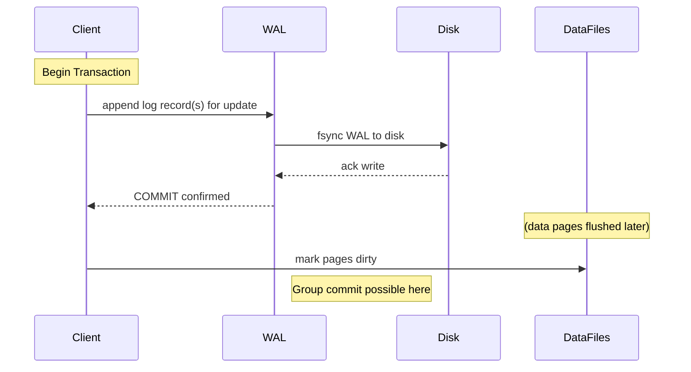

# Perplexity research

# How Write-Ahead Logging (WAL) Works

## Overview

Write-Ahead Logging (WAL) is a durability and crash-recovery technique where all changes are first appended to a persistent log **before** being applied to the main data store. This simple "log first" rule underpins atomicity and durability in many databases, file systems, and distributed systems by ensuring that committed changes can always be recovered after a crash.[1][2][3][4][5]

## Core Principle: Log Before Data

The central rule of WAL is that any modification to data pages must be logged to stable storage before the modified pages are allowed to reach disk. This is sometimes summarized as "log before page" or "log first, then page". Because the log is append-only and written sequentially, flushing it to disk is typically much cheaper than forcing all dirty data pages to disk at commit time.[2][4][5][6][7][1]

In practice, this rule is enforced with two related constraints:

- The log record for a data-page change must be durable (fsynced) before that page can be flushed to disk.[8][9][7]
- A transaction’s commit record must be durable before the system acknowledges the commit to the client.[5][9][2]

## WAL Data Structures

Most WAL implementations revolve around a few core data structures:

- **Append-only log file**: A sequential file on disk where each entry describes a logical or physical change (insert, update, delete) to the database.[10][2][5]
- **Log Sequence Number (LSN)**: A monotonically increasing identifier assigned to each log record that encodes its position in the log.[11][9][8]
- **Page LSN**: Each data page stores the LSN of the last log record whose effects are reflected on that page.[9][8]
- **Flushed LSN**: The largest LSN for which all log records up to that point have been flushed (fsynced) to disk.[8][9]

Log records typically contain enough information to support both **REDO** (re-applying changes) and often **UNDO** (reverting changes), depending on the recovery algorithm used. Common fields include transaction ID, page ID, the operation type, and before/after images or logical redo/undo actions.[1][5][11]

## Normal Operation: Write Path

At a high level, a typical WAL-backed database handles a modifying operation (e.g., an UPDATE) as follows:

1. **Modify in-memory page**: The transaction modifies a cached page (buffer pool) or in-memory structure (memtable), marking it dirty.[2][5]
2. **Generate log record**: A log record is created describing the change, including enough info to redo and possibly undo it.[5][11]
3. **Append to log buffer**: The log record is appended to an in-memory log buffer and assigned an LSN.[2][5]
4. **Commit**: When the transaction commits, the system flushes the log buffer (up to and including the commit record) to the on-disk WAL file using fsync.
   - Only after this flush completes is the commit considered durable and acknowledged to the client.[4][5][2]
5. **Deferred data writes**: Dirty data pages remain in memory and are written to their data files later by background processes or checkpoints, respecting the rule that a page’s `pageLSN` must not exceed `flushedLSN` when written.[4][1][8]

This protocol decouples transaction durability from data-page flushing, allowing the system to batch and reorder page writes for performance while still guaranteeing that committed changes are never lost.[1][4][2]

## Crash Recovery: REDO and UNDO

If the system crashes, the on-disk data files may be inconsistent: some committed changes might only exist in memory and be missing from disk, while some uncommitted changes might have been flushed early. WAL-based recovery replays the log to bring the database back to a consistent state.[6][5]

Many systems follow the ARIES-style three-phase recovery:

- **Analysis phase**: Scan the log from the last checkpoint to determine which transactions had committed (winners), which were in-flight at crash time (losers), and which pages might be dirty.[7][9][8]
- **REDO phase (repeating history)**: Scan forward from a recovery LSN, re-applying all logged operations to bring data pages to the state they had at the moment of crash.[9][7][8]
- **UNDO phase**: Scan backward through the log, undoing the effects of loser transactions to ensure atomicity (no partial transactions).[11][7][8]

Because log records and page LSNs are designed to be idempotent, reapplying the same WAL record multiple times leaves the page in the same final state, which simplifies recovery.[8][9]

## Checkpointing

Without compaction, the WAL would grow indefinitely, and crash recovery would need to replay the entire history. Checkpointing addresses this by periodically flushing dirty pages and recording a restart point.[7][5][2]

A typical checkpoint procedure:

- Flush (write) dirty pages older than some threshold to disk.
- Determine the smallest LSN of any remaining dirty page (recovery LSN).
- Append a CHECKPOINT log record that records this recovery LSN.[5][7][2]

After a crash, recovery can start from the recovery LSN in the most recent checkpoint, not from the beginning of the log, limiting recovery time while preserving correctness.[7][2][5]

## Relationship to ACID Properties

WAL directly supports the **A** (atomicity) and **D** (durability) of ACID:

- **Durability**: Once a transaction’s commit record is flushed to the log, its effects will survive any crash; recovery’s REDO phase ensures committed changes are reapplied even if data pages were never flushed.[4][1][5]
- **Atomicity**: UNDO information in the log allows incomplete (loser) transactions to be rolled back during recovery, so each transaction is all-or-nothing.[11][1][5]

Isolation and consistency are enforced by higher-level concurrency control and integrity mechanisms, but they rely on WAL for correct crash behavior.

## Example: PostgreSQL WAL

PostgreSQL implements WAL as a set of segment files that are written sequentially and reused or archived as they are consumed and checkpointed.[6][4]

Key characteristics in PostgreSQL include:

- Each modification generates WAL records before touching heap or index files; these WAL records must be flushed on commit.[6][4]
- Checkpoints periodically flush dirty buffers and write checkpoint records, limiting how far back recovery needs to read.[4][6]
- During crash recovery, PostgreSQL replays WAL from the last checkpoint and uses page LSNs to decide what to redo.[5][6]

## Example: SQLite WAL Mode

SQLite’s WAL mode inverts its traditional rollback-journal approach by keeping the main database file mostly read-only during writes and appending changes to a separate WAL file.[12]

In this mode:

- A transaction commits when a special commit record is appended to the WAL, not when the main database file is updated.[12]
- Readers can continue reading from the original main database while writers append to the WAL, improving concurrency.[12]
- A background process periodically performs a **checkpoint**, copying WAL changes back into the main database file and truncating or recycling the WAL.[12]

## WAL Beyond Databases

WAL or WAL-like logs are used beyond classical RDBMSs, for example:

- Messaging systems like Kafka, which treat the log as the primary store and derive materialized views from it.[3]
- Distributed databases and storage engines that ship or replicate WAL records to replicas, which replay them for replication and recovery.[13][3]

In all these systems, the append-only log provides a single, durable source of truth from which state can be reconstructed or copied.

## Performance Considerations and Trade-offs

WAL improves write throughput by turning many random data-page writes into sequential log appends, but it introduces its own costs and design choices.[10][2][5]

Important considerations include:

- **fsync cost and batching**: For strong durability, commits often force an fsync of the WAL; systems may group commits or allow relaxed durability modes (e.g., fsync every N ms) to reduce overhead.[2][5]
- **Log size and archiving**: Long-running systems must manage WAL size via checkpointing and log archiving, especially when WAL is also used for replication or backup.[6][7][4]
- **I/O characteristics**: Sequential log writes are cache- and disk-friendly, but heavy WAL traffic can still saturate storage if not tuned carefully.[10][2][5]

Despite these trade-offs, WAL remains the standard mechanism for durability and crash recovery in modern data systems because it aligns well with the performance characteristics of disks and SSDs while providing strong correctness guarantees.[1][2][4]

---

# Gemini

# **Architecture and Mechanics of Write-Ahead Logging in Database Management Systems**

Write-Ahead Logging (WAL) is the foundational state-machine primitive that enables modern Database Management Systems (DBMS) to deliver atomicity and durability—the "A" and "D" of ACID transaction processing—without sacrificing high-throughput concurrent I/O performance1. At its core, the WAL protocol enforces a fundamental structural invariant: any modification to a database object must first be recorded in an immutable, sequential log on non-volatile stable storage before the corresponding dirty data page in volatile memory can be written to physical disk1. By converting arbitrary, non-sequential data page updates across disk blocks into contiguous, append-only disk writes, WAL decouples operational latency from physical data page persistence2. This architectural paradigm permits database engines to manipulate state in memory at sub-millisecond speeds while guaranteeing that system crashes, power outages, or hardware failures will not result in data corruption or committed transaction loss1.

## **Core Principles and the Buffer Pool Management Matrix**

To evaluate how write-ahead logging operates, one must analyze the interaction between volatile memory in the buffer pool and non-volatile storage spanning data files and log files2. The database buffer pool caches disk pages in RAM to accelerate read and write operations2. When a transaction modifies a record, the engine updates the cached page in the buffer pool, marking it as dirty2. Flushing these dirty pages back to non-volatile disk is an expensive operation due to random I/O overhead2.  
Database recovery architectures are defined by two key operational policy decisions regarding buffer pool page management: the STEAL/NO-STEAL policy and the FORCE/NO-FORCE policy2. Under a STEAL policy, the buffer pool management algorithm is permitted to write uncommitted dirty pages to non-volatile disk to free memory frame space for other active operations2. If the system crashes after an uncommitted page is written to disk, the database engine must be able to reverse those uncommitted changes, imposing a mandatory requirement for UNDO logging2. Under a NO-STEAL policy, uncommitted pages are never written to disk, eliminating the need for UNDO logic at the expense of severe memory exhaustion when handling large transactions2.  
The FORCE policy mandates that every page modified by a transaction must be flushed to non-volatile disk before the transaction commit operation can complete and acknowledge success to the client2. While a FORCE policy guarantees that committed data is on disk and eliminates the need for REDO logging, it introduces severe random I/O write latency2. Modern enterprise engines universally employ a NO-FORCE policy, where transaction commit merely requires flushing the small, sequential log records to disk, deferring data page flushes to asynchronous background processes2. This necessitates REDO logging during recovery to re-apply changes for committed transactions whose data pages were not yet flushed prior to a crash2.

| Policy Combination      | UNDO Logging Needed? | REDO Logging Needed? | Performance Implications                                                           | Industry Usage                                         |
| :---------------------- | :------------------- | :------------------- | :--------------------------------------------------------------------------------- | :----------------------------------------------------- |
| **STEAL / FORCE**       | Yes2                 | No2                  | High commit latency due to synchronous page writes; poor write scaling2.           | Rare / Legacy systems                                  |
| **NO-STEAL / FORCE**    | No2                  | No2                  | Extreme memory requirements; long transactions block buffer frames entirely2.      | Theoretical baseline                                   |
| **NO-STEAL / NO-FORCE** | No2                  | Yes2                 | High memory pressure; cannot process transactions exceeding buffer pool capacity2. | Niche / Embedded engines                               |
| **STEAL / NO-FORCE**    | Yes2                 | Yes2                 | Maximum throughput; optimal buffer pool utilization; sequential log append2.       | Enterprise standard (PostgreSQL, MySQL InnoDB, ARIES)9 |

The adoption of a STEAL/NO-FORCE architecture yields optimal transactional performance, but it shifts the burden of atomicity and durability directly onto the Write-Ahead Logging subsystem2.

## **Log Sequence Number Architecture and Ordering Rules**

To maintain absolute coherence between data pages in memory, data pages on disk, and the log stream on stable storage, database engines assign a monotonically increasing 64-bit integer to every log entry, known as the Log Sequence Number (LSN)2. A canonical WAL record comprises several metadata attributes alongside operational payload data2. The record includes its own globally unique LSN, a prevLSN pointer that creates a reverse-linked list of records for that specific transaction, a unique transaction identifier (TxID), an action type identifier (such as BEGIN, UPDATE, COMMIT, ABORT, or CLR), the targeted physical PageID, and the physiological undo/redo payload data1.  
The recovery manager tracks state across the system using four core LSN indicators2. Every physical data page header stores a pageLSN, which identifies the log record corresponding to the most recent modification made to that specific page2. In memory, the log manager tracks flushedLSN, representing the largest LSN flushed and safely persisted to stable storage2. The dirty page table maintains a recLSN for each dirty page in RAM, marking the oldest log record that dirtied the page since it was last flushed to disk2. Finally, the transaction table tracks lastLSN, reflecting the latest log record generated by each active transaction1.

| LSN Metric | Tracking Location                    | Description                                                                                 |
| :--------- | :----------------------------------- | :------------------------------------------------------------------------------------------ |
| pageLSN    | Header of each individual Data Page2 | The LSN of the log record corresponding to the most recent modification made to that page2. |
| flushedLSN | Log Manager State in Memory2         | The largest LSN that has been written and flushed to non-volatile stable storage2.          |
| recLSN     | Dirty Page Table Entry2              | The oldest log record LSN that dirtied the page in memory since its last disk flush2.       |
| lastLSN    | Transaction Table Entry1             | The LSN of the latest log record generated by a given active transaction1.                  |

The core mathematical protocol enforcing write-ahead logging requires that a dirty page ![][image1] in volatile memory cannot be written to non-volatile disk storage until the log record describing the update has been flushed to stable storage1:  
![][image2]  
If the buffer pool checkpointer or background writer attempts to flush page ![][image1] to disk while ![][image3], the operation must block until the log manager flushes the log buffer up to at least ![][image4]2. This protocol guarantees that if the system experiences a power failure mid-operation, the disk will never contain a data state change for which there is no corresponding log record available to perform UNDO or REDO operations during crash recovery2.

## **The ARIES Crash Recovery Protocol**

The gold standard for crash recovery implementations relying on WAL is the Algorithm for Recovery and Isolation Exploiting Semantics (ARIES) developed by C. Mohan1. ARIES operates under a STEAL/NO-FORCE buffer pool policy and executes recovery in three distinct sequential phases upon restart following a failure: Analysis, Redo, and Undo1.

\+-----------------------------------------------------------------------------------+  
| CRASH RECOVERY PIPELINE |  
| |  
| \[Analysis Phase\] \---\> Reconstructs ATT and DPT from Fuzzy Checkpoint |  
| |  
| \[Redo Phase\] \---\> "Repeats History" forward from min(recLSN) in DPT |  
| |  
| \[Undo Phase\] \---\> Scans backward, reversing uncommitted "loser" txns |  
\+-----------------------------------------------------------------------------------+

ARIES relies on two primary in-memory tracking structures maintained during runtime and reconstructed during recovery: the Active Transaction Table (ATT), which tracks active, committing, or aborting transactions along with their lastLSN, and the Dirty Page Table (DPT), which tracks dirty memory pages alongside their recLSN1.

### **The Analysis Phase**

The Analysis Phase scans the log forward starting from the location of the most recent Fuzzy Checkpoint record1. A fuzzy checkpoint periodically writes the current contents of the ATT and DPT to the log without pausing active transactions or forcing dirty pages to disk9. The Analysis phase initializes its in-memory tables from this checkpoint record and scans forward to the end of the log1.  
When an update log record for transaction ![][image5] is encountered, ![][image5] is added to the ATT if absent, and its lastLSN is updated to the current record's LSN12. If the record touches page ![][image1] and ![][image1] is not in the DPT, ![][image1] is added to the DPT with its recLSN set to the record's LSN1. Transaction status changes (COMMIT or ABORT) update the ATT, while END records remove transactions from the ATT entirely1. At the end of Analysis, the DPT identifies all dirty pages present in memory at the moment of crash, while the ATT identifies active "loser" transactions that must be undone1.

### **The Redo Phase**

The Redo Phase restores the database state to the exact point in time immediately preceding the failure1. Starting at the smallest recLSN present in the reconstructed DPT, the engine scans forward through every logged update, repeating history by reapplying changes for both committed transactions and uncommitted "loser" transactions1.  
To minimize unnecessary disk reads, the engine skips redoing an update record touching page ![][image1] if page ![][image1] is no longer in the DPT, if the record's ![][image6], or if page ![][image1] is fetched from disk and its on-disk header shows ![][image7]1. If none of these skip conditions apply, the operation is reapplied in memory and ![][image4] is set to the record's LSN1. Reapplying history ensures complete idempotency (![][image8]), allowing recovery to be restarted safely if a system crashes repeatedly during the recovery process11.

### **The Undo Phase**

Once the Redo Phase completes, the database reflects the exact state at crash time, but contains uncommitted updates from active "loser" transactions1. The Undo Phase traverses backward through the log, rolling back these uncommitted transactions by processing log records in reverse chronological order based on lastLSN values1.  
As the engine reverses an update, it appends a Compensation Log Record (CLR) to the log1. A CLR contains an explicit UndoNextLSN field that points directly to the prevLSN of the record being undone, skipping past already-reversed operations1. CLRs contain redo-only information and are never undone during subsequent recovery operations1. If a failure strikes during the Undo Phase, subsequent recovery runs replay the CLRs during Redo and use the UndoNextLSN pointers during Undo to skip previously rolled-back operations, guaranteeing bounded recovery times across repeated crashes1.

| Recovery Phase | Scan Direction | Starting Location                        | Primary Purpose                                                                       | Key Outputs                                                              |
| :------------- | :------------- | :--------------------------------------- | :------------------------------------------------------------------------------------ | :----------------------------------------------------------------------- |
| **Analysis**   | Forward1       | Last Fuzzy Checkpoint1                   | Identify active transactions and dirty memory pages at crash moment1.                 | Active Transaction Table (ATT) & Dirty Page Table (DPT)1.                |
| **Redo**       | Forward1       | Minimum recLSN across all pages in DPT12 | Re-apply all changes to bring system state to exact crash moment ("Repeat History")1. | Fully restored state containing both committed and uncommitted updates1. |
| **Undo**       | Backward1      | Highest lastLSN of active transactions1  | Reverse changes of uncommitted "loser" transactions1.                                 | Consistent database state; Compensation Log Records (CLRs)1.             |

## **Storage Hardware Realities and Torn Page Protection**

A primary architectural challenge in WAL design arises from the physical size mismatch between logical database pages and physical hardware storage sectors8. Database engines process data in multi-kilobyte pages (such as 8KB in PostgreSQL and SQLite, or 16KB in MySQL InnoDB), whereas underlying storage controllers, solid-state drives, and hard disks commit data in physical sectors of 512 bytes or 4KB8.  
If a power loss or hardware failure occurs while the operating system is writing an 8KB database page, the disk block may end up partially written—containing, for example, 4KB of new data and 4KB of old data8. This corrupted state is known as a torn write, torn page, or fractured block8.  
When a page suffers a torn write, standard physiological WAL records cannot be applied during recovery13. Physiological log records contain row-level delta instructions that assume the target page on disk is structurally sound13. Replaying delta records over a partially written, corrupted page yields unrecoverable binary corruption and causes page checksum validation failures13.  
To prevent torn write failures, database engines implement distinct page protection mechanics8. PostgreSQL utilizes Full Page Writes (FPW) governed by the full_page_writes configuration setting13. Following every checkpoint, the first time a page is modified in memory, PostgreSQL writes a complete 8KB Full Page Image (FPI) into the WAL stream alongside the normal delta record13. During crash recovery, if an on-disk page is torn or corrupted, PostgreSQL ignores the damaged disk page, restores the clean 8KB page image directly from the WAL record into the buffer pool, and then replays subsequent physiological delta records on top of it13. While FPW guarantees crash safety, it produces high write amplification and log volume spikes immediately after checkpoints13.  
MySQL InnoDB avoids log inflation by moving page backup overhead out of the sequential redo log path and into a dedicated storage region called the Doublewrite Buffer20. Before dirty buffer pages are written to their primary data tablespaces, InnoDB writes the 16KB pages sequentially into the contiguous Doublewrite Buffer on disk and issues an fsync() command20. Only after the doublewrite flush succeeds are pages written to their final data storage locations20. If a crash causes a torn page in a primary data file, InnoDB restores the pristine page copy from the Doublewrite Buffer before executing redo log recovery20.  
Cloud-native serverless database architectures, such as Neon, eliminate local torn page vulnerabilities entirely19. Neon decouples compute from storage, streaming WAL records directly to a distributed Paxos-based quorum of log safekeepers19. Because stateless compute nodes do not write to local data directories, local torn disk pages cannot occur, allowing engine designers to safely disable full_page_writes to achieve up to a five-fold increase in write throughput19.

| Protection Strategy          | Primary Engine             | Write Path Location                                | I/O Overhead Profile                                       | Architectural Trade-offs                                                           |
| :--------------------------- | :------------------------- | :------------------------------------------------- | :--------------------------------------------------------- | :--------------------------------------------------------------------------------- |
| **Full Page Writes (FPW)**   | PostgreSQL16               | Embedded inside standard WAL file (pg_wal)16.      | Variable; high write spikes immediately post-checkpoint13. | Simple storage engine layout; higher log network and disk bandwidth consumption13. |
| **Doublewrite Buffer (DWB)** | MySQL InnoDB20             | Separate dedicated doublewrite tablespace block20. | Predictable, steady-state double-write I/O cost20.         | Smooth transaction throughput; requires extra storage block management20.          |
| **Cloud Quorum Replicas**    | Neon / Serverless Engine19 | Distributed network WAL quorum nodes19.            | Zero local full-page write logging overhead19.             | Maximum write throughput; requires specialized distributed storage backend19.      |

## **Comparative Implementation Implementations Across Database Engines**

Database engines adapt the core write-ahead logging model to align with their specific storage layouts, thread models, and concurrency goals2.

### **PostgreSQL**

PostgreSQL manages write-ahead logs as a series of 16 MB segment files residing in the $PGDATA/pg_wal directory22. Page header modifications update pd_lsn tracking fields23. When transactions commit, the log manager flushes memory buffers (wal_buffers) to disk synchronously unless synchronous_commit is explicitly disabled18. Checkpoint frequency is governed by parameters such as max_wal_size and checkpoint_completion_target, which spread disk writes over time to prevent underlying storage saturation8.

### **MySQL InnoDB**

MySQL InnoDB separates storage engine durability from server-level replication by maintaining two coexisting log engines: the InnoDB Redo Log and the Binary Log (Binlog)21. The Redo Log is a set of fixed-size ring-buffer files (ib_logfile0, ib_logfile1) used strictly by the storage engine for crash recovery via physiological logging21. The Binary Log stores statement or row-based logical operations generated at the SQL layer for point-in-time recovery and cross-node replication21.  
To prevent state divergence between the Redo Log and Binary Log during a failure, MySQL coordinates commits using an internal Two-Phase Commit (2PC) protocol combined with Binary Log Group Commit21. Group commit batches concurrent transaction commits, flushing log buffers to disk in combined I/O operations to optimize disk throughput21.

### **SQLite WAL Mode**

In its default configuration, SQLite employs a rollback journal that copies unmodified database pages into a \-journal file prior to updating the main file in place24. When configured to WAL mode (PRAGMA journal_mode=WAL;), SQLite reverses this design entirely24.  
In WAL mode, committed updates are appended to a separate \-wal sidecar file without modifying the main database file24. To coordinate page lookups, SQLite creates a shared-memory index file (-shm) using memory mapping (mmap)24. Readers read the main database file while referencing the \-shm index to find newer page revisions in the \-wal file24. This decouples reading and writing completely: readers never block writers, and writers never block readers24. However, SQLite enforces a strict single-writer lock that serializes concurrent write operations24. Furthermore, because the \-shm index relies on process-shared memory mappings, SQLite WAL mode cannot be deployed on network filesystems like NFS or SMB24.

| Architectural Feature        | PostgreSQL                                 | MySQL InnoDB                                    | SQLite (WAL Mode)                                      |
| :--------------------------- | :----------------------------------------- | :---------------------------------------------- | :----------------------------------------------------- |
| **Primary Log Structure**    | 16 MB sequential segment files (pg_wal)22. | Circular ring-buffer log files (ib_logfileN)21. | Single append-only sidecar file (-wal)24.              |
| **Index Mapping Layer**      | Shared Buffers LSN memory tracking8.       | Log Buffer / Redo LSN pointers21.               | Memory-mapped shared index file (-shm)24.              |
| **Concurrency Capabilities** | Multi-writer / multi-reader MVCC13.        | Multi-writer / multi-reader MVCC21.             | Multi-reader concurrent; strictly **single-writer**24. |
| **Torn Page Strategy**       | Full Page Writes (FPW)13.                  | Doublewrite Buffer (DWB)20.                     | Write-Ahead Log frame offset snapshotting24.           |
| **Network Storage Support**  | Full support (POSIX, NFS, SAN, EBS)22.     | Full support (POSIX, SAN, EBS)21.               | **Unsupported** (requires local mmap shared memory)24. |

## **Operational Risks, Diagnostics, and Best Practices**

Operating write-ahead log systems requires managing specific disk and concurrency failure modes22. A severe operational risk is log directory disk exhaustion (such as PostgreSQL pg_wal filling to 100% capacity)22. When the host volume runs out of space, the database engine cannot write commit records and must execute an emergency shutdown22.  
Primary causes of unbounded WAL retention include:

- **Inactive Replication Slots**: A replication slot retains WAL files until downstream standby servers or CDC connectors consume them22. If a standby crashes or disconnects without dropping its slot, the primary node retains all generated WAL segments indefinitely, causing disk exhaustion22.
- **Archiving Failures**: If continuous archiving is enabled (archive_mode=on), segment recycling is blocked whenever the archive_command fails due to network interruptions, permission errors, or full backup targets22.
- **Bulk Transaction Spikes**: Unbounded batch transactions generate log records at a rate that temporarily outpaces background checkpointer recycling, exceeding configured soft bounds like max_wal_size22.

Database administrators must **never delete WAL files directly using operating system utilities (rm)**22. Deleting active log files destroys sequence continuity, causing fatal database corruption and preventing restart recovery22.  
The proper remediation protocol requires querying administrative interfaces (pg_replication_slots and pg_stat_archiver) to identify the holding process22. Dropping stale replication slots (SELECT pg_drop_replication_slot('slot_name');) or fixing the archiving pipeline releases retained files immediately22. Once space is restored, executing an explicit CHECKPOINT; command safely recycles unneeded log segments22. If the system is offline and disk space cannot be expanded, administrators should run official engine tools like pg_archivecleanup to clean files up to a verified backup baseline22.  
In SQLite production deployments, high write concurrency can lead to lock contention and SQLITE_BUSY errors30. To eliminate lock contention failures, high-throughput applications configure specific PRAGMA parameters and transaction execution patterns24.

| Parameter / Configuration     | Operational Purpose                                                                                                                          |
| :---------------------------- | :------------------------------------------------------------------------------------------------------------------------------------------- |
| PRAGMA journal_mode \= WAL;   | Enables Write-Ahead Logging to permit concurrent reader operations during write transactions24.                                              |
| PRAGMA busy_timeout \= 5000;  | Instructs the database driver to wait up to 5000ms for write locks to clear instead of throwing SQLITE_BUSY immediately24.                   |
| PRAGMA synchronous \= NORMAL; | Synchronizes the WAL file during checkpoints while allowing standard commits to avoid synchronous fsync calls, balancing safety and speed24. |
| BEGIN IMMEDIATE;              | Acquires the write lock up front at transaction start, preventing deadlocks caused by mid-transaction lock escalation36.                     |

## **Synthesis and Architectural Trajectory**

Write-Ahead Logging remains a critical design principle in database systems research and engineering1. By ensuring that log records reach stable storage before modified data pages are written to physical media, WAL resolves the core tension between runtime operational speed and crash recovery guarantees1.  
The evolution of write-ahead logging tracks hardware developments and system topologies2:

- **Classic Single-Node Recovery**: The ARIES protocol established the foundation for crash recovery by decoupling dirty page management from log updates using a STEAL/NO-FORCE policy, precise LSN tracking, and Compensation Log Records to make recovery fully deterministic and idempotent1.
- **Torn Write Protection**: Architectural features like PostgreSQL's Full Page Writes and MySQL's Doublewrite Buffer emerged to bridge software page models with underlying storage sector limits13.
- **Distributed Cloud Storage**: Modern cloud database engines decouple compute nodes from storage nodes entirely19. By offloading WAL streams to dedicated, fault-tolerant log quorums, cloud engines eliminate local page tearing risks, remove full-page logging overhead, and achieve higher transaction throughput19.

Across these hardware shifts—from traditional disk drives to solid-state media and cloud storage arrays—the Write-Ahead Logging protocol continues to serve as the baseline mechanism for maintaining transactional integrity and durability in modern data management systems1.

#### **Works cited**

> 1. Algorithms for Recovery and Isolation Exploiting Semantics, [https://en.wikipedia.org/wiki/Algorithms_for_Recovery_and_Isolation_Exploiting_Semantics](https://en.wikipedia.org/wiki/Algorithms_for_Recovery_and_Isolation_Exploiting_Semantics)
> 2. Write-ahead logging and the ARIES crash recovery algorithm, [https://sookocheff.com/post/databases/write-ahead-logging/](https://sookocheff.com/post/databases/write-ahead-logging/)
> 3. Database Logging: WAL, Redo, and Undo Mechanisms \- Medium, [https://medium.com/@moali314/database-logging-wal-redo-and-undo-mechanisms-58c076fbe36e](https://medium.com/@moali314/database-logging-wal-redo-and-undo-mechanisms-58c076fbe36e)
> 4. Algorithm for Recovery and Isolation Exploiting Semantics (ARIES), [https://www.geeksforgeeks.org/dbms/algorithm-for-recovery-and-isolation-exploiting-semantics-aries/](https://www.geeksforgeeks.org/dbms/algorithm-for-recovery-and-isolation-exploiting-semantics-aries/)
> 5. Write-Ahead Logging (WAL) in Database Engines & Recovery., [https://medium.com/@jatinumamtora/a-deep-dive-into-write-ahead-logging-wal-in-database-engines-recovery-71f6d98f0e23](https://medium.com/@jatinumamtora/a-deep-dive-into-write-ahead-logging-wal-in-database-engines-recovery-71f6d98f0e23)
> 6. PostgreSQL WAL Internals for Data Engineers | by Jonathan Duran, [https://blog.dataengineerthings.org/postgresql-wal-internals-for-data-engineers-ef6229584a99](https://blog.dataengineerthings.org/postgresql-wal-internals-for-data-engineers-ef6229584a99)
> 7. Database Recovery in DBMS: WAL, Checkpoints, Worked Example, [https://www.knowledgegate.ai/blog/database-recovery-data-base-management-system-complete](https://www.knowledgegate.ai/blog/database-recovery-data-base-management-system-complete)
> 8. A Tale of Two Databases: How PostgreSQL and MySQL Handle, [https://www.percona.com/blog/a-tale-of-two-databases-how-postgresql-and-mysql-handle-torn-pages/](https://www.percona.com/blog/a-tale-of-two-databases-how-postgresql-and-mysql-handle-torn-pages/)
> 9. Database Crash Recovery | Maxnilz, [https://maxnilz.com/docs/003-database/020-recovery/](https://maxnilz.com/docs/003-database/020-recovery/)
> 10. ARIES Recovery Algorithm Overview | PDF \- Scribd, [https://www.scribd.com/presentation/941610306/Aries](https://www.scribd.com/presentation/941610306/Aries)
> 11. Recovery with Aries, [https://www.cs.cmu.edu/\~natassa/courses/15-415/S03/notes/recovery.pdf](https://www.cs.cmu.edu/~natassa/courses/15-415/S03/notes/recovery.pdf)
> 12. Notes on ARIES: A Transaction Recovery Method Supporting Fine, [https://www.sh-reya.com/blog/aries/](https://www.sh-reya.com/blog/aries/)
> 13. Full page writes \- PostgreSQL wiki, [https://wiki.postgresql.org/wiki/Full_page_writes](https://wiki.postgresql.org/wiki/Full_page_writes)
> 14. WAL in PostgreSQL: 3\. Checkpoint \- Postgres Professional, [https://postgrespro.com/blog/pgsql/5967965](https://postgrespro.com/blog/pgsql/5967965)
> 15. On the impact of full-page writes | EDB, [https://www.enterprisedb.com/blog/impact-full-page-writes](https://www.enterprisedb.com/blog/impact-full-page-writes)
> 16. PostgreSQL Documentation: full_page_writes parameter, [https://postgresqlco.nf/doc/en/param/full_page_writes/](https://postgresqlco.nf/doc/en/param/full_page_writes/)
> 17. How Full Page Writes Protect PostgreSQL Databases from Torn Pages, [https://www.cybrosys.com/research-and-development/postgres/how-full-page-writes-protect-postgresql-databases-from-torn-pages](https://www.cybrosys.com/research-and-development/postgres/how-full-page-writes-protect-postgresql-databases-from-torn-pages)
> 18. Postgresql: How do full_page_writes help prevent data loss?, [https://dba.stackexchange.com/questions/78644/postgresql-how-do-full-page-writes-help-prevent-data-loss](https://dba.stackexchange.com/questions/78644/postgresql-how-do-full-page-writes-help-prevent-data-loss)
> 19. Everyone gets faster writes: We turned off FPW's in Neon, [https://neon.com/blog/turning-off-fpw-for-faster-writes](https://neon.com/blog/turning-off-fpw-for-faster-writes)
> 20. Re: \[PROPOSAL\] Doublewrite Buffer as an alternative torn page, [https://www.postgresql.org/message-id/CAKZiRmyN40%3DWW27Mnkj_zO3FvYn8fcoFwnQ%2Ba%3D%2BW6zymqPr0vQ%40mail.gmail.com](https://www.postgresql.org/message-id/CAKZiRmyN40%3DWW27Mnkj_zO3FvYn8fcoFwnQ%2Ba%3D%2BW6zymqPr0vQ%40mail.gmail.com)
> 21. MySQL Day 19: Atomicity/Durability — MTR and Redo Logs in InnoDB, [https://medium.com/sys-base/mysql-day-19-durability-via-mtr-and-redo-logs-in-innodb-162d42a48668](https://medium.com/sys-base/mysql-day-19-durability-via-mtr-and-redo-logs-in-innodb-162d42a48668)
> 22. PostgreSQL pg_wal directory full: causes and emergency recovery, [https://www.netdata.cloud/guides/postgres/postgres-wal-disk-full/](https://www.netdata.cloud/guides/postgres/postgres-wal-disk-full/)
> 23. PostgreSQL Write-Ahead Logging (WAL): The Internals of Reliability, [https://www.postgresql.eu/events/pgconfeu2023/sessions/session/4896/slides/429/Hamid%20Akhtar%20-%20PostgreSQL%20Write-Ahead%20Logging%20(WAL)\_%20The%20Internals%20of%20Reliability%20and%20Recovery.pdf](<https://www.postgresql.eu/events/pgconfeu2023/sessions/session/4896/slides/429/Hamid%20Akhtar%20-%20PostgreSQL%20Write-Ahead%20Logging%20(WAL)_%20The%20Internals%20of%20Reliability%20and%20Recovery.pdf>)
> 24. Runnable SQLite Docs: WAL & Concurrency \- Coddy.tech, [https://coddy.tech/docs/sqlite/wal-mode-and-concurrency](https://coddy.tech/docs/sqlite/wal-mode-and-concurrency)
> 25. Documentation: 18: 19.5. Write Ahead Log \- PostgreSQL, [https://www.postgresql.org/docs/current/runtime-config-wal.html](https://www.postgresql.org/docs/current/runtime-config-wal.html)
> 26. max_wal_size, Postgres full page writes and UUID vs BIGINT, [https://pganalyze.com/blog/5mins-postgres-max-wal-size-full-page-writes-uuid-bigint](https://pganalyze.com/blog/5mins-postgres-max-wal-size-full-page-writes-uuid-bigint)
> 27. Binary Log Group Commit and InnoDB Flushing Performance | Server, [https://mariadb.com/docs/server/server-usage/storage-engines/innodb/binary-log-group-commit-and-innodb-flushing-performance](https://mariadb.com/docs/server/server-usage/storage-engines/innodb/binary-log-group-commit-and-innodb-flushing-performance)
> 28. Understanding the Differences Between InnoDB Undo Log and, [https://www.percona.com/blog/understanding-the-differences-between-innodb-undo-log-and-redo-log/](https://www.percona.com/blog/understanding-the-differences-between-innodb-undo-log-and-redo-log/)
> 29. Writing data into MySQL InnoDB \- Jean-Marie Renouard, [https://www.jmrenouard.fr/en/mysql-en/writing-data-into-mysql-innodb](https://www.jmrenouard.fr/en/mysql-en/writing-data-into-mysql-innodb)
> 30. Abusing SQLite to Handle Concurrency | SkyPilot Blog, [https://skypilot.ai/blog/abusing-sqlite-to-handle-concurrency](https://skypilot.ai/blog/abusing-sqlite-to-handle-concurrency)
> 31. SQLite WAL Mode: Write-Ahead Log & \-wal Files \- Cleanor, [https://cleanor.app/reference/sqlite-wal](https://cleanor.app/reference/sqlite-wal)
> 32. Single-writer Database Architecture with SQLite \- Bugsink, [https://www.bugsink.com/blog/database-transactions/](https://www.bugsink.com/blog/database-transactions/)
> 33. Write-Ahead Logging \- SQLite, [https://www.sqlite.org/wal.html](https://www.sqlite.org/wal.html)
> 34. Where SQLite Gives Up \- Locks, Writers, and the Single-File Problem, [https://gauravsarma1992.medium.com/where-sqlite-gives-up-locks-writers-and-the-single-file-problem-69ea745d0c3b](https://gauravsarma1992.medium.com/where-sqlite-gives-up-locks-writers-and-the-single-file-problem-69ea745d0c3b)
> 35. SQLite: enable WAL mode and busy_timeout for concurrent write, [https://github.com/cashubtc/nutshell/issues/907](https://github.com/cashubtc/nutshell/issues/907)
> 36. SQLite WAL Mode Can Lock Short-Lived Readers \- Hynek Schlawack, [https://hynek.me/til/sqlite-read-only-wal-locked/](https://hynek.me/til/sqlite-read-only-wal-locked/)

[image1]: data:image/png;base64,iVBORw0KGgoAAAANSUhEUgAAABAAAAAaCAYAAAC+aNwHAAAApElEQVR4XmNgGAXoYAIQfwTi/1D8HYjfoYmtgqvGA2CK0YE8A0R8F7oEOgApOo4uCAW4DIeDCAaIAnd0CSDgZCDCgGsMuBWsZ4DIBaBLIANcNjgyQMQnokugA5gBH4D4PRD/gPIvA7EwkjqsAOb/JHQJYsFNBuzOJxrg8j/RAKT5DrogsaCaAWJAOroEITAZiD8zQEIclO6/AvE/FBWjYBTQGgAA/GAxOhsgBN4AAAAASUVORK5CYII=
[image2]: data:image/png;base64,iVBORw0KGgoAAAANSUhEUgAAAiwAAABNCAYAAACFQD8/AAAJTUlEQVR4Xu3dCYxlRRXG8YOgAm4IiCBiRoOioEYlIhI2EeMyccE1mghqcAtLQDEqAWbCpoGIEVziAhPQaIwKKBJQVGKUzQ1XcFjExJEIKhjFBVGhPqpOv/PO1Js33f1e94z9/yUnc++pevdtnbmnb1XdNgMAAAAAAAAAAAAAAAAAAAAAAAAAAAAAAAAAAAAAAAAAAAAAAAAAAAAAAAAAAAAAAAAAAAAAAAAAAAAAAAAAAFO2eYmVJQ4vsVnLvXymdWl4Q4mPhv0nhO1J26HEY3JygrYvsVNOzsEDShxV4pgSW7XcLoNmAABm76El7ihxb4h7Svwpdur4eYnbSiwrsWeJH5T4mtXHuz+WuKvlFMeHNnlBaPPYcajHwtkkJ8ZQsabXu7zEH9q2x6SdaINjqwiYtHfZ4PinhvyfQ17xXxv/c3FeiX+X2K3Fl0qstuHPRT8Xf205xWWhTbYMbR6vHeoBAFiynmL1xPDj3NDxKuufmFdZPx9PPA9ObaJCZrFOSM+z+rpOzg1jqKi7vG1/q8TvSjzO+u9/UnTsaRQsTsePBYvz724cXf3p9TvE+vn4c/Gk1Cb7lPh4TgIAljYvWH6YGzr0G7SuKvSMOjHt3v7Vb+nZ20rsn5NT9karr0fDWXOhxx6dctu1/LTo2BtywfJtG92vl1fu4e3fXruKmJU5CQBY2rxg0dDOOKNOMNLLe+4nbTv/1qyCZb+Um5b3W30Nr8wNs6RjvDnltm75adGxN+SCRcOEo/r9Kids0Pestv3T0CYqWFakHABgARxc4qQSX2z7B5U4p8Q7ZnoMO8zqcMP1Jd6b2qJdS3ymxAlt/4NWTwDPnulh9qASZ1s9cawMeecFy9W5oeMLVvv+vcSjU1tPPIn5ye8RIaeCRZf/p0kTY/9ndb7NfKgoeYnV9/Dhtq3PXx7Z8u7JJY4o8ZESb205fQ+HlvhAifNbzukzuKLENVaHyG4cbh4qWHSF6Fyr80R69ihxXYmLSzwntbmXWf1Z1MRhmW/B8nYb9NV7HyceU1fetB9fqwqWPO8JALAA4uRJ/Qf9tJZf03K+0kZuaTn3o7Tv1O+Gtv1cq320IuOqEp9veZ+noROqaCJkPpYXLFem/Cj+Pjz+U+LAoR4D8bl0EvLHOBUse4f9SbqgxL9scqt3HmuDSaqXtm19vpILlv2sFgzKqWiRLawWOvkzOL3E58K+ioj8HWn/lBLfa/tPbLnXzfSofmZ1QrRTHxWrzodhfHWTikfNyVFuPgWL6LP2/h7vHOoxEI+puU35efSzclzYBwAsoF9a/z9/5TQ3xH2l5aJ8QlGB0Ouj4iHn8qRS5Y4M+16wfD/kxtHVn3xyunCoR5Vf43daToWTqGDZa9A8Mbq6oeeZxrF1XL+i5XLB4pTzgiXmYl9t6wpFlI+VH+M5Xelyr265SFfyYk5XmrQCKFOf+RYs8mkbPMYjXy2SfMwVLfebtq+C5dhBMwBgIfk8juy71s87PxnGgkBDRvkx+eTymravqzkavvFQzn9TFy9YNCTRM+4+Gm+ywXNryW+UX6N4X60sUcGiq0PTomEUPZdWN02KjjfJgkVXxLT/W1u7cHFqX9XJxeP4fvyu/fvWcJRfXXm9PyBQfrYFy7YltsnJQMu+/fHPSG29Y/oVmhdbLVg05wgAsAi0Cqf3H7Xmtij/9JD7Zst91eqcBt92uneIci8NOe1reMFpmEG5F1q9IhPjWaHfuIJFV1Oc5sj06B4qOkY+yfTer26C5ieyaRcszodZVOjNl44zm4JFE0tzLve9KeQVK4ab78/lCcv5OL6fv2sfrtNcGrX35vIor7k1WX6OSEM2D2nbR8eGQDeS0+O/kfK9Y3pfBQULACyiUQWLLwn1eSba1qX7SDndnC3nNATkN+I6Y7h5ZiLkzimfjZvDEl9z7/U7tZ3WyfVowqfa7rZ+waLC6Gar70/zLT5W4p82XLTNxb5Wn7d3NWF96fGzKVg+0cnFvirgnCb23m5rH0v7Z3Zy+bvJj4u0OkrtmgCeKd8rRtd1zHgjOb3mUfT4vAJt1DE150Vt+rmgYAGARTKqYIknhZ3a9lsGzfdT7iKrwy8+ifTXM62j6XH5N3P5ethe1yohXfaPr1nbo27Br7b823vv/Tp/372CRVSI5ZNo7znmQkWcTopaYTVbeg0rU86HXvJdc5XTvI6cy59pptymad8nysZcfKwm5faOpRVBPnSjdt2RNlM+F5uSnyOKed3BNhfMTv3e18mNcqfVdgoWAFgkXrC8J+S0dFO5eBLWvlahuFUt9wurJ0rdUl+U0/JVDeVcUuKTNjysJFoSrX7LQk4TX/3vvIhW6ahPvheGLvPnE5bvHxBy0psorKEI5XxFVPYwq+2jCha1+XuNuTwfYj50ZeTynBxDryEP83jRpwIvUi4Wgvo7O73PdNyQifZ1VSrncj8VYXnidbxh37utPiYWVqtbTv9G/v3k5/C5UTGvgkX7GuKLNLk7P17FonKvSPlI7RQsALBIvGDxAkHxD1t74qL+Q9dJx/voXh+6qqLteLVEl+S9T4y/hD6iO83qRObtfv+OeKfRdUVcwaR9+XLb9nto6IQV3VXi91ZvW3+r1QmVPVru/cyctMF8hkhXW/LzLCTNNdKS4TUt9PnrniP6bPUe9V51F+C4CkdzPDSU5Z/l/mHb35/+jX9bSSt/vKD8kNVj6th6Tn23j7L6OXgufyafssGxVNBmmtPk7Xpt+e/3SNxfVzi9Bi1P1jyY2J6/d+37Z6WfD/2c9LzIRs+LAQBM2aj7qcyFiogVOVk80OpzLNYfEpwUvxKhpeAa+tK9Qkbd0wMAAEyQhnQmVbDoOL76I1Ob34F1Y6V5DBrimisVbMvXMyYxJwYAgP8LGsvXVREVE5q38vjh5ll7qtVjxfkwy0rcUeLakNtY6b3F1TOzpbkkutX7+oTmnwAAgOL5VieX6rd5La2d1JCN7sPy2RKXWV2qG1eWbKx8WAsAAGCD9DerEzE18TSvdgEAAAAAAAAAAAAAAAAAAAAAAAAAAAAAAAAAAAAAAAAAAAAAAAAAAAAAAAAAAAAAAAAAAAAAAAAAAAAAAAAAAAAAAAAAAAAAAAAAAAAAAAAAAAAAAAAAAAAAAAAAAAAAAAAAAAAAAAAAAAAAAAAAAAAAAAAAAAAAAAAAAAAAAACApe4+CGK8zR4OcxoAAAAASUVORK5CYII=
[image3]: data:image/png;base64,iVBORw0KGgoAAAANSUhEUgAAAOAAAAAZCAYAAAAosCIwAAAG4UlEQVR4Xu2bd4gkRRSHn3rmrIgZTlFUzGJOmEA90x8GFBVPPFEEMQvq6SoiGMCcE+aIoiCYuUVBUVEEUVBUzDlHzNZn1dt+87Z6Znamd529rQ8edP2qprr7dcVXuyKFQqFQKBQKhUKhAWYGmx1s9ZReONgiI7lzP1sHuzXY0im9QrBVquxGWTLYJl5sEOrf1Is9MlOmdrsYE18F+8fZ18FWtIUcR0ost0WwVYNdGuzHYH8HWz6VeTrYd6kc9lnSLZS3972sNXug+SvYDcGOk9Z3OMsWaoDFpPLTTy6vKXgXfX7ly2B/Gl3bxX6mjKe0iz7wH6AdlJvPaesmXR2tfB7s25R3iMuDxYO95sUB51qpfDVDYkMFtKY7oELd49UBoe771+k5pnq76ItuHX2m1Jf7Q/KOhnb1D3uhAVj2TPNiQ/Ae33tRpnYHnCztYmBp5wjL5RLLzeszAldJvaP3lfpGNMcLDXG3xOUOe7Mm4T3e96JM7Q448O1i/2CnB7slpTcKdlGwS7SAY6dg9wT7SOJGvw42z0MS19sLSlx/8zJX2EKBk4N9ItEZObp19DpSld3G5eVQRwP353cnGQ3YF4wnV0pcJuLzfmHJyTt8ka4xxXbAeYIdEez8YA+MlIjLLcrcbjRgyXVvsHeDnRrsjtbslka6fbD7gh1eZbewTLCHg70kcY+ag4DLjcGOT+m671+newa+XeBUHMiN2GTulfTrkkZETTksaeul9MEp7SNsfFx0Nuo4nes7g+2aroFOyfWhKc19SM+f0kq3jgZGfy2vxmCSwzoatLxdHj5lrscTBkDurb7vhRMl1sE35BpT0LUDLiBxUPR+Jd9rfNdfTZqoqv8WpGk/BEKYZRZKmt8n6fMxAMBbwX6rsv+DvRcdHSj3nIx+JqVOzzHw7YIIEjfxG1UiRfYlN05pG7olrZt9qzGzKfcnzfJLsJ+dRj1EuSxjcTScJqOdzb083tE7Siz7u9GeMNcTATMHz3CMz+gSfksH9KD7JWjOr8x+VuO7vW3S4PeYuXqY5axGxyS9s9EAbcN0/WRKe3L1Q51ex0C3i70l/zJ681k+I8GowEbW/5a0bUQ3Jc1CmiUsa3C1x5NuaedoPuzaXjQwq2rI2i95vKPhTYllmcGB5/k/2F3ic5zhMzrAb/rpgLc5TVcszFTnSnWuaMnVw5LVamwvSNtvjaFRL3CN/z25+qFOV7b1gmHg2sUekn8ZOhj6g0ZjZkNjCXGUVGcjFl7uZZNmprOb2TUk/ob9xC4Zs7RzNE7m2aHd8o3f26UU5BwNej9m+cYd3SXMCpyBXeMzOsBz13XAoYzm/eo7ILBU07LYG63Z2Xr4rlYjXkDaf2dstVSG/MfStSVXP9TpwMCsS8xJ0S7qOuB2EvWLU/rFlGYfoehIYqEc627tnHWROT5UJ9o5miCCHsyz+Z9eZbXAAODrqHM0jZ+yPHvO0awKCEJR5mqJQSUa5Ye2UI/ojDPkM7pEn9uTqzPn17ucRiBNoVHjY/J3MHquHr+UJerry3jI1/2fJVc/1OlwbLCD0vVEtYu+qOuArHXR2VgD1x9U2SOa/pYRVLVOUIZR3vOeS7dztNXZr7xg0hbK+dG1ztHwvMTf1Dn6FIlLbwvHCo86rVt07zfLZ4yROl+hnZPRfNkfnDYn2JYmDeyFCBopuXr8DKiBuAOMBgRa2JtBrh4Yqw7oujWZyHbRM9oB3zEaMwsaI4hC2o6wa0m1BySqeUHSKfONxAdmc83Iuk/KU3QPoOtqYAaw+x4+UM7RW2V0DfRcaDTYLOmWpZJ2ttMt7RzNu9nnBso/5LRO8K78bjef0SPeJwoaRx4WBgtbdmVp/ZYwLKOXaOQv59L+njpwWx5JmtYNHJkoy0rM38BoGjn1dUFOny5VRF+ZyHbRM9oBF5W44daX8w2DDsFSS/P1rIbIGJ1NYc+oZbxZWMqy7NC8E0ye/12dKTh6TYlnXJrHDMtgwFmWwvL4U4nvwd6EmSvHShKjeTmomyMWhbL+3drBkp6l+/o+o0emSTwG+FjiezGKs+wjwMHfNKJxpuWjzq9L5SvOfc8z6dkSOyAN1bYJjWQuITFiTd0Y1zwH/sSvaNybepQDpaqHmZROZ6ED6JYGswOt+tem25kyke2iZ/aU1ofuBwIHPlStcI/rvTjJ0JA6jRejcY4lWMLvmf0LhRH0z26a4JVgz3oxQTDGLmknI8zSTfmqUJCjg70qsVHdLPFP0/qFKd52NJYmw9J6mDlZYWnCfx0UCo0wQ+LBJNEuztX4W88m4HyHMP0zEg9iWTvPDTBQNf1H1IVCoQMENAhi8Od5zOSbt2YXCoVCoVAoFAqFwsDzL6oyxLzFUN15AAAAAElFTkSuQmCC
[image4]: data:image/png;base64,iVBORw0KGgoAAAANSUhEUgAAAF0AAAAZCAYAAABTuCK5AAADxUlEQVR4Xu2YWahNYRTHl3mOvBiiECEKD2YeSJHxAU+IQuQFGcoU5cVQxoxFCImIJ3NuPIgiJYoiU4bMmTJb/761zlln2Xvfc9xzu113/+pfe/2/9e29v3W+/e1vH6KUlJSUlAKYwlrKaidxPVb9TGtKLK9Yv51es1rYJMd0Cnm9Wa1ZG1gfWL9YzSTnPOud5EHPxbcg3153Y27z/48OPB+QV8N5XcTXoisvWG+lbaJrA41YN71ZVci36MsoPu87RRcdJJ2/xBtVhaSiWDZRyKvuG5gtFF/0sRT6fTRtygVvFIvxrMWsPRJ3Z61lrdcEx2DWIdYT1l7XZmnMWk5hXa1DYZ3FwDbbJGY+6ymFwkSRb9E7Uza3v2uLQosOcH30m2c8gPW/XFhIoRi4KF4go8TfIV4/icFk8bpKPEHiVpmMwCrxG7KayvEB1lA5BvghcDxJYlwHcS2JlXyLDh5SNl+FCRSFLTrQ/JrGO2eOi844Chf0LyG8+e2Ae0hst1+If5hYPcxg5Yh4ls+sT87DeV46r5Cig0X0d+FxLY8v+iAKud+Md8YcF53RFD0wvZFpvkHArMBLyvdFPMvEu8SzIMbyhLVWdVp8S1LRsX538qYBTw9+SPSf7dp80cEdCrl4UgHup9wYQdEDQ1HhHzMeZjC8u6wZlN3TWjDQaybGjLYvqvYU+uxnDYmQJanoAyjcO9BlMQr0/+K8qKIDvR6e5gop+kAK/jqJr0pcO5ORnUkW5GF91R8Exx4temkkFf0oZT+WDrPaZJtywI/uzxFX9G4UcnHvUUXH04+NBHK2UtgY3GY9tkn5EFd0rGnw60qM40fZ5oynffcZrzSQ89ObzAMXJxXd+nhvXDGxBXmnnBdXdHCZQp+oooMFFJZVC75yTzovES36PeNhBsHDDFJ0BigdKbumYzeyWnzkvKFw82dZB1ljpE3BGo5+un4C7G6WmLgaRRe9b4SvL+s1xgM9xbc0EW+F8y1JRcfY7H0D5B93XiJa9Aasr3IMDbNJFIqAx0jb54j/nkKBFbwDNMfLgmXqvmmba9p8vzgpKHoH1lTThicJEwCf9AqWvmcUxoFvDczQKFqyTnhTwLmxHVaQ68dWKiPpHzrFsI3CjxAFrrHTm5UM7JgwjlsiTFKMuWD0U7gYXGdd8qaAF6pdriojeBrLXKuZrBsUTrSbwt8CZQWPtS0utp4llPvhUVnBcrTdm4UynMJHRB8K+178t1IM2lLYUl2k8L8K1r3/AUzO5t5MKR9WUtjv468RPLG9cptTUlJSKpw/U/o3rDPP0/sAAAAASUVORK5CYII=
[image5]: data:image/png;base64,iVBORw0KGgoAAAANSUhEUgAAAA8AAAAaCAYAAABozQZiAAAAlklEQVR4XmNgGLlgMxD/JwGjAJBAGBYxdIUa6GJCDBCbkQETA0TRBTRxEHiEzNkKxIzIAkBQwADR7I8mzgbEfcgC+cgcKHjPgOlkEBAAYnF0QXSAzb9EAWYGiMYz6BLEgHIGiGZvdAliwGcGMp0MAmT7FxQVZPt3NgNEcwKaOE4QBMTfGCBx+xaKQf7+xUCm80fBKIADAO8/LWwyw7tTAAAAAElFTkSuQmCC
[image6]: data:image/png;base64,iVBORw0KGgoAAAANSUhEUgAAAJEAAAAZCAYAAAAxO8yWAAAEx0lEQVR4Xu2ZachuUxSAl/GSCDdDKSWkSJEyD1eZZUpubvhxuwgZikJI94d5FiX//JCEpJSUoXSJUkpm4od5zjxmWM+397rvOuvd+7zD/a773uynVt85a61z9j7rXWfvtc4n0mg0Go3G/55FKjerHOV0J7vjxvRsKSm2ZzndZe54pvhK5Q+Vf5x8q3K7dwpsLslvqcpGKhfl8+dU7sk+R0q6j79v5Gfp2r/vmtd6iAHP5J/xV5WvvVOB71ReUdlK5QiVT1RulG4MucdvWYcc4mywPOv74j/vTDIQfidFpSS9JZFxrsqz2fZGsBnjjru2Qgx4xlujocBdKr9EpfKalOPkE6nE0ypbR+Xqom8invWk7ne3lJNob5U/JV13YNc8R+1+q8KiqFiDWBKxPY0CvwejMlOKEwlnO8FnwQYPRMXqZNwkYq/G7+xokLT81pJoA6mPUdJNy5OSttGF0bAGsSS6KRoK1GIEJb2tWj9Ksi92NpjJJALzPS8aClgSweWSrvtoYJ5j3HFrkKBvq3ygsiDY+thX5WKVe1U2lbRK3tLxSByr8qHKwyrbBRuwOt8pqb58XmW3rnllEt0Q9CUYB9/3VTYJthJ+6yv9hjObRFfLwN9kRcdjgE8i4KHxP8Hpxh03soWkAvNFlXWCbRxOkXQt47OF7JKP/XxY1V7Kxxtm2xkD81wiojs0n5+Zz30dYkl0ndPVWF+GY0sDsrN3cvgkOk2Sv29QZjaJYB8ZfliEt9JDAPE1+LHjWJOMCztIKigfjYYpYfw38/FylePzMTVenBsrTpy7f4HYTuI1lkTXBH0NYvSODMf2Eu+UodvzfCnJ9/x8PlNJdGJUOFji35N0fSzuCOB+QbdMki9vOfSN69lL5W9JP+58wvgXRqUMYrKNk8OzDk7Nx/vn8xqWRNdGQ+aAqAhcKfXf5/eokIHvulJPIjpFVjhWcjpCallie5t3mpTaJI2X89/NVHbyBgcPFO9BAEtB+kaSry3/48A3E3yviIZVhHseF5UyiMlhBYHHs33UVjoqiXwi1Do4tl7uEV9Iut4I36fwZbWuJRHg4z8Um26cWqxIXxLtLqn4hF1V7huYOlwqw/cggAcFnWFjxmtGYSsSb9B8wPgkaGTU3KhxsO8YDYFRNZEfo288bMcE3V/h3KAwx7+0UhlxLFYudDQqU9EXsB9UzsnHdB41v/tl2EYADw46g66nb9xRbC9pSX4kGiaE8dmmIi9IeW7Xu2PsD7lzYGXyCdPXndnqanDMc5XARuHt4WWq0RfbPWTYRmfJM09NaUC2Lms5rcOyJHrdnBzofX1AZlPo0XrXlnxscdxJoT3/VFIQJsW+X50eDRlsvs7jEwLPZFBD4OPb+lel22BcJcnnDqcD6hL0pTY9lgysLHxC8FwgyXfboDf2lHpsH5O0FfIlnCKeheLojscE2KRHiQWFYLG10SGZ7af817ft1BhfSPom9LGkAJS+sUBpX58G5sj/nN6V1I6Pgn8JfC6DOVqhH7HaB3ki2MBqEIT2euOsp8uLcSzJM9kfOAeeg2OrM+NLy//XmDNzJ8nf6ppX8lRUZLjnkqhsdIlfbhtdLFkbjamwD6SNxlTQ9lN+UIfVOrtGo9FoNBqNRqPxX/Mv6imMr55xXuEAAAAASUVORK5CYII=
[image7]: data:image/png;base64,iVBORw0KGgoAAAANSUhEUgAAASQAAAAZCAYAAACYalMrAAAJjUlEQVR4Xu2bC9CuUxXHl6IikYQo5ihNIZdSocsYlzkMoatppowzQ8KkSCWJY7q6DMpdyp0uuk7NFLkclyHkNpQwOHJPoSkVuu2fvf/nW+969/O+3+t85z183/7NrJlnr7Wf532e/ey99tprP69Zo9FoNBqNRqPRaDQaY2VOki8meW0pL51kmQXWRuO5x4pJ1onKKeIVSY5I8jGn298dNybBn5P8L8hfkqzqKwVocOptnGT1JN9I8rck/02ySqlzUZLHSz3koaL3UN//7jd7zY3GlEFfVT+7Mtg8Wyf5q/X2y39aHieDoK9fn2SlJLOT3J/kMMvnC67xr6JDNnM2OKTovcxYRmkA6r0w6NYtejkk8XCSx4rto8EGL0tyc1ROAcsmeSLJOdHQqPI563930xH64SCHJPa0XPfIaKhwbJJ/RKXlfl0bU94p1bgwycpROdMY1ECeg6y73tPW36lxSDDo+vOiYgpZzvI9XJVkiWBrTHCD9b+76cioDokl2DCo972oLNT6PM7rU5ZtDwYbnBsVM5FBDsNzjOV6L4iGxPHW36nlkD5g+by/O5u4JCoWAUsmuTXJ3UleEmyN/G7iu5uOjOqQDo+GCoPGTk2vaIo0B/adnA3G4pA+lOQLSU4v5Q0te9+jVSGwhWWve1+SM4LNs3ySuZbzOC+2vFZm0BNGej6T5AHLTqPGoEb1rG0Tdd8ZbDXkkIDf57z9nA7IN42TeZbX/Kz3ny1bJrktyR1Jvub0dC7e82lOR919Lbf9W4vudUn2TnJckndYbtcTLS81YZckX03yQ8vL468n2aHYxIuSfCfJ7yznHwSR4G6W+5f6waaWl69zSlmwCaE84keSbFukC+6BRO2ppbyj5ag5wv2TNzzd6hMAz0TO8JEkV1he8ke2T3JXkh8lWS/YJtM+sLnl51aimeccxSEdGg0V/mi57p1JXhpsNfzyrjbuxuKQWKPjKPhxkrk0NpxcdHRKQWOje1Mp01Eov2ZBjQyNhZ5OTIafYxqfxJweEifF8c6lzO9QXqqURa1hurjHJupLukJb75BA9YlYBGvmxcF3kzxp2TmMwp+sN9TmechXAbuOXNO35S5Jbio6DfZNkpxXdN9P8v5yrPO+5Mr83ifLse6VgUZ5hVLWtQBHdVQp4zTZpCCixTGg417Ep5McXPRzSxnpgslkvuX6v03y8nLMoBT/sexcgagL+1oT5meeHR3PADhPyj5v8pT1Ojr6HMtuMax9gPvQZEeb4CCpM4pD8pNNF/Rl3YuE/vB6X8nhHZLGNol0MRaHBB+0/OMxIazQTby5lP0WOuV/u7J0RD7Cd0rBw2uwCK7DzORRQ06WA6z/JdQSe9EhaSDR4cQF7njcXG79bTGIU6y/nShf58q7F10EXYw+fLuT9Pfvk2vKxgTyS2dD/xVXlo6B6cvxPn5W0REpopvsko2NCOqfUMpMqopg5Hg9Uccx7S6IKr39bsuTdoQ6TLZiUPvQ7+J9ALpRHFJs4y6ISnH+anNJXA0Au3YeHCp1P1HKY3NIhJS1RtIgZaaogQcmYRzPpbyXKxO+1+qw5KOzSc4veo8asAaz6xuj0kHUhZPjfJJ1nuiQQC9O4TD3M07ovFpuMXOOwqB2EnOsXgddzSH9OOjEtVa/Dst/9DgB/17R+YFeu1eisagb1SGxLKH++tFgWU+7+vuaW/Tw4XLsVwQR7LVURnyervYB9DjKCPpRHBLLwhrD0hUHWv/9CiLoiOoy1sbmkLaz+g0q5PMdk5kS3e1JPm4T3+x4cAJ+ZiYS8kljwmTOOTvJVhXxdDUevMvyvYOWmjU4P3r/mkMC/R5R4LgcEssLZiM/aEeFe2ZyGITC8Ai6mkPq2lruGnC8T/REC/GdvsXVq71TneuRQ3pV0Hchh0SkFEHPdne8L/W3n5c6XTuea1i21xxBfJ6u9mGphP7z0WBZ75d+XQxzSN6pdKUrNHGQv/PU+o/SLHwSsNgd0rst61n3wzWl7GdvRSAe6rG2lrPiOIKeTjiM+LI9JBVXLcc/SDJrwtQDDjFeo8shbWC5Lvdec0hEjST1qcPSgOTs75Pc6ytNklmWHSU5o4VlUDuJuAQR6OTYva4rT9E14Jig0K8VDYHavZ5V0b2y6PjIFYZ9oCqHVIsu0d8XlQ6elTqD8nbYieoj8Xm62kcOVol3D/rfRGWFYTkk/7u1exDY4iREbqsGSXHq1yKoRUKXQyKHgl67ERz7JKF0OvdMpxsGdWoNMD+U/fUjXn9ekqtd2UO9XwVdl0MCZirOqTkk+Kz1zybsjvlcwSDYycThdc1gz4ZLrN5O/rnfa/11tJkQI0x0XbMwSeN4HYFeORzPL9xx7Z3WIiQlpvUXoJ84Ww02UagfN0Yg5kPFZe4YOxObh4hJgx87H9NG0Pt847D2mR+VlvVM5MMYtMs223p/l2MiuxrYlgy6Wn5M1N7ZIkMOCU8oiDziC6Lsb/oNNpFDYtfssKKnzqOWB/avLYd6bMN6lFvwDUt4yBpX0BlqDUGoGfU4JMqHOx28reg96uiHBL0He5dD4tlih6D+T4OuBrO9T/BOFazxuYcHnI4I43pX5h1RB73Q3xGIUDzovh10QjNmjf0t22Y53cWW21zEdwea/CLo1Cdqdg/RDXXiri+wYYPtUqd7teX+KbQDuK7TkfjWZo+WXN6O8433Nah91Hf1GQUQ6aPzGypdsFtKXT6n8bC8Rl/buo8RK/f3SNDtbblu1/JYG1pjQQ6JkJewTA+yja9k2UGwNJF9n6KnU/v1Lzkn1YniIbTmew7Z+CZGxPO6ROCQ6DC7OhsRGM7R5xSYhR60/ByE8EQ2NVazvPNTg2v7DkXd+GyLC83OSG15IYeB0A7g25OtdqJH2gbhWyCfJKa9cHq0H9vV5L4iG1lvP9IAXs7yQOBchGNmaa7Jb+maDDrxPuu/Tg0GM+dyjfut+70SRet68Zs4UM4EoV8v3Wt+Zoz8wSbqRKc9mfZhItf59E8mKf8OamjjaZjocwLQtZiUONY7uWVBjYxvf/rErb3mBXjnvUh5j3U3xKicaL3fLnj4jW9F5fMMRSJ89IfwknnmRqMxRejvE1MB3vjyqCyQ3I5r9OcbRHEL21ZEpJOVRmNGsUeSGy0PMrL/bAkuLCyVvOMhLJ9nk1sjP9chvD0pKkdk4xGk0ZhRsPXHTgufzfNdD/9VmwrWtJzwYxfjeMt5lukAjrsr8ddoNBpj4cuWv2di+5hI7+295kaj0Wg0Go1Go9FoNBqNacv/AY/wOh/ToPynAAAAAElFTkSuQmCC
[image8]: data:image/png;base64,iVBORw0KGgoAAAANSUhEUgAAAK0AAAAaCAYAAADFYNyOAAAGN0lEQVR4Xu2aZ6gkRRSFrzkrKhgwoBhQjCDmsJhzDisivFUxghkDKu4qKioqBgxg2FXBnDChIqygYgDFf2IAA+acc6pD1X1Tc7bu7Z5583pmsT+4zHvnVFXX3KnurqpukZaWlpaW0WfBEMuw2Ce7sNAgB7CQsTELczEHstAgU1iYDFYMcb3EgWnxFwsGe4Y4n8WM40KczWKD4Me8jcWMf1kYQY4IcSyLGXeH2IbFBrk2xBiLg2SLEP+EOFzsH+zvEPOyWOCxEA+FmC3ltlYJ8Un2/2YhvpNYVuP7EN+E+DX9/1OIjbRCxpch/pROvV8k1vs2xB9Je3y8dDevhjiMxcTqEtsYVT4McXKID0J8TB7YI8Qz2f+nhvhBOnnCb42c53lCOytohQzkGOW1Ln6LryXWx5iAduN46W7Q/rosDgoc+Ir0WRpouCo9yqIB6i+ZPl8nD0BfmMXAwRK9y9gIHCnRO4mNhNVvDD7ov7ORKNVRfg6xN4sjwGLS6Tc+r8o8xfpeuJPC250N6XjbspGwcryXRP1dNgJLS7nOQEDD3hlR98C4XXlltxJ7AOmgvYCNxAyJ/kqkAyuhQL3l2Ai8H+I6FhNrid3mMMFt3+vXOSHeYDGhA3N7NhLPSfRLd9Q6OS6Bq/TA59ZTxT4g0MFUhzfFL4tbuTWX1eN4c2ErOZYO1FuHDelcJSzgLcrikEGfcFu2gI/pXgkdtNuxkQH/KxalXo5L4A5uXah6Zg2Jc5+XJR4Qt8LdukpEMH96gUViJ4mLL7Tzo8TBsHNXiQj8RVhM6KA9j40MKzmWvoBEHWe7RameAu9yFocEfhs9yV6RmO/SQsv7PjpoS/UUK5eWjgU89C/YSKg/EPYNcZp0flT8fUpXiQj8o1kkTpROW1gA4G/sEOQsIX7nddCey0aGLtiwcs7RhOJEROCqij5rfzxQZksWE6g7sKvEBMHCS3OMhQ/+3r+rRLwIeTnWQbs1GxmaS6wHSrrmGNPJi5Pm7cQAr099gQYfYDED/o4sFsA8CGXXZyOBeZTX+TqD9m2JZaaTrgndIQX2gHEl+lzilX/xTtE5QD0+CZSbxO+zMiPEnUbcEWJWiJkhbg1xi8TVfD9sKn5/sB7w/F4G7RRDz3O8j8QdHtyNS/NgBfX4JJgQaBC3HYu6BzxE/IRhYHh+nUH7m8Qyu5KuCS3xmURvTTYS8C5lMXGW2O0OgxvE78/t4vu9DFo+0b0cq2dN/eCVpp59UXXmAvirsVjgCfHbGhPfrzNorcRZOlhbomc9GIF3JYuJM8RudxjgruH1Z6b4fi+DlrF0cIxE7y02EvAGtn2IuZHVEQW+tUWS4w0MgBWtd6yqhdg8En3cihgvoVj9ez50a/+3Tn4AfjQs2OpGae1QB/TlRRYzsDPj9bdqIbaqRP8RNsTPIfZ9PR/6hiz2C54gWQdS4B/FYgGUm8ViRtVGsw5aa8vrI7HrewnDvBLeU2wk4GH/uATqIEejAvo6jcUMLMysPAAdtNaWlz5dLOHl+D2JnrWdCW9+FvsFjT3NIoFHrrNZLIC2rFW4gjLWuw3HS/R5iwmPbzVh85GnWAm9SKLu3QFK9RR4V7M4JPD428uB4n2feyT62GXI0Suld4JaOb5Poo5Fb4llpVyvb9BY1c7ANKk+KFaTVWUAypxOGq5ymhANDDIsuvC8HA8srDevuJ7WxYoW7y9gt2G/8dJzghWw1294uEOMAheK31cFZTYhDU/JvDy9FGLl8dLdcD1sj+KKjLrYgnxN/IvVJRIfiQ+E9aReEkBVufulugw4U+ILF6MCTgjsMZfAj1jnOzUFXlzBIKniSfHnvU2DAb4Bi72CHwJXsJslvq1Th4clPvPO0YURVvv4xPZQHVB2YPObCeINSryh5L132wTYpkMfsdrH5+bdton3vZokf7lnQqCRQ9Nn6W0rCz64TvqXL3ge2K97h8Uh8KzYe4f4TtjfHTbXSMwttu1woakL5vL3sjgEPhV72tETePz2YIiF2KgA5TGPyTlI4oq0V7DYqno0PJlgDn4Xixm9nISTDRaomBf2yvMywG2mPpgu/kvqjYH3ZJdisU/GWGiQE1jIsLaD5kb4/Y8mmcpCS0tLS0tLS0tLy/+R/wDNMfXf82EXAwAAAABJRU5ErkJggg==

---

# ChatGPT

# Write-Ahead Logging (WAL): Mechanisms and Implementations

**Executive Summary:** Write-Ahead Logging (WAL) is a fundamental technique in database systems that ensures **atomicity** and **durability** of transactions by writing changes to a persistent log before applying them to the database. By strictly ordering writes – first to the log, then to data pages – WAL guarantees that committed transactions are never lost after a crash (though unflushed transactions may be), and that the database can always be recovered by replaying the log (redo) and undoing incomplete changes. Modern implementations (e.g. PostgreSQL, SQLite, InnoDB) use WAL to reduce synchronous disk writes: only the log needs to be flushed on commit, allowing **group commits** and sequential I/O for high throughput. WAL also enables online backup, point-in-time recovery, and physical replication. However, trade-offs exist: forcing every WAL flush gives strong durability at the cost of latency, whereas asynchronous commit (delaying fsync) increases throughput but risks losing the latest transactions. The details vary by system: PostgreSQL segments WAL into 16 MB files with LSN-based addresses, SQLite appends page-level frames to a single “-wal” file, and InnoDB uses circular log files with block headers and checksums. In all cases, a checkpoint process merges log changes into data files to limit log growth (e.g. PostgreSQL records the checkpoint LSN in `pg_control`; SQLite runs automatic checkpoints when the WAL reaches a threshold). Upon crash, the database replays WAL records from the last checkpoint to redo committed work and (in ARIES-style systems) undoes any in-flight transactions. Concurrency protocols (MVCC) and replication methods further interact with WAL: for example, Postgres uses WAL shipping (streaming replication) by continuously sending WAL segments to standbys, whereas MySQL relies on a separate binary log for replication (but still requires strict WAL flush ordering via `innodb_flush_log_at_trx_commit` for ACID). This report analyzes WAL’s core guarantees, record formats, checkpoints, commit protocols, recovery algorithms, performance trade-offs, and implementation differences across PostgreSQL, SQLite, and InnoDB. Diagrams illustrate the write/flush/commit sequence and the ARIES-style recovery flow (mermaid), and tables compare features, durability, checkpoint strategies, and tuning knobs.

## Core Principles and ACID Guarantees

Write-Ahead Logging is designed to enforce the **WAL rule**: _never overwrite or apply data changes on disk before the corresponding log records are durably stored_. In other words, any change to the database’s pages must be preceded by a log entry describing that change, and the log entry must be flushed to stable storage before the data page is updated. This simple rule yields two key ACID properties:

- **Durability:** Once a transaction is reported committed, its effects persist through crashes. WAL ensures that the log (on disk) contains a record of every committed change. The database only acknowledges a commit after the WAL record is synced, so even if a crash follows, recovery can replay the log and not lose any _committed_ work.
- **Atomicity (Crash Safety):** If a transaction fails or the system crashes, partial changes must not appear. In WAL-based schemes (especially ARIES-style), recovery detects incomplete transactions (those without a final commit log record) and undoes them. Thus the database is returned to a consistent state with only fully committed transactions applied. (In SQLite’s WAL mode, for example, a special commit marker in the WAL indicates transaction completion; any uncommitted frames beyond that marker are simply ignored on recovery.)

Additionally, WAL imposes a strict **ordering** on writes. Since the log is append-only and each record has a Log Sequence Number (LSN) or offset, all operations are serialized in log order. Checkpoint LSNs, commit markers, and LSN comparisons ensure consistency and ordering guarantees. For instance, systems using WAL can employ _group commit_: multiple transactions buffer their log entries together and flush once, knowing that the sequential WAL write will make all of them durable with a single fsync.

**ARIES Principles:** Many systems follow the ARIES recovery algorithm (1992) which explicitly states WAL as a principle: “any change is first recorded in the log, and the log must be written to stable storage before changes to the object are written to disk”. ARIES uses a _steal/no-force_ policy: pages can be written (stolen) from cache before commit, and data pages need not be forced to disk at commit time. WAL compensates by providing a log-based redo for committed changes and undo for aborts.

## WAL Record Structure and Formats

WAL records (also called _log records_ or _write-ahead log entries_) encapsulate the information needed to redo or undo a change. The exact format differs by system:

- **PostgreSQL:** The WAL is segmented into 16 MB files of sequential pages. Each WAL record begins with a header (defined in `access/xlogrecord.h`) containing its length, transaction ID, and other metadata. Within each record are _redo_ data (page updates) and optional _undo_ or previous-pointer fields. PostgreSQL’s `pg_lsn` type identifies records by a byte offset into the WAL. Write-ahead records include commit markers, heap or index page images, and any change to relation files. (With full-page writes enabled, the first change to a page after a checkpoint includes the entire page image in the WAL.) In practice, Postgres appends each record to the WAL file and advances the LSN monotonically.
- **SQLite (WAL mode):** When `PRAGMA journal_mode=WAL` is used, SQLite writes all changes to a single `-wal` file (append-only) rather than using the rollback journal. The WAL file consists of a sequence of _frames_, each containing a database page number and its new content. Conceptually, the main database file pages remain untouched; new versions are in the WAL. A transaction’s commit is recorded by appending a special commit record to the WAL. SQLite also maintains a `-shm` file (the WAL index) for quick lookup of pages within the WAL. On a clean shutdown or checkpoint, SQLite writes back all frames to the main file and truncates the WAL.
- **MySQL/InnoDB (Redo Log):** In InnoDB, the WAL is called the _redo log_. It typically consists of multiple large pre-allocated files (grouped, often totaling GBs). The redo log is divided into fixed-size pages (default 512 B) each with a header and trailer for checksum and metadata. Transactions build _mini-transactions_ (`mtr`) that collect multiple log records in memory; upon commit these are flushed as a single group to the redo log buffer and eventually to disk. Each change to a data page is logged by appending the delta (or operation code) into the redo log pages. InnoDB enumerates log bytes by LSN, similar to Postgres, and uses this for crash recovery.

Each WAL record in these systems typically includes: the transaction ID, target page or table reference, and enough “before”/“after” information to apply or undo the change. Some implementations include logical operations (e.g. an INSERT statement details) whereas others just encode physical page diffs. Importantly, all logs are **append-only** and protected by checksums or CRC to detect corruption.

## Log Sequence Numbers and Checkpoints

**Log Sequence Number (LSN):** WAL systems use an LSN to identify positions in the log. In PostgreSQL, an LSN is essentially a byte-offset within the WAL stream, and is monotonic. The LSN is returned to the caller on each flush and used to gauge replication and recovery progress. In InnoDB, an LSN likewise ticks up with each byte written to the redo log. SQLite does not use a single LSN, but each WAL frame has a frame number and the WAL-index maps pages to their latest frame.

**Checkpoints:** To bound recovery time and reclaim log space, a _checkpoint_ periodically flushes dirty pages from memory to the data files and records a checkpoint LSN.

- In **PostgreSQL**, a checkpoint writes all dirty shared buffers to disk and then records its end position. The checkpoint LSN is saved in `pg_control`. On crash restart, PostgreSQL reads `pg_control` to find the last checkpoint, then begins WAL replay (redo) from that LSN. (With full-page writes enabled, the WAL contains the complete image of any page changed since the last checkpoint, simplifying recovery.)
- In **SQLite**, “checkpointing” means copying WAL frames into the main database file. By default SQLite automatically checkpoints when the WAL grows beyond a threshold (typically 1000 pages) or on clean close. On checkpoint, the WAL is synced to disk and then pages written back to the DB file; afterward, the WAL and index are reset (the WAL file is truncated). This prevents unbounded WAL growth. Checkpoints can be passive or full (contending readers may stall a checkpoint in WAL mode).
- In **InnoDB/MySQL**, InnoDB periodically flushes dirty buffer pages and advances its checkpoint. The checkpoint LSN is stored in the redo log file header. When InnoDB does a checkpoint (often triggered by log file capacity or timers), it writes a new checkpoint LSN, allowing the log to be truncated up to that point. On recovery, InnoDB finds the latest checkpoint LSN across log files and replays redo from there.

Key checkpointing strategies differ: Postgres uses a time or WAL-volume limit (`checkpoint_timeout`, `max_wal_size`), SQLite uses WAL-size thresholds and connection count, and InnoDB uses log capacity and write-flush heuristics. Tuning these (e.g. PostgreSQL’s `checkpoint_completion_target`, InnoDB’s `innodb_log_buffer_size`, SQLite’s `wal_autocheckpoint`) affects I/O patterns and performance.

## Flush and Commit Protocols

The commit protocol in a WAL system dictates _when_ WAL and data are flushed. By default (full synchronous commit), a transaction’s commit waits for the WAL record to be written to disk (`fsync`), ensuring durability. This is why WAL enables _group commit_: multiple transactions can append their records to the log and share a single disk sync.

- **PostgreSQL:** The parameter `synchronous_commit` controls flush behavior. In **synchronous (default)** mode, the server waits for WAL fsync at each commit. In **asynchronous** mode, it returns success before the WAL is on disk, improving throughput at the cost of losing recent commits on a crash. The WAL writer background process periodically flushes (every `wal_writer_delay` ms), so the “window of vulnerability” is small. PostgreSQL’s design ensures that async commit _loses transactions but not cause corruption_: any crash will still replay WAL up to the last fsync, preserving commit order and consistency. There is also `commit_delay`, a configurable nanosecond delay before flushing, which groups close-by commits into one flush (i.e. increasing the chance of group commit).
- **SQLite:** SQLite’s durability is governed by `PRAGMA synchronous`. In WAL mode, at **FULL synchronous** the WAL file is fsynced on every commit; at **NORMAL** synchronous, SQLite skips the WAL fsync and only syncs on checkpoint or when needed. Thus `PRAGMA synchronous=NORMAL` improves throughput by only syncing the database and WAL during checkpoint, but opens a small risk (recent commits not flushed could be lost on a power failure). Checkpoints always fsync the database file and WAL, so they serve as durability points.
- **InnoDB/MySQL:** The crucial parameter is `innodb_flush_log_at_trx_commit` (values 0,1,2). Setting it to **1** (default) flushes and fsyncs the redo log at each transaction commit, guaranteeing full ACID. Setting **0 or 2** delays fsync (e.g. once per second), which greatly improves throughput but risks losing up to 1 second of transactions on a crash. (Regardless of this setting, InnoDB recovery ensures atomicity: each committed transaction is fully redone or not applied.) Additional knobs like `innodb_flush_method` and `innodb_flush_neighbors` affect I/O patterns. MySQL’s binary log (`sync_binlog`) also interacts: if binlog is used in sync and InnoDB is sync (flush=1), the durability chain is strong; if not, replication consistency can be compromised.

Across all systems, excessive fsyncs or forced writes degrade latency. WAL amortizes this by sequential log writes. Still, tuning is critical: for example, PostgreSQL’s `max_wal_size` and `checkpoint_timeout` balance how often checkpoints force page writes; SQLite’s `wal_autocheckpoint` interval controls how often to sync; InnoDB’s `log_buffer_size` and `innodb_flush_log_at_timeout` batch log writes. Benchmarks often graph throughput vs commit latency, showing that more relaxed WAL flushing (group commit or batched commit) yields higher throughput but increases commit-time risk.

**Pseudocode (simplified):**

```python
# Writing a transaction with WAL:
log_entry = generate_WAL_entry(transaction)
append_to_logfile(log_entry)
fsync(logfile)                        # durable write
mark_data_pages_dirty(transaction)    # changes in cache
release_transaction_locks()
# Client sees commit now, though data pages may flush later
```

```python
# Recovery after crash (ARIES-style):
last_checkpoint = read_checkpoint_LSN()
for each WAL_record from last_checkpoint:
    apply_changes_to_pages(WAL_record)
# Undo uncommitted transactions (e.g. using CLRs)
for each tx active at crash:
    undo_transaction(tx)
```

## Interaction with Buffer/Cache and Page Writes

WAL works with a buffer cache under **steal/no-force** policies:

- **Steal:** Dirty pages can be written to disk _before_ their transactions commit. This means we can’t rely on buffers alone for atomicity (hence need WAL/undo). For example, PostgreSQL and InnoDB will sometimes flush old versions of pages even if transactions holding them are uncommitted. WAL ensures such partial writes can be corrected on recovery.
- **No-Force:** At commit time, the system does _not_ require flushing all modified pages to disk. Only the WAL record is forced. Page writes are deferred to later (e.g. at checkpoint or replacement). This improves performance at commit, as noted: “We do not need to flush data pages on every transaction commit because…we know that in the event of a crash we will be able to recover the database using the log”.

The practical effect is that on each commit only the WAL page is synced; the actual table/index files can be updated lazily. A background flush or checkpoint process later writes dirty pages back. In PostgreSQL, the `bgwriter` and checkpoints handle this flushing. InnoDB has background page-cleaner threads (flush lists) that write pages whose redo LSN is behind the flushed LSN (ensuring write-ahead: a page is not flushed until its log is also on disk). SQLite in WAL mode does not “steal” from its buffer in the same way (pages remain in WAL until checkpoint), but it does defer writing to the main file until checkpoint.

This separation allows **concurrency**: readers see a consistent snapshot of old data pages while new transactions append to WAL. For example, SQLite’s WAL mode explicitly allows readers and the writer to operate in parallel without blocking. In MVCC systems like Postgres and InnoDB, each transaction sees a snapshot of page versions, and commits are recorded in WAL. The WAL then provides a total order of commits; readers use transaction IDs or snapshots (not WAL directly) to determine visibility, but WAL ensures all committed versions can be recovered and propagated.

## Crash Recovery (Redo and Undo)

After a crash, the database must recover using the WAL. Most systems follow the **ARIES**-style three-phase recovery (analysis, redo, undo).

- **Analysis:** The recovery process scans the log around the last checkpoint to rebuild in-memory tables of active transactions and dirty pages. In Postgres, startup reads `pg_control` and the checkpoint record, then scans forward WAL records. InnoDB similarly identifies the checkpoint LSN from log headers.
- **Redo (Roll-Forward):** Replay all changes in the WAL from the checkpoint to reapply updates of _committed_ transactions (and indeed even uncommitted at crash time, to reconstruct the exact pre-crash page states). Because WAL is idempotent and ordered, redo simply redoes each logged page update. As PostgreSQL notes, “any changes that have not been applied to the data pages can be redone from the WAL records”.
- **Undo (Roll-Back):** Finally, any transactions that were active (not committed) at crash time are undone. In ARIES systems, the log contains UNDO information or uses Compensation Log Records (CLRs) to undo partially applied transactions. For InnoDB, this means playing back the UNDO log entries. In SQLite’s WAL mode, the model is simpler: if a crash occurred with a transaction lacking a final commit record, that transaction’s writes were only in the WAL and not marked committed, so recovery simply does _not_ transfer those frames into the database (effectively discarding them). The database ends up in the state of the last fully committed transaction.

The **recovery flow** can be depicted as:

```mermaid
flowchart LR
    A[Start Recovery (after crash)] --> B[Read checkpoint LSN (pg_control)]
    B --> C[Scan WAL from checkpoint]
    C --> D[Redo: apply all logged changes]
    D --> E[Undo: rollback uncommitted transactions]
    E --> F[End recovery, consistent state]
```

PostgreSQL’s documentation assures that recovery using WAL always yields “self-consistent” state – committed transactions are present and uncommitted are not, and no corruption is introduced. InnoDB similarly promises atomic recovery: “Transactions are either applied entirely or erased entirely”, regardless of flush settings.

## Concurrency and MVCC

WAL dovetails with multi-version concurrency control. In MVCC systems (PostgreSQL, InnoDB), each update creates a new version of a row or page. WAL records these updates with the associated transaction ID or ordering. Readers use snapshots and visibility rules (based on transaction IDs) independent of WAL, but WAL guarantees durability. Importantly, because WAL defers actual data writes, readers can continue to scan old page versions while new transactions append to the log.

In **SQLite WAL mode**, readers simply note the WAL’s end-of-log when they start, and always read the latest version of a page up to that point. A single writer appends to WAL; it never blocks readers (except readers cannot read beyond their end-mark). This separation eliminates write-read conflicts seen in rollback journaling: “readers do not block writers and a writer does not block readers”.

In **PostgreSQL**, MVCC is implemented by storing old row versions in the table itself (with transaction IDs). WAL must record enough information to rebuild or replay these versions. Committed transactions’ changes are in WAL; PostgreSQL’s shared buffer manager and visibility rules ensure queries see the correct version. WAL also underlies logical decoding and replication of transactions in order.

The key point is that WAL enables concurrent transactions by deferring and batching I/O: each transaction can commit (by writing WAL) without immediately updating all affected pages on disk. Systems then manage locking and snapshots at a higher level. Even in MySQL, InnoDB’s combination of undo logs (for snapshot isolation) and redo log (WAL) allows high concurrency with only one writer at a time for any page but overall many simultaneous transactions.

## Replication and WAL Shipping

WAL also facilitates replication, especially _physical_ replication. Systems can ship the WAL (or apply it) to replicas to keep them in sync:

- **PostgreSQL:** Supports both file-based log shipping and streaming replication. In file-based log shipping, WAL segment files (usually 16 MB each) are continuously archived and transferred to standby servers. The standby reads these WAL files (from an archive or over the network) and replays them. In streaming replication, the primary continuously sends WAL records over a replication connection to standbys, which apply them in real time. The official docs note that this allows a warm standby to apply every WAL change, making the standby nearly up-to-date. WAL shipping is asynchronous unless _synchronous replication_ is configured; there is inherently a small window where committed transactions on primary might not yet be shipped to replica.
- **MySQL/InnoDB:** Replication is typically done via the binlog (binary log), which is a logical (row-based or statement-based) log separate from InnoDB’s redo log. The InnoDB WAL (redo log) is not normally shipped to replicas. However, for consistency, when using row-based binlog with InnoDB, MySQL requires both `innodb_flush_log_at_trx_commit=1` and `sync_binlog=1` to ensure that both log writes are flushed to disk in tandem. In other words, full durability (flush redo at commit and flush binlog) is needed to avoid divergence on crashes. (If using InnoDB hot backup tools, one can ship redo logs for physical backup, but this is separate from normal replication.)
- **SQLite:** There is no built-in WAL shipping or replication feature. All processes share the same database file. One can, however, use WAL files for _point-in-time recovery_: by archiving the `-wal` file and applying it after restoring an old database file, one can roll forward changes. Distributed replication would have to be implemented at the application level (e.g. by copying the WAL file to another node and applying it).

In summary, WAL provides a stream of changes that can be **copied to replicas**. PostgreSQL directly leverages this with its streaming mechanism. MySQL’s architecture instead decouples physical log (WAL) from replication log (binlog), but still mandates strict WAL flushing for safety.

## Performance Trade-Offs and Tuning

While WAL boosts performance by making writes mostly sequential, it introduces trade-offs between throughput and latency/durability. Tuning these knobs is crucial:

- **Group Commit & fsync Overhead:** WAL appends are sequential, so even fsync is relatively cheap. PostgreSQL’s docs highlight that “the WAL file is written sequentially, and so the cost of syncing the WAL is much less than ... flushing the data pages”. Indeed, group commit often allows dozens of concurrent transactions to share one fsync, dramatically improving throughput for small transactions. Configuring `commit_delay` (Postgres) or batching transactions (application-side) can leverage this.
- **Asynchronous Commit:** Both Postgres (`synchronous_commit=off`) and InnoDB (`innodb_flush_log_at_trx_commit=0/2`) can disable per-commit fsync, trading durability for speed. As Postgres warns, this _loses transactions, not corrupt data_: after a crash, all flushpoint commits are intact, but recent ones might vanish. InnoDB explicitly documents that setting 0/2 allows losing up to 1 second of transactions. SQLite’s `synchronous = OFF/NORMAL` is analogous.
- **Checkpoint Tuning:** Frequent checkpoints reduce recovery time and readers’ overhead on large WALs, but cause bursts of I/O. PostgreSQL’s `checkpoint_timeout`, `max_wal_size`, `checkpoint_completion_target` control how quickly the system writes pages. SQLite’s automatic checkpointing size (default 1000 pages) balances write latency vs read performance. InnoDB’s `innodb_io_capacity` and log file size influence how fast dirty pages flush.
- **Log File Sizes and Buffering:** Larger WAL segments and log buffers allow bigger bursts of writes without checkpoints. PostgreSQL’s `wal_segment_size` and `wal_buffers` can be raised. InnoDB’s `innodb_log_buffer_size` similarly batches log writes; as [16] notes, InnoDB groups multiple updates before flushing log groups. However, large buffers delay crash recovery (more redo work) if a crash occurs just before a flush.
- **Synchronous I/O Methods:** The OS sync strategy matters. Both Postgres and MySQL mention disabling write caches or using battery-backed caches to avoid “false flush” issues. InnoDB’s `innodb_flush_method` (O_DIRECT, fsync, etc.) can reduce double buffering and improve throughput on some hardware. SQLite also warns that if the filesystem caches, durability is not guaranteed without `synchronous=FULL`.

**Example Trade-off Chart (conceptual):** A typical chart (not shown) would have _throughput_ on the y-axis and _commit sync strategy_ on the x-axis. With strict sync (one fsync per commit), throughput is low (high latency). Allowing 10-100 transactions per fsync (group commit) can multiply throughput by 5×–10×, at the cost of a small window of lost commits on crash.

## Failure Modes and Data Corruption Risks

WAL greatly reduces, but does not eliminate, risks of corruption:

- **Disk Write Ordering:** WAL relies on the storage system respecting write ordering. Some disk controllers report write completion before actual persistence. As PostgreSQL warns, drives that “falsely report” success can subvert WAL’s guarantee. A sudden power loss on such hardware can corrupt both WAL and data files. Systems recommend battery-backed caches or disabling write caching to ensure fsync truly persists data.
- **Partial Writes:** If a crash occurs in the middle of writing a WAL page or segment, checksums can detect the incomplete block. For example, InnoDB’s redo log blocks have headers/trailers with checksums. SQLite’s WAL has checksums in frames (the WAL format spec includes CRCs per frame) to spot torn writes. Detected corruption may force the database to stop recovery and require manual intervention or restore from backup.
- **WAL Corruption:** If the WAL file itself is damaged, recovery may fail. PostgreSQL protects the WAL’s integrity by syncing it and relies on `pg_control` for metadata. It even suggests the possibility of “scanning existing WAL segments in reverse” if `pg_control` is corrupt. SQLite’s WAL-index is not needed for correctness and is not fsynced, but the WAL file itself is critical. In practice, having cold backups plus WAL archives helps recover from most failures.
- **Data Divergence:** In replication contexts, misaligned WAL writes (e.g. if `innodb_flush_log_at_trx_commit!=1` with binlog enabled) can cause a replica to miss transactions. Thus ensuring consistent fsync policies across log and data is important.
- **Bugs or Race Conditions:** Implementation bugs (e.g. SQLite’s “WAL-reset bug” discussed online) can cause corruption under rare conditions. Robust systems minimize these by thorough testing. SQLite’s design (append-only WAL) in fact _avoids_ many classic corruption modes of rollback journals.

In summary, WAL greatly enhances crash safety, but it hinges on correct underlying IO. Administrators must configure storage correctly (disable reordering caches) and monitor for disk errors.

## Differences in PostgreSQL, SQLite, and MySQL/InnoDB

| **Feature**            | **PostgreSQL WAL**                                                                            | **SQLite WAL**                                                                                                                 | **MySQL InnoDB Redo Log (WAL)**                                                                                               |
| ---------------------- | --------------------------------------------------------------------------------------------- | ------------------------------------------------------------------------------------------------------------------------------ | ----------------------------------------------------------------------------------------------------------------------------- |
| _Logging Mode_         | Always WAL (since around v9.x).                                                               | WAL mode optional (default is rollback journaling).                                                                            | InnoDB’s default engine uses redo log (WAL).                                                                                  |
| _Log Container_        | Multiple 16 MB segment files in `pg_wal/`.                                                    | One append-only `dbname-wal` file (plus `-shm` index).                                                                         | Group of large log files (`#ib_redoNNN`).                                                                                     |
| _Format_               | Record-based (headers, XLOG records); includes full page images after checkpoints if enabled. | Frame-based (page number + page image per frame); commit marker appended.                                                      | Block-based (512 B log blocks with header/trailer CRC) containing redo records.                                               |
| _LSN/Positioning_      | 64-bit LSN offsets; chronological.                                                            | Frame numbers and wal-index entries.                                                                                           | LSN increments per byte; stored in log headers.                                                                               |
| _Checkpoints_          | Background checkpoints write dirty buffers; checkpoint LSN in `pg_control`.                   | Auto-checkpoints when WAL >1000 pages; writes WAL content to DB then resets WAL.                                               | Flushed when log space exhausted or timed; checkpoint LSN in redo log header.                                                 |
| _Sync on Commit_       | `synchronous_commit=on/off/local` (fsync WAL on commit vs delayed).                           | `PRAGMA synchronous={OFF,NORMAL,FULL}` (controls WAL and DB fsyncs).                                                           | `innodb_flush_log_at_trx_commit=0/1/2` (controls WAL fsync).                                                                  |
| _Group Commit_         | Yes; multiple txns can share one WAL fsync if closely timed.                                  | Implicit via single-writer. Writers always append sequentially; SQLite will fsync WAL at commit (FULL sync) or defer (NORMAL). | Yes; InnoDB collects multiple mini-transactions in log buffer before flushing.                                                |
| _Concurrency_          | MVCC allows many readers/writers; WAL applies after commit; readers see snapshots.            | Readers don’t block writer; one writer at a time. WAL provides reader snapshots via wal-index.                                 | MVCC with undo logs; many concurrent txns, one page writer at a time (but log writes are multi-producer safe).                |
| _Replication_          | Physical WAL shipping (file or streaming) for standby; logical decoding from WAL.             | None built-in (only file copy/PITR via WAL).                                                                                   | Uses separate binlog for replication; InnoDB WAL not shipped. Durability must align with binlog (sync_binlog).                |
| _Durability Guarantee_ | If full-sync, no tx lost. Async commit may lose recent txns.                                  | If FULL, no tx lost; NORMAL may lose last commits if crash (checkpoint is last sync).                                          | FLUSH=1/2 ensures all committed txns recovered; 0/2 may lose up to 1s of txns. Recovery always atomic.                        |
| _Tune Parameters_      | `synchronous_commit`, `commit_delay`, `checkpoint_timeout`, `max_wal_size`, `wal_buffers`.    | `PRAGMA synchronous`, `wal_autocheckpoint`, `wal_checkpoint`, page cache size.                                                 | `innodb_flush_log_at_trx_commit`, `innodb_log_buffer_size`, `innodb_log_files_in_group`, `innodb_flush_method`.               |
| _I/O Pattern_          | Mostly sequential WAL writes; occasional random page writes at checkpoint.                    | Sequential WAL writes for each write, random writes during checkpoint (to original DB file).                                   | Sequential writes to redo log; random writes when flushing dirty pages (with doublewrite buffer for safety).                  |
| _Failure Modes_        | WAL integrity via fsync ordering; risk if disks reorder writes.                               | WAL-index not critical (no fsync), but WAL file uses checksums; power failures may roll back recent commits.                   | Redo log blocks include checksums; disk write ordering critical; log corruptions cause crash (requires recovery from backup). |

The tables above summarize that **all three systems use WAL to guarantee ACID** but differ in implementation details. For example, PostgreSQL’s WAL has a rich record format and WAL archiving, SQLite’s WAL is simple page appends with a shared-memory index, and MySQL’s InnoDB uses a classic ARIES-style redo log with checkpointed undo buffers. Durability defaults (e.g. full fsync vs batched) differ but each can be tuned for performance vs safety.

## Diagrams

**Write/Flush/Commit Sequence:** The following sequence diagram (mermaid syntax) shows a typical WAL-based transaction commit. The client sends changes to the database, which are **appended to the WAL** and then flushed. Only after the WAL is fsynced does the system acknowledge the commit to the client. Actual data page writes to the data files occur later (during checkpoint or background flush) and do not block the commit.



**Crash Recovery Flow (ARIES-style):** Upon restart after a crash, the system reads the last checkpoint position and **replays the WAL** from there (redo), then **undos** any incomplete transactions. The mermaid flowchart below outlines these steps:

```mermaid
flowchart LR
    Start[<b>Restart Database</b>] --> ReadCtrl[Read checkpoint LSN (pg_control)]
    ReadCtrl --> ScanWAL[Scan WAL from checkpoint]
    ScanWAL --> Redo[Redo: apply all logged changes]
    Redo --> Undo[Undo: rollback uncommitted txns]
    Undo --> End[System Consistent]
```

## Practical Example and Pseudocode

**WAL Write Example (PostgreSQL-like):** When a transaction modifies data, PostgreSQL internally constructs a WAL record. Pseudocode:

```python
# Simplified commit flow
log_rec = make_wal_record(transaction, changed_pages)
append_to_logfile(log_rec)      # write to WAL buffer
if sync_commit:                 # synchronous_commit = on
    fsync(logfile)              # flush WAL to durable storage
flush_log_buffer_to_disk()      # (background WAL writer)
# Now transaction is considered committed
# Dirty pages remain in memory for later flush
```

**Recovery Algorithm:** During restart, PostgreSQL uses ARIES:

```python
checkpoint_lsn = read_pg_control_checkpoint()
for rec in wal_records_from(checkpoint_lsn):
    apply_redo(rec)
# After all redo, identify uncommitted txns
for txn in active_txns_before_crash:
    undo(txn)   # use before-images in WAL
```

This ensures all _committed_ changes (with commit records in WAL) are reapplied, and any _uncommitted_ changes are undone.

## Conclusion

Write-Ahead Logging is the backbone of modern transactional database reliability. By capturing every change in an append-only log before touching the data files, databases can achieve high throughput (sequential I/O, group commits) without sacrificing durability or atomicity. The variations in implementations (PostgreSQL’s segmented WAL, SQLite’s single-file WAL+index, InnoDB’s redo log) reflect different use-cases and performance trade-offs, but all adhere to the same core principles. The WAL provides not only crash safety (through redo/undo recovery) but also a natural path for backup and replication. Understanding the nuances of record formats, LSNs, checkpoints, and flush policies is essential for tuning WAL performance and ensuring data integrity. In practice, one chooses WAL settings (sync mode, checkpoint frequency, buffer sizes) to balance throughput against acceptable risk of data loss on failure.

**Sources:** Authoritative documentation and literature were consulted, including PostgreSQL’s official WAL chapters, SQLite’s WAL documentation, MySQL/InnoDB manuals, and ARIES recovery papers, among others. These sources provide the technical details cited above.
